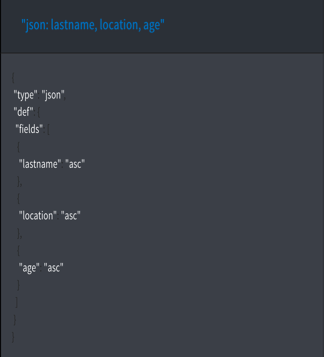
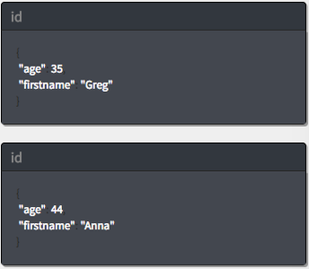

---

copyright:
  years: 2017, 2019
lastupdated: "2019-06-12"

keywords: create database, create documents, create index, create query, run query, fields, operators

subcollection: cloudant

---

{:new_window: target="_blank"}
{:shortdesc: .shortdesc}
{:screen: .screen}
{:codeblock: .codeblock}
{:pre: .pre}
{:tip: .tip}
{:note: .note}
{:important: .important}
{:deprecated: .deprecated}

<!-- Acrolinx: 2017-05-10 -->

# 建立 {{site.data.keyword.cloudant_short_notm}} 查詢
{: #creating-an-ibm-cloudant-query}

本指導教學示範如何建立資料庫、將文件移入其中、建立索引，然後使用索引來查詢資料庫。
{: shortdesc}

同時提供  _指令行_ 及  _{{site.data.keyword.cloud}} 儀表板_ 的練習。「{{site.data.keyword.cloud_notm}} 儀表板」練習可提供每一個作業的視覺化範例。您可以遵循整個指導教學裡的鏈結，以取得相關資訊。

首先，您會建立 `query-demo` 資料庫，以及包含這些練習之資料的一些文件。

## 假設
{: ##assumptions}

開始之前，請遵循下列步驟，以準備執行指導教學：

1.  [建立 {{site.data.keyword.cloud_notm}} 帳戶 ](https://cloud.ibm.com/registration){: new_window}。
2.  登入 [{{site.data.keyword.cloud_notm}} 儀表板 ](https://cloud.ibm.com/catalog/services/cloudant){: new_window}。
3.  [在 {{site.data.keyword.cloud_notm}} 上建立 {{site.data.keyword.cloudant_short_notm}} 實例](/docs/services/Cloudant?topic=cloudant-creating-an-ibm-cloudant-instance-on-ibm-cloud#creating-a-service-instance)。
4.  （選用）[建立 acurl 別名](/docs/services/Cloudant?topic=cloudant-authorized-curl-acurl-#authorized-curl-acurl-)，以便能從指令行更輕鬆且更快速地執行指令。
5.  將練習中所含指令中的 `$ACCOUNT` 變數，取代為您用來登入「{{site.data.keyword.cloudant_short_notm}} 儀表板」的使用者名稱。如果您決定不要設定 `acurl`，請使用下列 URL，而不要使用練習中所提供的 URL：
  ``` sh
  curl https://$USERNAME:$PASSWORD@$ACCOUNT.cloudant.com/query-demo
  ```
  {: codeblock}

## 建立 `query-demo` 資料庫
{: #creating-the-query-demo-database}

在本節中，您會建立 `query-demo` [資料庫](/docs/services/Cloudant?topic=cloudant-databases#create-database)，這是本指導教學中所使用的資料庫。

在本指導教學中，我們使用 `acurl` 別名，而不是 `curl` 指令。`acurl` 別名是使用[授權 curl：`acurl`](/docs/services/Cloudant?topic=cloudant-authorized-curl-acurl-#authorized-curl-acurl-) 中的步驟建立的。如果您偏好使用 `curl` 指令或另一種方法來呼叫 API 端點，請替換指導教學中的指令，以及指令所需的參數（例如使用者名稱及密碼）。
{: tip}

 _指令行_

1.  執行這個指令，以建立資料庫：
  ``` sh
  acurl https://$ACCOUNT.cloudant.com/query-demo -X PUT
  ```
  {: codeblock}
2.  檢閱結果：
  ```json
  {
    "ok": true
  }
  ```
  {: codeblock}

 _{{site.data.keyword.cloud_notm}} 儀表板_

1.  開啟您已建立的 {{site.data.keyword.cloudant_short_notm}} 服務實例。
2.  在 {{site.data.keyword.cloudant_short_notm}} 服務頁面上，按一下**啟動**。即會開啟「資料庫」標籤。
    
  
4.  按一下**建立資料庫**。
5.  輸入 `query-demo`，然後按一下**建立**。

  即會自動開啟 `query-demo` 資料庫。

## 在資料庫中建立文件
{: #creating-documents-in-the-database}

您在此練習中建立的[文件](/docs/services/Cloudant?topic=cloudant-documents#documents)，會包含您用來在稍後練習中查詢 `query-demo` 資料庫的資料。

 _指令行_

1.  將範例文字複製到名為 `bulkcreate.dat` 的資料檔，以建立五份文件：
  ```json
  {
    "docs":
    [
      {
        "_id": "doc1",
        "firstname": "Sally",
        "lastname": "Brown",
        "age": 16,
        "location": "New York City, NY"
      },
      {
        "_id": "doc2",
        "firstname": "John",
        "lastname": "Brown",
        "age": 21,
        "location": "New York City, NY"
      },
      {
        "_id": "doc3",
        "firstname": "Greg",
        "lastname": "Greene",
        "age": 35,
        "location": "San Diego, CA"
      },
      {
        "_id": "doc4",
        "firstname": "Anna",
        "lastname": "Greene",
        "age": 44,
        "location": "Baton Rouge, LA"
      },
      {
        "_id": "doc5",
        "firstname": "Lois",
        "lastname": "Brown",
        "age": 33,
        "location": "Syracuse, NY"
      }
    ]
  }
  ```
  {: codeblock}

2.  執行這個指令，以建立文件：
  ```sh
  acurl https://$ACCOUNT.cloudant.com/query-demo/_bulk_docs -X POST -H "Content-Type: application/json" -d \@bulkcreate.dat
  ```
  {: codeblock}

請注意，用來指出檔案包含資料的 '`@`' 符號，是透過提供的名稱進行識別。
{: tip}

3.  檢閱結果：
  ```json
  [
    {
      "ok":true,
      "id":"doc1",
      "rev":"1-57a08e644ca8c1bb8d8931240427162e"
    },
    {
      "ok":true,
      "id":"doc2",
      "rev":"1-bf51eef712165a9999a52a97e2209ac0"
    },
    {
      "ok":true,
      "id":"doc3",
      "rev":"1-9c9f9b893fcdd1cbe09420bc4e62cc71"
    },
    {
      "ok":true,
      "id":"doc4",
      "rev":"1-6aa4873443ddce569b27ab35d7bf78a2"
    },
    {
      "ok":true,
      "id":"doc5",
      "rev":"1-d881d863052cd9681650773206c0d65a"
    }
  ]
  ```
  {: codeblock}

 _{{site.data.keyword.cloud_notm}} 儀表板_

1.  按一下 **`+`**，然後選取**新建文件**。即會開啟「新建文件」視窗。
2.  若要建立文件，請複製下列範例文字，並取代新文件中的現有文字。

  _第一個範例文件_：
  ```json
  {
    "firstname": "Sally",
    "lastname": "Brown",
    "age": 16,
    "location": "New York City, NY",
    "_id": "doc1"
  }
  ```
  {: codeblock}

3.  重複步驟 2，以將其餘文件新增至資料庫。

  _第二個範例文件_：
  ```json
  {
    "firstname": "John",
    "lastname": "Brown",
    "age": 21,
    "location": "New York City, NY",
    "_id": "doc2"
  }
  ```
  {: codeblock}

  _第三個範例文件_：
  ```json
  {
    "firstname": "Greg",
    "lastname": "Greene",
    "age": 35,
    "location": "San Diego, CA",
    "_id": "doc3"
  }
  ```
  {: codeblock}

  _第四個範例文件_：
  ```json
  {
    "firstname": "Anna",
    "lastname": "Greene",
    "age": 44,
    "location": "Baton Rouge, LA",
    "_id": "doc4"
  }
  ```
  {: codeblock}

  _第五個範例文件_：
  ```json
  {
    "firstname": "Lois",
    "lastname": "Brown",
    "age": 33,
    "location": "New York City, NY",
    "_id": "doc5"
  }
  ```
  {: codeblock}

  `query-demo` 資料庫已移入五筆記錄。您可以在下列畫面擷取的「表格」視圖中看到記錄：

       

## 建立索引來查詢資料庫
{: #creating-an-index-to-query-the-database}

{{site.data.keyword.cloudant_short_notm}} 提供視圖及索引來查詢資料庫。視圖會執行儲存至資料庫的查詢，而結果稱為結果集。當您將查詢提交給視圖時，查詢會搜尋結果集。索引是一種建構資料以改善擷取時間的方式。

我們會在本指導教學中使用「{{site.data.keyword.cloudant_short_notm}} 查詢」，這會使用 Mongo 樣式的查詢語法，透過使用邏輯運算子來搜尋文件。「{{site.data.keyword.cloudant_short_notm}} 查詢」是視圖及搜尋索引的組合。

使用 {{site.data.keyword.cloudant_short_notm}} Query 時，查詢策劃器會查看選擇器（您的查詢）以確定要從中進行選擇的正確索引。如果找不到適當的索引，它會使用 `_all_docs` 特殊索引，依 ID 查閱文件。在最糟的案例情境中，它會依 ID 傳回所有文件（完整表格掃描）。在記憶體中，我們會依選取器過濾掉文件，這就是為何即使沒有索引，您仍然可以搭配各種欄位進行查詢。完整表格掃描很昂貴，因此建議您建立索引。請參閱下列清單中不同類型之索引的說明：

*	主要索引 – 依 ID 查閱文件或文件清單。  
*	[視圖](/docs/services/Cloudant?topic=cloudant-views-mapreduce#views-mapreduce) – 在資料庫中搜尋符合所指定搜尋準則（例如計數、總和、平均值及其他數學函數）的資訊。您可以搜尋的準則指定於視圖的定義中。視圖使用 MapReduce 參照範例。
*	[搜尋索引](/docs/services/Cloudant?topic=cloudant-search#search) – 搜尋一個以上的欄位、大量文字，或是搭配使用萬用字元、模糊搜尋或資料類型與 [Lucene 查詢剖析器語法 ](http://lucene.apache.org/core/4_3_0/queryparser/org/apache/lucene/queryparser/classic/package-summary.html#Overview){: new_window}。

如果沒有符合所指定查詢的可用已定義索引，則 {{site.data.keyword.cloudant_short_notm}} 會使用 `_all_docs` 索引。
{: tip}


 _指令行_

1.  將下列範例 JSON 資料複製到名為 `query-index.dat` 的檔案。
  ```json
{
	"index": {
      "fields": [
        "age",
			"lastname"
		],
		"partial_filter_selector": {
			"age": {
				"$gte": 30
			},
			"lastname": {
				"$eq": "Greene"
			}
		}
	},
  		"ddoc": "partial-index",
		"type": "json"
}
  ```
  {: codeblock}

2.  執行下列指令，以建立索引：
  ```sh
  acurl https://$ACCOUNT.cloudant.com/query-demo/_index -X POST -H "Content-Type: application/json" -d \@query-index.dat
  ```
  {: codeblock}

3.  檢閱結果：
  ```json
  {
    "result":"created",
    "id":"_design/752c7031f3eaee0f907d18e1424ad387459bfc1d",
    "name":"query-index"
  }
  ```
  {: codeblock}


 _{{site.data.keyword.cloud_notm}} 儀表板_

1.  按一下**所有文件**或**設計文件**標籤上的 **`+` > 查詢索引**。
2.  將下列範例 JSON 資料貼入**索引**欄位中：
  ```json
  {
	"index": {
      "fields": [
        "age",
			"lastname"
		],
		"partial_filter_selector": {
			"age": {
				"$gte": 30
			},
			"lastname": {
				"$eq": "Greene"
			}
		}
	},
  		"ddoc": "partial-index",
		"type": "json"
  }
  ```
  {: codeblock}

  已建立索引。您可以在下列畫面擷取中看到索引：

  


## 建立查詢
{: #creating-a-query}

查詢可讓您從 {{site.data.keyword.cloudant_short_notm}} 中擷取資料。妥善撰寫的[查詢](/docs/services/Cloudant?topic=cloudant-query#query)可以縮小搜尋及其結果的範圍，只包含您要的資料。

此練習示範如何撰寫及執行簡單查詢、含有兩個欄位的查詢，以及含有兩個[運算子](/docs/services/Cloudant?topic=cloudant-query#operators)的查詢。您可以指定至少一個欄位及其對應值，以使用運算子進行查詢。查詢接著會使用此值來搜尋資料庫中是否有相符項。

針對最簡單查詢以外的所有查詢，請將 JSON 新增至資料檔，並從指令行中執行它。

### 執行簡單查詢
{: #running-a-simple-query}

此範例示範「{{site.data.keyword.cloudant_short_notm}} 查詢」如何使用 `query-index` 來尋找 `lastname`，以及如何過濾記憶體中的結果來尋找 `firstname`。   

 _指令行_

1.  將下列範例 JSON 複製到名為 `query1.dat` 的資料檔。
  ```json
    {
      "selector": {
            "lastname" : "Greene",
            "firstname" : "Anna"            
         }        
    }       
  ```    
  {: codeblock}

2.  執行下列指令，以查詢資料庫：
  ```sh
  acurl https://$ACCOUNT.cloudant.com/query-demo/_find -X POST -H "Content-Type: application/json" -d \@query1.dat
  ```
  {: codeblock}

3.  檢閱查詢結果：
  ```json
  {
    "docs": [
      {
        "_id":"doc4",
        "_rev":"3-751ab049e8b5dd1ba045cea010a33a72",
            "firstname":"Anna",
            "lastname":"Greene",
            "age":44,
            "location":"Baton Rouge, LA"
      }
    ]
  }
  ```
  {: codeblock}

 _{{site.data.keyword.cloud_notm}} 儀表板_

1.  按一下**查詢**標籤。
2.  複製下列範例 JSON，並將其貼入「{{site.data.keyword.cloudant_short_notm}} 查詢」視窗：
  ```json
   {
      "selector": {
      "lastname" : "Greene",
            "firstname" : "Anna"            
         }        
   }
  ```
  {: codeblock}

3.  按一下**執行查詢**。

  即會顯示查詢結果。您可以在下列畫面擷取的「表格」視圖中看到它們：

  

### 執行含有兩個欄位的查詢
{: #running-a-query-with-two-fields}

此範例使用兩個欄位來尋找名為 `Brown` 且住在 `New York City, NY` 的所有人。

我們使用與下列範例類似的 ['selector' 表示式](/docs/services/Cloudant?topic=cloudant-query#selector-syntax)來說明搜尋：
```json
  {
    "selector": {
      "lastname": "Brown",
      "location": "New York City, NY"
    }
  }
```
{: codeblock}

我們可以在 selector 表示式內新增更多詳細資料，以修改結果來符合需求。`fields` 參數指定結果所包含的欄位。在我們的範例中，結果包含名字、姓氏及位置。結果會根據 `sort` 參數中的值，依名字的遞增順序排序。額外詳細資料類似下列範例：
```json
{
  ...
  "fields" : [
    "firstname",
      "lastname",
      "location"
    ]
}
```  
{: codeblock}

 _指令行_

1.  將範例 JSON 複製到名為 `query2.dat` 的資料檔。
  ```json
  {
    "selector": {
      "lastname": "Brown",
      "location": "New York City, NY"
    },
    "fields" : [
      "firstname",
     "lastname",
     "location"
  ]
  }
  ```
  {: codeblock}

2.  執行下列指令，以查詢資料庫：
  ```sh
  acurl https://$ACCOUNT.cloudant.com/query-demo/_find -X POST -H "Content-Type: application/json" -d \@query2.dat
  ```
  {: codeblock}

3.  檢閱查詢結果：
  ```json
  {
    "docs": [
      {
        "firstname": "Sally",
        "lastname": "Brown",
        "location": "New York City, NY"
      },
      {
        "firstname": "John",
        "lastname": "Brown",
        "location": "New York City, NY"
      },
      {
        "firstname": "Lois",
        "lastname": "Brown",
        "location": "New York City, NY"
      }
    ]
  }
  ```
  {: codeblock}

 _{{site.data.keyword.cloud_notm}} 儀表板_

1.  按一下**查詢**標籤。
2.  複製下列範例 JSON，並將其貼入「{{site.data.keyword.cloudant_short_notm}} 查詢」視窗：
  ```json
  {
    "selector": {
      "lastname": "Brown",
      "location": "New York City, NY"
    },
    "fields": [
      "firstname",
      "lastname",
      "location"
    ] 
  }
  ```
  {: codeblock}

3.  按一下**執行查詢**。

  即會顯示查詢結果。您可以在下列畫面擷取的「表格」視圖中看到它們：

  

### 執行含有運算子的查詢
{: #running-a-query-with-operators}

在此範例中，使用 `$eq`（等於）及 `$gt`（大於）運算子來搜尋包含姓氏 `Greene` 而且年齡大於 `30` 的文件。

我們使用與下列範例類似的 selector 表示式：
```json
{
  "selector": {
      "age": {
      "$gt": 30
    },
    "lastname": {
      "$eq": "Greene"
    }
  }
}
``` 
{: codeblock}

結果會根據 `sort` 參數中所指定的值，依年齡的遞增順序排序。

```json
    "sort": [
      {
        "age": "asc"   
      }] 
```  
{: codeblock}

 _指令行_

1.  將下列範例 JSON 複製到名為 `query3.dat` 的檔案。
  ```json
  {
   "selector": {
      "age": {
         "$gt": 30
      },
      "lastname": {
         "$eq": "Greene"
      }
   },
    "fields": [
      "age",
      "firstname"
   ],
    "sort": [
      {
        "age": "asc"   
      }],
   "use_index": "_design/partial-index"
  }
  ```
  {: codeblock}

2. 執行此查詢：
  ```sh
  acurl https://$ACCOUNT.cloudant.com/query-demo/_find -X POST -H "Content-Type: application/json" -d \@query3.dat
  ```
  {: codeblock}

3.  檢閱查詢結果：
  ```json
{"docs":[
     {"age":35,"firstname":"Greg"},
     {"age":44,"firstname":"Anna"}
   ],
  "bookmark": "g1AAAABCeJzLYWBgYMpgSmHgKy5JLCrJTq2MT8lPzkzJBYqzAFkmIDkOmFwOSHWiDkiSzb0oNTUvNSsLAEsmEeQ"
  }
  ```
  {: codeblock}

 _{{site.data.keyword.cloud_notm}} 儀表板_

1.  按一下**查詢**標籤。
2.  複製下列範例 JSON，並將其貼入「{{site.data.keyword.cloudant_short_notm}} 查詢」視窗：
  ```json
  {
   "selector": {
      "age": {
         "$gt": 30
      },
      "lastname": {
         "$eq": "Greene"
      }
   },
    "fields": [
      "age",
      "firstname"
   ],
    "sort": [
      {
        "age": "asc"   
      }],
   "use_index": "_design/partial-index"
  }
  ```
  {: codeblock}

3.  按一下**執行查詢**。

  即會顯示查詢結果。您可以在下列畫面擷取的「表格」視圖中看到它們：

  

如需 {{site.data.keyword.cloudant_short_notm}} 的相關資訊，請參閱 [{{site.data.keyword.cloudant_short_notm}} 文件](/docs/services/Cloudant?topic=cloudant-overview#overview)。
