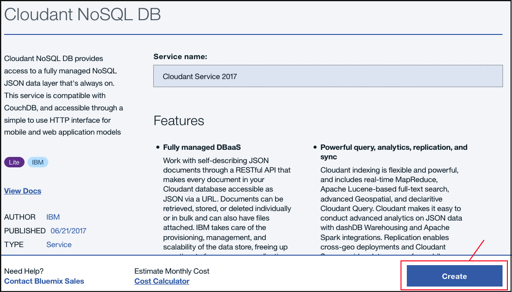

---

copyright:
  years: 2017, 2018
lastupdated: "2018-10-24"

---

{:new_window: target="_blank"}
{:shortdesc: .shortdesc}
{:screen: .screen}
{:codeblock: .codeblock}
{:pre: .pre}
{:tip: .tip}

<!-- Acrolinx: 2018-09-19 -->

# 在 {{site.data.keyword.cloud_notm}} 上建立 {{site.data.keyword.cloudant_short_notm}} 實例

本指導教學顯示如何使用 {{site.data.keyword.cloud}} 儀表板來建立 {{site.data.keyword.cloudantfull}} 服務實例，並顯示哪裏可以找到讓應用程式使用資料庫的必要資訊。
{:shortdesc} 

## 建立服務實例

1.  登入 {{site.data.keyword.cloud_notm}} 帳戶。 
    {{site.data.keyword.cloud_notm}} 儀表板位於 [http://console.bluemix.net ](http://bluemix.net){:new_window}。
    使用使用者名稱和密碼進行鑑別之後，您會看到沒有任何服務實例的 {{site.data.keyword.cloud_notm}} 儀表板： 
    

2.  按一下`建立資源`按鈕： 
     
即會出現 {{site.data.keyword.cloud_notm}} 上可用的服務清單。

3.  按一下`資料庫`種類，然後選取 `Cloudant` 服務： 
     

4.  在服務配置視窗中，輸入服務名稱。請驗證服務名稱、地區/位置、資源群組及鑑別方法都正確無誤。可用的鑑別方法包括`僅使用 IAM` 或`同時使用 Legacy 認證及 IAM`。如需相關資訊，請參閱[鑑別方法](../guides/iam.html#ibm-cloud-identity-and-access-management-iam-){:new_window}。
    在此範例中，服務名稱是 `Cloudant-o7`： 
    

5.  依預設，會使用「精簡」定價方案來建立服務，此方案免費但隨附固定數量的已佈建傳輸量及資料儲存空間。如果您有付費 {{site.data.keyword.cloud_notm}} 帳戶，則也可以選擇付費「標準」方案，以切換已佈建傳輸量，並視需要調整資料用量。如需定價方案的相關資訊，請參閱[方案](../offerings/bluemix.html#plans){:new_window}。    若要建立服務，請按一下`建立`按鈕： 
    

6.  即會出現服務頁面，以確認您的新 {{site.data.keyword.cloudant_short_notm}} 服務可用。若要建立您的應用程式連接至服務所需的連線資訊，請按一下`服務認證`標籤： 
    

7.  建立新的 {{site.data.keyword.cloudant_short_notm}} 服務認證：
   a. 按一下`新建認證`按鈕。
   
   b. 在「新增認證」視窗中，輸入新認證的名稱。請參閱影像。
   c. 接受「管理員」角色。
   d. 建立新的服務 ID，或自動產生服務 ID。
   d.（選用）新增線型配置參數。請注意，{{site.data.keyword.cloudant_short_notm}} 服務認證目前未使用此參數，因此請予以忽略。
   e. 按一下`新增`按鈕。 
   
   您的新認證會出現在表格後面。 
   f. 按一下「動作」下的`檢視認證`。
   

8.  即會出現服務認證的詳細資料： 
    

在 {{site.data.keyword.cloudant_short_notm}} 上建立示範 {{site.data.keyword.cloudant_short_notm}} 服務後，即定義這些範例中的服務認證。我們在這裡重新產生認證，是要示範它們在儀表板中的顯示方式。不過，已移除示範 {{site.data.keyword.cloudant_short_notm}} 服務，因此這些認證不再有效；您_必須_ 提供及使用自己的服務認證。
{: tip}

## 服務認證

服務認證很重要。如果有任何人或任何應用程式可以存取認證，他們/它們可以有效地對服務實例執行想要的一切作業。例如，他們/它們可能會建立偽造資料，或刪除很重要的資訊。請小心地保護這些認證。

    
{{site.data.keyword.cloudant_short_notm}} 在佈建時間有兩種可用的鑑別方法：`僅使用 IAM` 或`同時使用 Legacy 認證及 IAM`。只有在選擇`同時使用 Legacy 認證及 IAM` 鑑別方法時，才能看到有關舊式認證的詳細資料。認證會顯示在您實例的「服務認證」標籤上。如需相關資訊，請參閱 [IAM 手冊](guides/iam.html#ibm-cloud-identity-and-access-management-iam-)及[舊式鑑別](api/authentication.html#authentication)文件，以取得使用任一種鑑別樣式的詳細資料。

服務認證包括下列欄位：

欄位       |用途
------|--------
`username` | URL 中服務實例使用者的服務名稱。此欄位也用來作為管理使用者名稱。
`password` | 應用程式存取服務實例所需的舊式認證密碼。只有在選擇`同時使用 Legacy 認證及 IAM` 選項時，才會顯示此欄位。
`host`     |應用程式用來尋找服務實例的主機名稱。只有在選擇`同時使用 Legacy 認證及 IAM` 選項時，才會顯示此欄位。
`port`     | 用來存取主機上服務實例的 HTTPS 埠號。它是 443，因為 {{site.data.keyword.cloudant_short_notm}} 只容許 HTTPS 存取。只有在選擇`同時使用 Legacy 認證及 IAM` 選項時，才會顯示此欄位。
`url`	| 存取 {{site.data.keyword.cloudant_short_notm}} 實例的 HTTPS URL。如果選擇`同時使用 Legacy 認證及 IAM` 選項，則也會包括內嵌的舊式使用者名稱和密碼。
`apikey` | IAM API 金鑰。
`iam_apikey_description` | IAM API 金鑰的說明。
`iam_apikey_name` | IAM API 金鑰的 ID。
`iam_role_crn` | IAM API 金鑰具有的 IAM 角色。
`iam_serviceid_crn`	| 服務 ID 的 CRN。

若要建立可存取服務實例的應用程式，您需要這些認證。

## 找到服務認證

您隨時可以找到與您帳戶相關聯之服務的認證。

1.  首先，登入 {{site.data.keyword.cloud_notm}}。{{site.data.keyword.cloud_notm}} 儀表板位於 [http://bluemix.net ](http://bluemix.net){:new_window}。利用使用者名稱及密碼進行鑑別之後，您會看到 {{site.data.keyword.cloud_notm}} 儀表板： 
    

2.  在此範例中，我們要尋找先前在本指導教學中建立之 {{site.data.keyword.cloudant_short_notm}} 服務實例（稱為 `Cloudant-o7`）的服務認證。
    按一下對應的列： 
    

3.  若要查看存取服務所需的認證，請按一下`檢視認證`： 
    

4.  即會出現服務認證的詳細資料： 
    

在 {{site.data.keyword.cloudant_short_notm}} 上建立示範 {{site.data.keyword.cloudant_short_notm}} 服務後，即定義這些範例中的服務認證。我們在這裡重新產生認證，是要示範它們在儀表板中的顯示方式。不過，已移除示範 {{site.data.keyword.cloudant_short_notm}} 服務，因此這些認證不再有效；您_必須_ 提供及使用自己的服務認證。
{: tip}

