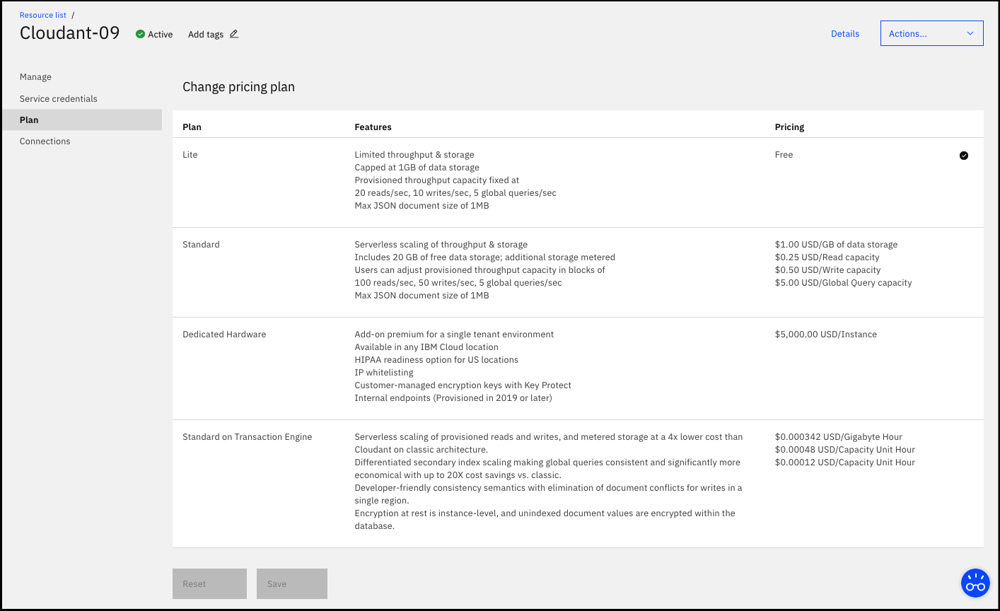
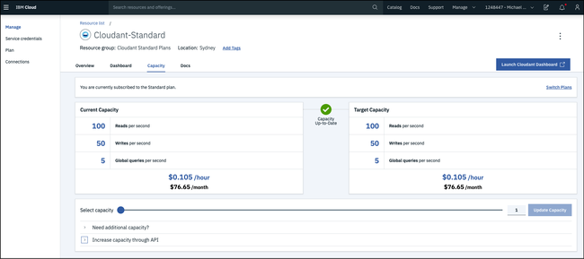
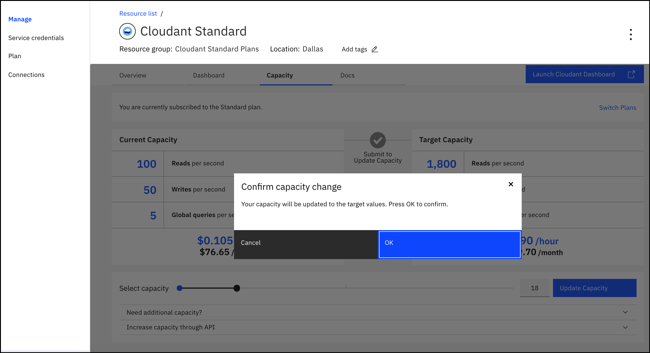
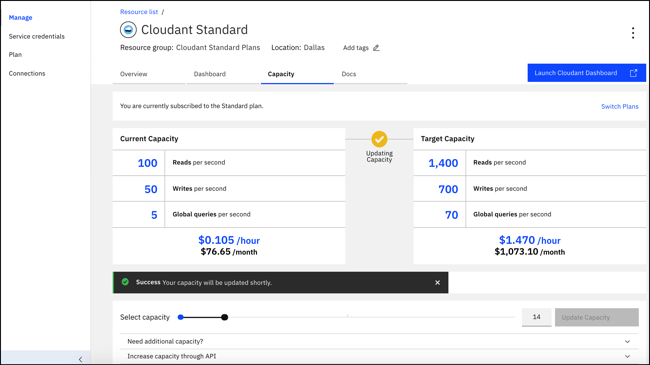
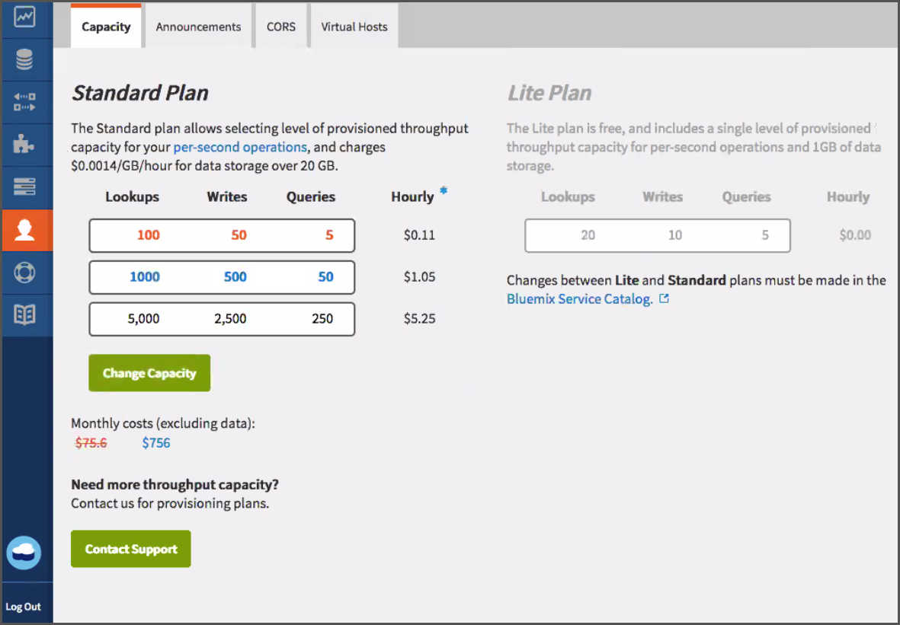
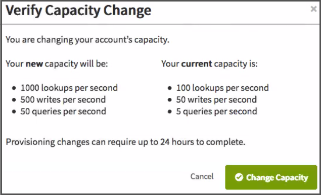
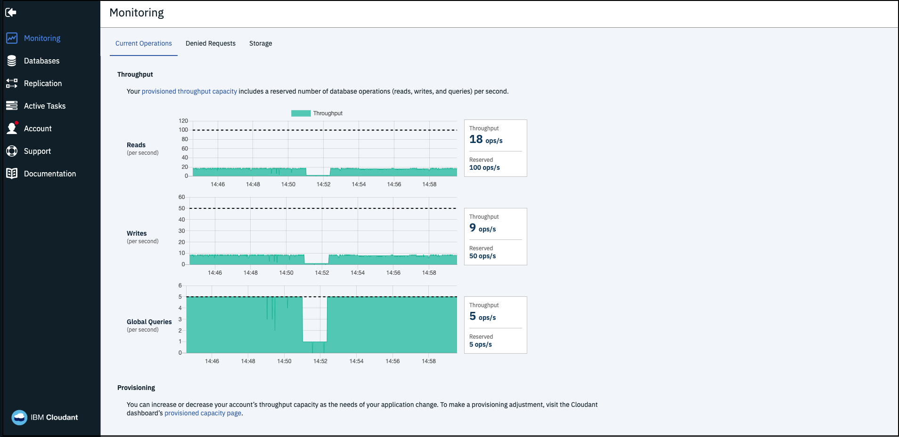
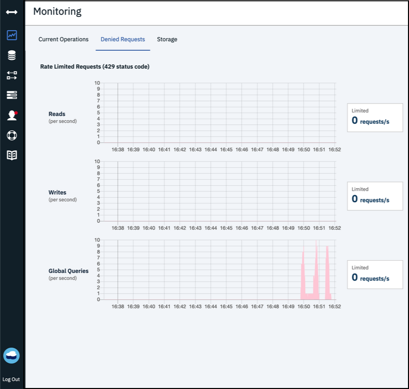

---

copyright:
  years: 2015, 2020
lastupdated: "2020-02-06"

keywords: standard plan, lite plan, dedicated hardware plan, event type, provisioned throughput capacity, consumption, capacity, monitor usage, data usage, size limits, locations, tenancy, authentication methods, high availability, disaster recovery, backup, support

subcollection: cloudant

---

{:new_window: target="_blank"}
{:shortdesc: .shortdesc}
{:screen: .screen}
{:codeblock: .codeblock}
{:pre: .pre}
{:tip: .tip}
{:note: .note}
{:important: .important}
{:deprecated: .deprecated}
{:external: target="_blank" .external}

<!-- Acrolinx: 2020-02-06 -->

# Plans and provisioning
{: #ibm-cloud-public}

{{site.data.keyword.cloudantfull}} Public is {{site.data.keyword.cloudant_short_notm}}'s most 
feature-rich offering, receiving updates and new features first. Pricing is based on 
provisioned throughput capacity that is allocated and data storage that is used, making it suitable for any 
required load. 
{: shortdesc}

The free [Lite plan](#lite-plan) includes a fixed amount of 
throughput capacity and data for development and evaluation purposes. The paid [Standard plan](#standard-plan) offers configurable provisioned throughput 
capacity and data storage pricing that scales as your application requirements 
change.  An optional [Dedicated Hardware plan](#dedicated-hardware-plan) is also available for an 
additional monthly fee to run one or more of your Standard plan instances 
on a dedicated hardware environment. The dedicated hardware environment 
is for your sole use, and if a Dedicated Hardware plan instance is provisioned 
within a US location, you can optionally select a [HIPAA](https://en.wikipedia.org/wiki/Health_Insurance_Portability_and_Accountability_Act){: new_window}{: external} 
-compliant configuration.

## Plans
{: #plans}

You can select which plan to use when you
[provision your {{site.data.keyword.cloudant_short_notm}} service instance](#provisioning-a-cloudant-nosql-db-instance-on-ibm-cloud).
By default,
the [Lite plan](#lite-plan) is selected.

### Lite plan
{: #lite-plan}

The Lite plan is free, and is designed for development and evaluation purposes. {{site.data.keyword.cloudant_short_notm}}'s full functionality is included, but Lite plan instances have a fixed amount of provisioned throughput capacity and data storage. The provisioned throughput capacity is fixed at 20 reads/sec, 10 writes/sec, and 5 global queries/sec, and data storage is capped at 1 GB. 

Storage usage is checked daily. If you exceed your 1-GB storage limit, requests to the {{site.data.keyword.cloudant_short_notm}} instance receive a 
402 status code with the following error message, "Account has exceeded its data usage quota. An upgrade to a paid plan is required." A banner also appears on the {{site.data.keyword.cloudant_short_notm}} Dashboard. You can still read and delete data. However, to write new data, you have two options. First, you can upgrade to a paid [Standard plan](#standard-plan), which removes the write limitation immediately. Alternatively, you can delete data so that your total storage falls under the 1-GB limit and wait until the next daily storage check runs for your instance to allow writes again. 

If you want to store more than 1 GB of data, or be able to scale provisioned throughput capacity, move to the [Standard plan](#standard-plan).

You're limited to one {{site.data.keyword.cloudant_short_notm}} Lite plan instance per {{site.data.keyword.cloud_notm}} account. If you already have one Lite plan instance, any attempt to create a Lite plan instance, or change a Standard plan instance to a Lite plan, returns the following message, "You can only have one instance of a Lite plan per service. To create a new instance, either delete your existing Lite plan instance or select a paid plan."
{: note}

### Standard plan
{: #standard-plan}

The {{site.data.keyword.cloudant_short_notm}} Standard plan is available to all paid {{site.data.keyword.cloud}} accounts, either as pay-as-you-go or subscription, and scales to meet the needs of your application. The Standard plan is priced based on two factors: the provisioned throughput capacity that is allocated and the amount of data that is stored in the instance. 

Pricing is pro-rated hourly with a starting provisioned throughput capacity of 100 reads/sec, 50 writes/sec, and 5 global queries/sec equal to a starting cost of USD $0.105/hour. You can toggle the provisioned throughput capacity up or down in increments of 100 reads/sec, 50 writes/sec, and 5 global queries/sec by using the user interface or API. Costs are calculated for the provisioned throughput capacity that is allocated and isn't on the metered volume of requests. The Standard plan includes 20 GB of data storage. If you store more than 20 GB, you're charged a defined cost per GB per hour. 

See the {{site.data.keyword.cloud_notm}} Pricing Calculator for pricing at different capacities and currencies, and the [pricing](/docs/Cloudant?topic=cloudant-pricing#pricing){: new_window} information for examples to estimate costs.

### Dedicated Hardware plan
{: #dedicated-hardware-plan}

An {{site.data.keyword.cloudant_short_notm}} Dedicated Hardware plan instance is a bare metal {{site.data.keyword.cloudant_short_notm}} environment that is provisioned for the sole use of your {{site.data.keyword.cloudant_short_notm}} Standard plan instances. The {{site.data.keyword.cloudant_short_notm}} Dedicated Hardware plan offers the following options: 
- An {{site.data.keyword.cloudant_short_notm}} Dedicated Hardware plan environment that can be provisioned in any [{{site.data.keyword.IBM}} global data center](https://www.ibm.com/cloud/data-centers/){:new_window}{: external}.
- This plan is necessary for HIPAA compliance and must be selected at provisioning time. 
- Users can choose to bring-your-own-key (BYOK) with customer-managed encryption keys with {{site.data.keyword.IBM_notm}} Key Protect for all environments provisioned 1 January 2020 or later. All {{site.data.keyword.cloudant_short_notm}} runs on encrypted disks, but in order to BYOK, the Dedicated Hardware plan is required. BYOK encryption details have to be chosen at provisioning time and the feature isn't available for already-provisioned Dedicated Hardware plan environments.
- For Dedicated Hardware environments provisioned after 1 January 2019, all Standard plan instances that are deployed on them include both private (internal) endpoints and public endpoints. Using private endpoints allows customers to connect to an {{site.data.keyword.cloudant_short_notm}} instance through the internal {{site.data.keyword.cloud}} network to avoid upstream application traffic from going over the public network and incurring bandwidth charges. For more information, see [Service Endpoint documentation](https://cloud.ibm.com/docs/resources?topic=resources-service-endpoints){:new_window}{: external} for details about enabling Service Endpoints for your {{site.data.keyword.cloud}} account. Private endpoints aren't available for the Dedicated Hardware plan if provisioned in an EU-managed environment.
- Users of an {{site.data.keyword.cloudant_short_notm}} Dedicated Hardware plan environment can employ IP whitelisting by contacting support. IP whitelisting configuration applies to all instances that are running on the environment.   

You can provision one or more Standard plan instances on a single Dedicated Hardware environment. The Dedicated Hardware environment expands or contracts as needed based on the throughput capacity and data that is used by the Standard plan instances. An {{site.data.keyword.cloudant_short_notm}} Dedicated Hardware plan instance has a fixed price that is an addition to the consumption pricing of any Standard plan instances deployed on it. Billing is prorated daily, with a 1-month minimum duration charged for the environment. Provisioning of an {{site.data.keyword.cloudant_short_notm}} Dedicated Hardware plan is asynchronous and can take 5-7 business days. To create an {{site.data.keyword.cloudant_short_notm}} Dedicated Hardware plan instance and provision a Standard plan instance on it, follow the [Creating and leveraging an {{site.data.keyword.cloudant_short_notm}} Dedicated Hardware plan instance on {{site.data.keyword.cloud_notm}}](/docs/Cloudant?topic=cloudant-creating-and-leveraging-an-ibm-cloudant-dedicated-hardware-plan-instance-on-ibm-cloud#creating-and-leveraging-an-ibm-cloudant-dedicated-hardware-plan-instance-on-ibm-cloud) tutorial. 

The Dedicated Hardware plan isn't available to {{site.data.keyword.cloud_notm}} Dedicated customers. The Dedicated Hardware plan is only available to {{site.data.keyword.cloud_notm}} Public customers.
{: important}

## Event types
{: #event-types}

Throughput provision is identified and measured as one of the following types of events:

1.	*Reads*
    (formerly called lookups) which are:
    1. A read of a specific document,
    based on the `_id` of the document.
    2. A *partitioned* query,
        which is a request that is made to an {{site.data.keyword.cloudant_short_notm}} 
        query endpoint within the `_partition` namespace in the request path,
        including the following types:
        -	Primary Index ([`_all_docs`](/docs/Cloudant?topic=cloudant-databases#get-documents))
        -	MapReduce View ([`_view`](/docs/Cloudant?topic=cloudant-using-views#using-views))
        -	Search Index ([`_search`](/docs/Cloudant?topic=cloudant-search#queries))
        -	{{site.data.keyword.cloudant_short_notm}} Query ([`_find`](/docs/Cloudant?topic=cloudant-query#finding-documents-by-using-an-index))
    
        The number of read operations that are consumed by a partitioned query request
        varies depending on the results returned.
2.	*Writes*,
    which are creation,
    modification,
    or deletion of individual documents.
3.	*Global Queries* to global indexes (formerly called queries),
        which are requests that are made to an {{site.data.keyword.cloudant_short_notm}} 
        query endpoint **not** within the `_partition` namespace,
    including the following types:
	-	Primary Index ([`_all_docs`](/docs/Cloudant?topic=cloudant-databases#get-documents))
	-	MapReduce View ([`_view`](/docs/Cloudant?topic=cloudant-using-views#using-views))
	-	Search Index ([`_search`](/docs/Cloudant?topic=cloudant-search#queries))
	-	Geospatial Index ([`_geo`](/docs/Cloudant?topic=cloudant-cloudant-nosql-db-geospatial#querying-a-cloudant-nosql-db-geo-index))
	-	{{site.data.keyword.cloudant_short_notm}} Query ([`_find`](/docs/Cloudant?topic=cloudant-query#finding-documents-by-using-an-index))

## Provisioned throughput capacity
{: #provisioned-throughput-capacity}

Throughput provision is identified and measured as events of the following
operation types: *Read*, *Write*, and *Global Query*.

The measurement of throughput is a simple count of the number of events of each type,
per second,
where the second is a *sliding* window.
If your account exceeds the number of throughput events that are provisioned for the plan,
requests are rejected until the number of events within the sliding window
no longer exceed the number that is provisioned.
It might help to think of the sliding 1-second window as being any consecutive period of 1,000 milliseconds.

For example, the Standard plan is provisioned for 200 reads per second. Your account might consume a maximum of 200 read events during a consecutive period of 1,000 milliseconds (1 second). Subsequent read requests made during the sliding 1,000-millisecond period
are rejected until the number of read events in that period drops to less than 200 again.

When a request is rejected because the number of events is exceeded,
applications receive a [`429` Too Many Requests](/docs/Cloudant?topic=cloudant-http#http-status-codes)
response.

Recent versions of the supported client libraries (for [Java&trade;](/docs/Cloudant?topic=cloudant-supported-client-libraries#java-supported),
[Node.js](/docs/Cloudant?topic=cloudant-supported-client-libraries#node-js-supported),
and [Python](/docs/Cloudant?topic=cloudant-supported-client-libraries#python-supported) languages) help you handle a `429` response. For example,
the Java library generates a
[`TooManyRequestsException`](http://static.javadoc.io/com.cloudant/cloudant-client/2.5.1/com/cloudant/client/org/lightcouch/TooManyRequestsException.html){: new_window}{: external} response.

By default,
the supported client libraries do not automatically attempt to retry
a request when a `429` response is received.

It's better to ensure that your application handles `429` responses correctly.
The reason is that the number of retries is limited;
regularly transgressing the number of requests is a strong indicator
for moving to a different plan configuration.

If you're porting an existing application, it might not be able to handle a `429` response. As part of your migration verification, check that your application handles `429` responses correctly.
{: note}

In summary,
you must ensure that your application can handle a [`429`](/docs/Cloudant?topic=cloudant-http#http-status-codes) response correctly.

### Consumption of read operations by partitioned queries
{: #consumption-of-lookup-operations-by-partitioned-queries}

Partitioned query requests consume a variable number of read operations
that depend on the results returned. Consumption is based on two axes:

1. The number of rows read from the index involved in the query.
2. The number of documents read from the database, if any, during the execution of the query.
    
#### `_all_docs`, view, and search queries

Each block of 100 rows read from the index consumes 1 read operation. In
addition, each document that is read from the database during execution of a query
consumes 1 read unit.

The number of rows read from the index is the same as the number of results
returned. Documents are only read from the database when `include_docs=true` is
passed as a query string parameter during the query request.

You can see example costs in the following table:

| Number of results | Include documents | Total Read consumption | Consumption for rows read | Consumption for documents read |
|--------------|----------------|-------------|---------------------| --- |
| 199      | No     | **2** | 2 | 0 |
| 199      | Yes     | **201** | 2 | 199 |
| 301      | No     | **4** | 4 | 0 |
| 301      | Yes     | **305** | 4 | 301 |
{: caption="Table 1. Example costs" caption-side="top"}

Reducing use of `include_docs=true` is key for reducing read consumption for
partitioned `_all_docs`, view, and search queries.

#### {{site.data.keyword.cloudant_short_notm}} Query

For {{site.data.keyword.cloudant_short_notm}} Query requests, the number of consumed read operations for index
rows read relates to the rows read from the underlying index *before* filtering
occurs based on parts of the selector that can't be satisfied by the index.
Therefore, this means that the rows read value, and consumed read units, can be
higher than the number of eventual results you receive.

In addition, {{site.data.keyword.cloudant_short_notm}} Query must read the document for every row that is returned by the
underlying index so it can execute further filtering that is required by the
selector and passed to the query.

| Number of results | Number of rows returned by index | Total Read consumption | Consumption for rows read | Consumption for documents read |
|--------------|----------------|-------------|---------------------|---|
| 5      | 199     | **201** | 2 | 199 |
| 199      | 199     | **201** | 2 | 199 |
| 5      | 301     | **305** | 4 | 301 |
| 301      | 301     | **305** | 4 | 301 |
{: caption="Table 2. Read consumption" caption-side="top"}

Using appropriate indexes is key for reducing read consumption for partitioned
{{site.data.keyword.cloudant_short_notm}} Query queries.

### Viewing and changing capacity
{: #viewing-and-changing-capacity}

Managing the provisioned throughput capacity allocated to an instance can be done by using either the UI or API. Changes to the provisioned throughput capacity are only allowed by using the paid {{site.data.keyword.cloudant_short_notm}} Standard plan. Users of the free Lite plan have a fixed amount of provisioned throughput capacity but can use the Capacity UI to estimate costs for a capacity setting on the Standard plan.

The method for managing the provisioned throughput capacity via the UI depends on whether the {{site.data.keyword.cloudant_short_notm}} instance is deployed in a Resource Group or a Cloud Foundry org and space. Starting in July 2018, all instances are deployed in Resource Groups. It's recommended that you migrate any instances that are deployed in a Cloud Foundry org and space to a Resource Group to take advantage of the latest user experience. For more information, see [How does {{site.data.keyword.cloudant_short_notm}} work with {{site.data.keyword.cloud_notm}} Resource Groups?](/docs/Cloudant?topic=cloudant-how-does-ibm-cloudant-work-with-ibm-cloud-resource-groups-)

#### UI - Resource Group

If the {{site.data.keyword.cloudant_short_notm}} instance is deployed in a **Resource Group**, go to the {{site.data.keyword.cloud_notm}} Dashboard Service Details page for the instance. Click the **Manage** tab and then **Capacity** tab where you can view the current and target capacity. 

To change the target capacity, slide the capacity slider to the setting you need, and click **Update Capacity**. A confirmation window appears. Click **OK** to confirm. 

The check mark turns yellow and says `Updating Capacity` until the target capacity is reached. Capacity changes are asynchronous. The time that is required to synchronize those changes depends on the size of the changes in capacity that were requested and the data that is stored in the instance. When the target capacity is reached, the check mark turns green and says "Capacity Up-to-Date".

Capacity increases via the {{site.data.keyword.cloud_notm}} Dashboard can be made up to 100 blocks of capacity, which is 10,000 reads/sec, 5,000 writes/sec, and 500 global queries/sec. If you require more capacity, see the **Need additional capacity?** tab on the Capacity page.
{: note}

#### UI - Cloud Foundry org and space

If the {{site.data.keyword.cloudant_short_notm}} instance is deployed in a Cloud Foundry org and space, launch the {{site.data.keyword.cloudant_short_notm}} Dashboard. Click the **Account** tab and then **Capacity** tab. 

To move to a different throughput capacity, select the provisioned throughput capacity that you need, then click **Update**. You're asked to confirm the change, 
and reminded that the provisioning change can take up to 24 hours to 
complete.

In the {{site.data.keyword.cloudant_short_notm}} Dashboard, the size of the capacity increase is limited to 10 units (1000 reads/second, 500 writes/second, and 50 global queries/second) per change. Decreases aren't limited by the number of units. Any change in capacity, either an increase or a decrease, is limited to once per hour. If you require more capacity than is available on the {{site.data.keyword.cloudant_short_notm}} Dashboard, contact [{{site.data.keyword.cloudant_short_notm}} support](mailto:support@cloudant.com).
{: note}

#### API

To use the API to view the current provisioned throughput capacity that is allocated or change the target provisioned throughput capacity for an {{site.data.keyword.cloudant_short_notm}} instance, see the [Capacity API](/docs/Cloudant?topic=cloudant-capacity) documentation. 

The API syntax for changing the capacity is also shown in the **Increase capacity through API** tab on the Capacity page for instances that are deployed in a Resource Group. 

### Monitoring usage 
{: #monitoring-usage}

Information about your usage of provisioned throughput capacity is available in the {{site.data.keyword.cloudant_short_notm}} Dashboard Monitoring tab. The **Current Operations** tab shows recent consumption of [provisioned throughput capacity](#provisioned-throughput-capacity) by showing the number of requests broken down by reads, writes, and global queries. The dotted line represents the peak capacity that is allowed according to the provisioned throughput capacity set for the instance. 

The **Denied Requests** tab shows the number of requests that were denied in a given second by showing the response, "429: too many requests." Requests are denied because they exceed the provisioned throughput capacity that is allocated to the instance. The graphs are broken down by reads, writes, and global queries.

Monitoring helps you recognize that a change to the provisioning in your plan might be advisable.
For example, if you frequently approach the maximum number of database reads, then you can modify the capacity for the instance through the [Capacity](#viewing-and-changing-capacity) UI.

## Data usage
{: #data-usage}

The data storage that is measured for billable purposes for an {{site.data.keyword.cloudant_short_notm}} instance is inclusive of both JSON data, indexes, and attachments. 

### Data storage included
{: #data-storage-included}

This value is the storage capacity that is included in the plan. The Lite plan has a hard limit of 1 GB allowed. The paid Standard plan includes 20 GB for free and any additional data stored is metered for billing. 

### Data overage
{: #data-overage}

All Lite and Standard plans are monitored for disk space used. When you use more data than the
plan allocates, you can expect the conditions that are described in the following table to apply:

| Plan | Description|
|------|------------|
| Lite | <ul><li>Disk usage is capped on the Lite plan at 1 GB.</li><li>After you reach the cap, you receive a warning on the {{site.data.keyword.cloudant_short_notm}} Dashboard and can't write new data. If you attempt to write new data, a `402: payment required` response occurs.</li> <li>To write new data, you must either upgrade to the Standard plan or delete data and wait until the next check runs for your account to be reactivated.</li></ul> | 
| Standard | <ul><li>If the account uses more than the 20 GB of storage that is included in the Standard plan, it's considered 'disk overage'. Overage causes the account to be billed at the indicated price for each extra GB used beyond the plan allocation.</li><li>The cost for the amount of disk overage is calculated on an hourly basis.</li></ul> |
{: caption="Table 3. {{site.data.keyword.cloudant_short_notm}} plans" caption-side="top"}

For example, assume your Standard plan increases disk usage to 107 GB for half a day (12 hours). This change means that your instance caused overflow of 87 GB more than the 20 GB plan allocation, for 12 hours.
Therefore, you would be billed an overage charge based on 87 GB x 12 hours = 1044 GB hours for that extra space.

Overage is calculated by using the maximum number of GB more than the plan allocation during a particular hour within the billing cycle.

### Disk overage example
{: #disk-overage-example}

Assume that you start a month of 30 days with a Standard plan service instance that uses 9 GB of storage.
Next,
your storage increases to 21.5 GB for 15 minutes during the hour beginning at 02:00 of day 3.
The instance drops back to 9.5 GB for the next 10 minutes of hour 02:00,
then increases to 108 GB for the next 25 minutes of hour 02:00.
Finally,
your instance finishes the hour and indeed the rest of the month by dropping down to 28 GB.

This pattern means the maximum number of GB more than the plan allocation was 88 GB during hour 2 of day 3.
For hour 03:00 of day 3,
and for the rest of the month,
your instance was 8 GB more than the plan allocation.

Therefore,
for hour 02:00 of day 3,
your bill includes an overage based on 88 GB x 1 hour = 88 GB hours.

For hour 03:00 of day 3 to the end of day 3,
your bill includes an overage based on 8 GB x 21 hours = 168 GB hours.

For hour 00:00 of day 4 to the end of the month (of 30 days),
your bill includes an overage based on 8 GB x 24 hours x 27 days = 5184 GB hours.

The total overage bill for the month is based on a total of 88 + 168 + 5184 = 5440 GB hours.

## Request and document size limits
{: #request-and-document-size-limits}

{{site.data.keyword.cloudant_short_notm}} JSON documents and requests have the 
following maximum size limits: 

Limit | Maximum Size
------|-------------
Individual Document Size | 1 MB
Single Attachment Size | 10 MB
Request Body Size | 11 MB

If you exceed these limits, a [413 response](/docs/Cloudant?topic=cloudant-http#http-status-codes) alerts you.

It's recommended that you store binary attachments, or large JSON blobs, 
in object storage and save a link to the location in an {{site.data.keyword.cloudant_short_notm}} JSON document.   

When you replicate, documents or attachments that exceed these limits do not 
replicate to the target database. For more information about how to detect replication
errors, see [Replication errors](/docs/Cloudant?topic=cloudant-replication-api#replication-errors).

## Locations and tenancy
{: #locations-and-tenancy}

By default, all Lite and Standard plans are deployed on multi-tenant 
environments. As part of your plan selection, you can choose from the 
following {{site.data.keyword.cloud_notm}} Public locations:

-   Washington DC
-   Dallas
-   London
-   Sydney
-   Frankfurt&Dagger;
-   Tokyo
-   Seoul (SZR)
-   Chennai (SZR)

Single-Zone Region (SZR) means only one availability zone is available in that location. All other locations are Multi-Zone Regions (MZR) and leverage three separate availability zones for instances that are deployed in those locations. For more information, see the [High availability (HA), disaster recovery (DR), and backup](/docs/Cloudant?topic=cloudant-disaster-recovery-and-backup&cloudant-disaster-recovery-and-backup){: new_window} documentation. 

Dedicated Hardware plan instances can be deployed in most 
[{{site.data.keyword.IBM_notm}} data center locations](https://www.ibm.com/cloud/data-centers/){: new_window}{: external}. 
See the drop-down menu in the {{site.data.keyword.cloud_notm}} catalog for an up-to-date list of available locations.

&Dagger;All {{site.data.keyword.cloudant_short_notm}} instances that are deployed from the 
{{site.data.keyword.cloud_notm}} Public Frankfurt region 
deploy in EU-managed environments. Any {{site.data.keyword.cloudant_short_notm}} 
account or API key that is generated 
outside an EU-managed environment can't be granted access to an EU-managed 
{{site.data.keyword.cloudant_short_notm}} instance. For more information, see [Enabling the EU Supported setting](https://cloud.ibm.com/docs/account?topic=account-eu-hipaa-supported#bill_eusupported) for your {{site.data.keyword.cloud_notm}} account.

## Authentication methods
{: #authentication-methods}

{{site.data.keyword.cloudant_short_notm}} is accessed by using an HTTPS API. Where the API endpoint requires it, the user is authenticated for every HTTPS request {{site.data.keyword.cloudant_short_notm}} receives. During provisioning, the available authentication methods include `Use both legacy credentials and IAM` or `Use only IAM`. For more information, see the [IAM guide](/docs/Cloudant?topic=cloudant-ibm-cloud-identity-and-access-management-iam-#ibm-cloud-identity-and-access-management-iam-) or the legacy [Authentication API document](/docs/Cloudant?topic=cloudant-authentication#authentication).

After you provision an {{site.data.keyword.cloudant_short_notm}} instance, the connection URL and IAM authorization details can be found when generating new credentials in the Service Credentials tab of the {{site.data.keyword.cloud_notm}} dashboard. If you chose this option during provisioning, the {{site.data.keyword.cloudant_short_notm}} legacy username and password is also included.

The {{site.data.keyword.cloudant_short_notm}} team recommends you use IAM access controls for authentication whenever possible. If you're using {{site.data.keyword.cloudant_short_notm}} legacy authentication, we recommended you use [API keys](/docs/Cloudant?topic=cloudant-authorization#api-keys){: new_window} rather than account-level credentials for programmatic access and replication jobs. 
{: important}

## High availability, disaster recovery, and backup in a data center
{: #high-availability-disaster-recovery-and-backup-in-a-data-center}

To provide high availability (HA) and disaster recovery (DR) within a data center, all data is 
stored in triplicate across three separate physical servers in a cluster. You can provision 
accounts in multiple data centers, then use continuous data replication to provide HA/DR across 
data centers. {{site.data.keyword.cloudant_short_notm}} data isn't automatically backed up, but supported tools are provided to handle backups. Review the 
[Disaster Recovery and Backup guide](/docs/Cloudant?topic=cloudant-disaster-recovery-and-backup) 
to explore all HA, DR, and backup considerations to meet your application requirements. 

## {{site.data.keyword.cloud_notm}} Support
{: #ibm-cloud-support}

Support for Standard and Dedicated plan service instances is optional.
It's provided when you purchase *{{site.data.keyword.cloud_notm}} Standard Support*. Support isn't available for the Lite plan.

For more information about support plans, see the [{{site.data.keyword.cloud_notm}} Standard Support plans](https://www.ibm.com/cloud/support#944376){: new_window}{: external}. For more information about support, see the [{{site.data.keyword.IBM_notm}} support guide](https://www.ibm.com/support/home/pages/support-guide/){: new_window}{: external}.

The support systems that are used for {{site.data.keyword.cloudant_short_notm}} do not offer features for the protection of content that contains Healthcare Information, health data, Protected Health Information, or data that is subject to additional regulatory requirements. As such, the Client must not enter or provide such data.
{: note}

## Provisioning an {{site.data.keyword.cloudant_short_notm}} instance on {{site.data.keyword.cloud_notm}}
{: #provisioning-a-cloudant-nosql-db-instance-on-ibm-cloud}

You can provision an {{site.data.keyword.cloudant_short_notm}} Lite or Standard plan instance on {{site.data.keyword.cloud_notm}} in two ways by:

- Using the dashboard. For more information, see the [Creating an {{site.data.keyword.cloudant_short_notm}} instance on {{site.data.keyword.cloud_notm}}](/docs/Cloudant?topic=cloudant-creating-an-ibm-cloudant-instance-on-ibm-cloud#creating-an-ibm-cloudant-instance-on-ibm-cloud){: new_window}{: external} tutorial that describes the process.
- Using the Cloud Foundry command tool. For more information, see the [Creating an {{site.data.keyword.cloudant_short_notm}} instance on {{site.data.keyword.cloud_notm}} by using the {{site.data.keyword.cloud_notm}} CLI](/docs/Cloudant?topic=cloudant-creating-an-ibm-cloudant-instance-on-ibm-cloud-by-using-the-ibm-cloud-cli#creating-an-ibm-cloudant-instance-on-ibm-cloud-by-using-the-ibm-cloud-cli){: new_window}{: external} tutorial that describes the process.
 
To create and leverage an {{site.data.keyword.cloudant_short_notm}} Dedicated Hardware plan instance, follow the [Creating and leveraging an {{site.data.keyword.cloudant_short_notm}} Dedicated Hardware plan instance on {{site.data.keyword.cloud_notm}}](/docs/Cloudant?topic=cloudant-creating-and-leveraging-an-ibm-cloudant-dedicated-hardware-plan-instance-on-ibm-cloud#creating-and-leveraging-an-ibm-cloudant-dedicated-hardware-plan-instance-on-ibm-cloud){: new_window}{: external} tutorial that describes the process.

