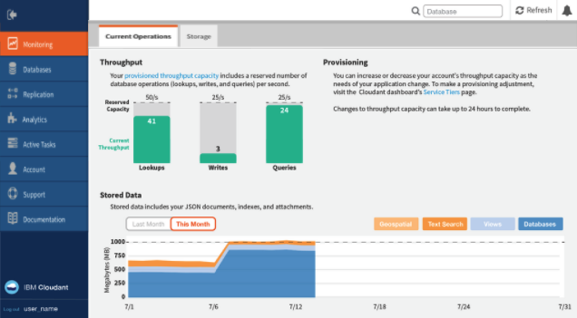

---

copyright:
  years: 2015, 2019
lastupdated: "2019-02-25"

keywords: standard plan, lite plan, dedicated hardware plan, event type, provisioned throughput capacity, consumption, capacity, monitor usage, data usage, size limits, locations, tenancy, authentication methods, high availability, disaster recovery, backup, support

subcollection: cloudant

---

{:new_window: target="_blank"}
{:shortdesc: .shortdesc}
{:screen: .screen}
{:codeblock: .codeblock}
{:pre: .pre}
{:tip: .tip}
{:note: .note}
{:important: .important}
{:deprecated: .deprecated}

<!-- Acrolinx: 2017-05-10 -->

# Plans & Provisioning
{: #ibm-cloud-public}

{{site.data.keyword.cloudantfull}} Public is {{site.data.keyword.cloudant_short_notm}}'s most 
feature-rich offering, receiving updates and new features first. Pricing is based on 
provisioned throughput capacity allocated and data storage used, making it suitable for any 
required load. 
{: shortdesc}

The free [Lite plan](#lite-plan) includes a fixed amount of 
throughput capacity and data for development and evaluation purposes. The paid [Standard plan](#standard-plan) offers configurable provisioned throughput 
capacity and data storage pricing that scales as your application requirements 
change.  An optional [Dedicated Hardware plan](#dedicated-hardware-plan) is also available for an 
additional monthly fee to run one or more of your Standard plan instances 
on a dedicated hardware environment. The dedicated hardware environment 
is for your sole use, and if a Dedicated Hardware plan instance is provisioned 
within a US location, you can optionally select a [HIPAA ](https://en.wikipedia.org/wiki/Health_Insurance_Portability_and_Accountability_Act){: new_window} 
-compliant configuration.

## Plans
{: #plans}

You can select which plan to use when you
[provision your {{site.data.keyword.cloudant_short_notm}} service instance](#provisioning-a-cloudant-nosql-db-instance-on-ibm-cloud).
By default,
the [Lite plan](#lite-plan) is selected.

### Lite plan
{: #lite-plan}

The Lite plan is free, and is designed for development and evaluation purposes. {{site.data.keyword.cloudant_short_notm}}'s full functionality is included, but Lite plan instances have a fixed amount of provisioned throughput capacity and data storage. The provisioned throughput capacity is fixed at 20 reads/sec, 10 writes/sec, and 5 global queries/sec, and data storage is capped at 1 GB. 

Storage usage is checked daily. If you exceed your 1-GB storage limit, requests to the {{site.data.keyword.cloudant_short_notm}} instance receive a 
402 status code with the error message, "Account has exceeded its data usage quota. An upgrade to a paid plan is required."
A banner also appears on the {{site.data.keyword.cloudant_short_notm}} Dashboard. You can still read and delete data. However, to write new data, you have two options. First, you can upgrade to a paid [Standard plan](#standard-plan) that removes the write limitation immediately. Alternatively, you can delete data so that your total storage falls under the 1-GB limit and wait until the next daily storage check runs for your instance to allow writes again. 

If you want to store more than 1 GB of data, or be able to scale provisioned throughput capacity, move to the [Standard plan](#standard-plan).

You are limited to one {{site.data.keyword.cloudant_short_notm}} Lite plan instance per {{site.data.keyword.cloud_notm}} account. If you already have one Lite plan instance, any attempt to create a new Lite plan instance, or change a Standard plan instance to a Lite plan, returns the message, "You can only have one instance of a Lite plan per service. To create a new instance, either delete your existing Lite plan instance or select a paid plan." 
{: note}

### Standard plan
{: #standard-plan}

The {{site.data.keyword.cloudant_short_notm}} Standard plan is available to all paid {{site.data.keyword.cloud}} accounts, either as pay-as-you-go or subscription, and scales to meet the needs of your application. The Standard plan is priced based on two factors: the provisioned throughput capacity that is allocated and the amount of data that is stored in the instance. 

Pricing is pro-rated hourly with a starting provisioned throughput capacity of 100 reads/sec, 50 writes/sec, and 5 global queries/sec equal to a starting cost of USD $0.105/hour. You can toggle the provisioned throughput capacity up or down in increments of 100 reads/sec, 50 writes/sec, and 5 global queries/sec in the {{site.data.keyword.cloudant_short_notm}} Dashboard. Costs are calculated for the provisioned throughput capacity that is allocated and is not on the metered volume of requests. The Standard plan includes 20 GB of data storage. If you store more than 20 GB, you are charged a defined cost per GB per hour. 

See the {{site.data.keyword.cloud_notm}} Pricing Calculator for pricing at different capacities and currencies, and the [pricing](/docs/services/Cloudant/offerings/pricing.html#pricing){: new_window} information for examples to estimate costs.

### Dedicated hardware plan
{: #dedicated-hardware-plan}

An {{site.data.keyword.cloudant_short_notm}} Dedicated Hardware plan instance is a bare metal {{site.data.keyword.cloudant_short_notm}} environment that is provisioned for the sole use of your {{site.data.keyword.cloudant_short_notm}} Standard plan instances. An {{site.data.keyword.cloudant_short_notm}} Dedicated Hardware plan environment can be provisioned in any [{{site.data.keyword.IBM}} data center ](https://www.ibm.com/cloud-computing/bluemix/data-centers). This plan is necessary for HIPAA compliance and must be selected at provisioning time. Users of an {{site.data.keyword.cloudant_short_notm}} Dedicated Hardware plan environment can employ IP whitelisting and bring-your-own-key (BYOK) customer-managed encryption keys with {{site.data.keyword.IBM_notm}} Key Protect. Additionally, Dedicated Hardware environments provisioned after January 1, 2019 include internal endpoints for all Standard plan instances deployed on them. Using internal endpoints allows customers to connect to an {{site.data.keyword.cloudant_short_notm}} instance through the internal {{site.data.keyword.cloud}} network to avoid upstream application traffic from going over the public network and incurring bandwidth charges. For more information, see [Service Endpoint documentation](https://cloud.ibm.com/docs/services/service-endpoint/getting-started.html#about){:new_window} for more details on enabling Service Endpoints for your {{site.data.keyword.cloud}} account.

You can provision one or more Standard plan instances, and the Dedicated Hardware environment expands or contracts as needed based on capacity and data that is used by the Standard plan instances. An {{site.data.keyword.cloudant_short_notm}} Dedicated Hardware plan instance has a fixed price that is an addition to the consumption pricing of any Standard plan instances deployed on it. Billing is prorated daily, and there is a 1-month minimum duration to be charged for the environment. Provisioning of an {{site.data.keyword.cloudant_short_notm}} Dedicated Hardware plan is asynchronous and can take 5-7 business days. To create an {{site.data.keyword.cloudant_short_notm}} Dedicated Hardware plan instance and provision a Standard plan instance on it, follow the [Creating and leveraging an {{site.data.keyword.cloudant_short_notm}} Dedicated Hardware plan instance on {{site.data.keyword.cloud_notm}} ](/docs/services/Cloudant/tutorials/create_dedicated_hardware_plan.html#creating-and-leveraging-a-cloudant-dedicated-hardware-plan-instance-on-bluemix){: new_window} tutorial. 

The Dedicated Hardware plan is not available to {{site.data.keyword.cloud_notm}} Dedicated customers. The Dedicated Hardware plan is only available to {{site.data.keyword.cloud_notm}} Public customers.
{: important}

## Event types
{: #event-types}

Throughput provision is identified and measured as one of the following types of events:

1.	_Reads_,
    (formerly called lookups) which are:
    1. A read of a specific document,
    based on the `_id` of the document.
    2. A _partitioned_ query,
        which is a request that is made to an {{site.data.keyword.cloudant_short_notm}} 
        query endpoint within the `_partition` namespace in the request path,
        including the following types:
        -	Primary Index ([`_all_docs`](/docs/services/Cloudant/api/database.html#get-documents))
        -	MapReduce View ([`_view`](/docs/services/Cloudant/api/creating_views.html#using-views))
        -	Search Index ([`_search`](/docs/services/Cloudant/api/search.html#queries))
        -	{{site.data.keyword.cloudant_short_notm}} Query ([`_find`](/docs/services/Cloudant/api/cloudant_query.html#finding-documents-using-an-index))
    
        The number of read operations consumed by a partitioned query request
        varies depending on the results returned.
2.	_Writes_,
    which are creation,
    modification,
    or deletion of individual documents.
3.	_Global Queries_ to global indexes (formerly called queries),
        which are requests made to an {{site.data.keyword.cloudant_short_notm}} 
        query endpoint **not** within the `_partition` namespace,
    including the following types:
	-	Primary Index ([`_all_docs`](/docs/services/Cloudant/api/database.html#get-documents))
	-	MapReduce View ([`_view`](/docs/services/Cloudant/api/creating_views.html#using-views))
	-	Search Index ([`_search`](/docs/services/Cloudant/api/search.html#queries))
	-	Geospatial Index ([`_geo`](/docs/services/Cloudant/api/cloudant-geo.html#querying-a-cloudant-geo-index))
	-	{{site.data.keyword.cloudant_short_notm}} Query ([`_find`](/docs/services/Cloudant/api/cloudant_query.html#finding-documents-using-an-index))

## Provisioned throughput capacity
{: #provisioned-throughput-capacity}

Throughput provision is identified and measured as events of the following
operation types: _Read_, _Write_, _Global Query_.

The measurement of throughput is a simple count of the number of events of each type,
per second,
where the second is a _sliding_ window.
If your account exceeds the number of throughput events that are provisioned for the plan,
requests are rejected until the number of events within the sliding window
no longer exceeds the number that is provisioned.
It might help to think of the sliding 1-second window as being any consecutive period of 1,000 milliseconds.

For example, the Standard plan is provisioned for 200 reads per second. Your account might consume a maximum of 200 read events during a consecutive period of 1,000 milliseconds (1 second). Subsequent read requests made during the sliding 1,000-millisecond period
are rejected until the number of read events in that period drops to less than 200 again.

When a request is rejected because the number of events is exceeded,
applications receive a [`429` Too Many Requests](/docs/services/Cloudant/api/http.html#http-status-codes)
response.

Recent versions of the supported client libraries (for [Java](/docs/services/Cloudant/libraries/supported.html#java),
[Node.js](/docs/services/Cloudant/libraries/supported.html#node-js),
and [Python](/docs/services/Cloudant/libraries/supported.html#python) languages) help you handle a `429` response.
For example,
the Java library generates a
[`TooManyRequestsException` ](http://static.javadoc.io/com.cloudant/cloudant-client/2.5.1/com/cloudant/client/org/lightcouch/TooManyRequestsException.html){: new_window} response.

By default,
the supported client libraries do not automatically attempt to retry
a request when a `429` response is received.

It is better to ensure that your application handles `429` responses correctly.
The reason is that the number of retries is limited;
regularly transgressing the number of requests is a strong indicator
for moving to a different plan configuration.

If you are porting an existing application, it might not be able to handle a `429` response. As part of your migration verification, check that your application handles `429` responses correctly.
{: note}

In summary,
you must ensure that your application is able to handle a [`429`](/docs/services/Cloudant/api/http.html#http-status-codes) response correctly.

### Consumption of Read operations by partitioned queries
{: #consumption-of-lookup-operations-by-partitioned-queries}

Partitioned query requests consume a variable number of read operations
depending on the results returned. Consumption is based on two axes:

1. The number of rows read from the index involved in the query.
1. The number of documents read from the database, if any, during the execution
    of the query.
    
#### `_all_docs`, view and search queries

Each block of 100 rows read from the index consumes 1 read operation. In
addition, each document read from the database during execution of a query
consumes 1 read unit.

The number of rows read from the index is the same as the number of results
returned. Documents are only read from the database when `include_docs=true` is
passed as a query string parameter during the query request.

Example costs are shown in the table below.

| Number of results | Include documents | Total Read consumption | Consumption for rows read | Consumption for documents read |
|--------------|----------------|-------------|---------------------| --- |
| 199      | No     | **2** | 2 | 0 |
| 199      | Yes     | **201** | 2 | 199 |
| 301      | No     | **4** | 4 | 0 |
| 301      | Yes     | **305** | 4 | 301 |

Reducing use of `include_docs=true` is key for reducing read consumption for
partitioned `_all_docs`, view, and search queries.

#### {{site.data.keyword.cloudant_short_notm}} Query

For {{site.data.keyword.cloudant_short_notm}} Query requests, the number of consumed read operations for index
rows read relates to the rows read from the underlying index _before_ filtering
occurs based on parts of the selector that cannot be satisfied by the index.
This means that the rows read value, and therefore consumed read units, can be
higher than the number of eventual results you receive.

In addition, {{site.data.keyword.cloudant_short_notm}} Query must read the document for every row returned by the
underlying index so it is able to execute further filtering required by the
selector passed to the query.

| Number of results | Number of rows returned by index | Total Read consumption | Consumption for rows read | Consumption for documents read |
|--------------|----------------|-------------|---------------------| --- |
| 5      | 199     | **201** | 2 | 199 |
| 199      | 199     | **201** | 2 | 199 |
| 5      | 301     | **305** | 4 | 301 |
| 301      | 301     | **305** | 4 | 301 |

Using appropriate indexes is key for reducing read consumption for partitioned
{{site.data.keyword.cloudant_short_notm}} Query queries.

### Viewing and changing capacity
{: #viewing-and-changing-capacity}

You can see details of the throughput capacity within the plans available for your account.
You can select the level of provisioning that you want to use,
through the Account tab of your {{site.data.keyword.cloudant_short_notm}} account dashboard.

To move to a different throughput capacity, select the provisioning you 
want, then click `Update`. You are asked to confirm the change, 
and reminded that the provisioning change can take up to 24 hours to 
complete.

The size of the capacity increase is limited to 10 units (1000 reads/second, 500 writes/second, and 50 global queries/second) per change. Decreases are not limited by the number of units. Any change in capacity, either an increase or a decrease, is limited to once per hour. If you require more capacity than is available on the {{site.data.keyword.cloudant_short_notm}} dashboard, contact [{{site.data.keyword.cloudant_short_notm}} support ](mailto:support@cloudant.com){: new_window}.
{: note}

### Monitoring usage 
{: #monitoring-usage}

Information about your usage is available in the Current Operations pane of the Monitoring tab within your {{site.data.keyword.cloudant_short_notm}} dashboard. 

Details are provided there,
illustrating your current [throughput](#provisioned-throughput-capacity),
and quantity of [stored data](#disk-space-included).

Monitoring helps you recognize that a change to the provisioning in your plan might be advisable.
For example,
if you frequently approach the maximum number of database reads,
then you can modify the provisioning through the [Service pane](#servicetier) on the Account tab of the dashboard.

## Data usage
{: #data-usage}

### Disk space included
{: #disk-space-included}

This value is the storage capacity that is included in the plan.
It is used for both data and index storage.

### Disk overage
{: #disk-overage}

All Standard and Lite plans include disk space, which
is used for JSON data, attachments, and indexes. All Standard and Lite plans are monitored for disk space used. When you use more data than the
plan allocates, you can expect the conditions described in the following table to apply:

<table>

<tr>
<th id="disk-overage-plan">Plan</th><th id="description">Description</th>
</tr>
<tr>
<th headers="standard-plan">Standard</td>
<td headers="description">

<ul><li>If the account uses more than the amount of storage that is alloted in your plan configuration, it is considered to 'overflow'. Overflow causes the account to be billed at the indicated price for each extra GB used beyond the plan allocation.</li>
<li>The extra money you must pay, for using more disk space than is provided in the plan, is called an 'overage'. An overage is calculated on an hourly basis.</li></ul>
</td>
</tr>
<tr>
<th headers="lite-plan">Lite</td>
<td headers="description">

<ul><li>Disk usage is capped on the Lite plan. After you reach the cap, you cannot write new data. To write new data, you must either upgrade to the Standard plan or delete data and wait until the next check runs for your account to be reactivated.

</li></ul></td>
</tr>
</table>

For example, assume that your Standard plan increases disk usage to 107 GB for half a day (12 hours). This change means that your instance caused overflow of 87 GB more than the 20 GB plan allocation, for 12 hours.
Therefore, you would be billed an overage charge based on 87 GB x 12 hours = 1044 GB hours for that extra space.

Overage is calculated by using the maximum number of GB more than the plan allocation during a particular hour within the billing cycle.

### Disk overage example
{: #disk-overage-example}

Assume that you start a month of 30 days with a Standard plan service instance that uses 9 GB of storage.
Next,
your storage increases to 21.5 GB for 15 minutes during the hour beginning at 02:00 of day 3.
The instance drops back to 9.5 GB for the next 10 minutes of hour 02:00,
then increases to 108 GB for the next 25 minutes of hour 02:00.
Finally,
your instance finishes the hour and indeed the rest of the month by dropping down to 28 GB.

This pattern means the maximum number of GB more than the plan allocation was 88 GB during hour 2 of day 3.
For hour 03:00 of day 3,
and for the rest of the month,
your instance was 8 GB more than the plan allocation.

Therefore,
for hour 02:00 of day 3,
your bill includes an overage based on 88 GB x 1 hour = 88 GB hours.

For hour 03:00 of day 3 to the end of day 3,
your bill includes an overage based on 8 GB x 21 hours = 168 GB hours.

For hour 00:00 of day 4 to the end of the month (of 30 days),
your bill includes an overage based on 8 GB x 24 hours x 27 days = 5184 GB hours.

The total overage bill for the month is based on a total of 88 + 168 + 5184 = 5440 GB hours.

## Request and document size limits
{: #request-and-document-size-limits}

{{site.data.keyword.cloudant_short_notm}} JSON documents and requests have the 
following maximum size limits: 

Limit | Maximum Size
------|-------------
Individual Document Size | 1 MB
Single Attachment Size | 10 MB
Request Body Size | 11 MB

Exceeding any of these limits results in a [413 response](/docs/services/Cloudant/api/http.html#http-status-codes).

It is recommended that you store binary attachments, or large JSON blobs, 
in object storage and save a link to the location in an {{site.data.keyword.cloudant_short_notm}} JSON document.   

When you replicate, documents or attachments larger than these limits do not 
replicate to the target database. More information about how to detect replication
errors is available [here](/docs/services/Cloudant/api/replication.html#replication-errors).

## Locations and tenancy
{: #locations-and-tenancy}

By default, all Lite and Standard plans are deployed on multi-tenant 
environments. As part of your plan selection, you can choose from the 
following {{site.data.keyword.cloud_notm}} Public regions:

-   Washington DC
-   Dallas
-   London
-   Sydney
-   Frankfurt&Dagger;
-   Tokyo

Dedicated Hardware plan instances can be deployed in most 
[{{site.data.keyword.IBM_notm}} data center locations ](https://www.ibm.com/cloud-computing/bluemix/data-centers). 
See the drop-down menu in the {{site.data.keyword.cloud_notm}} catalog for an up-to-date list of available locations.

&Dagger;All {{site.data.keyword.cloudant_short_notm}} instances that are deployed from the 
{{site.data.keyword.cloud_notm}} Public Frankfurt region 
deploy in EU-managed environments. Any {{site.data.keyword.cloudant_short_notm}} 
account or API key that is generated 
outside of an EU-managed environment cannot be granted access to an EU-managed 
{{site.data.keyword.cloudant_short_notm}} instance.

## Authentication methods
{: #authentication-methods}

{{site.data.keyword.cloudant_short_notm}} is accessed by using an HTTPS API. Where the API endpoint requires it, the user is authenticated for every HTTPS request {{site.data.keyword.cloudant_short_notm}} receives. During provisioning, the available authentication methods include 'Use both legacy credentials and IAM' or 'Use only IAM'. For more information, see the [IAM guide](/docs/services/Cloudant/guides/iam.html){: new_window} or the legacy [Authentication API document](/docs/services/Cloudant/api/authentication.html){: new_window}.

After provisioning an {{site.data.keyword.cloudant_short_notm}} instance, the connection URL and IAM authorization details can be found when generating new credentials in the Service Credentials tab of the {{site.data.keyword.cloud_notm}} dashboard. If you chose this option during provisioning, the {{site.data.keyword.cloudant_short_notm}} legacy user name and password is also included.

The {{site.data.keyword.cloudant_short_notm}} team recommends that you use IAM access controls for authentication whenever possible. If you are using {{site.data.keyword.cloudant_short_notm}} legacy authentication, it is recommended that you use [API keys](/docs/services/Cloudant/api/authorization.html#api-keys){: new_window} rather than account-level credentials for programmatic access and replication jobs. 
{: important}

## High availability, disaster recovery, and backup
{: #high-availability-disaster-recovery-and-backup}

To provide high availability (HA) and disaster recovery (DR) within a data center, all data is 
stored in triplicate across three separate physical servers in a cluster. You can provision 
accounts in multiple data centers, then use continuous data replication to provide HA/DR across 
data centers. {{site.data.keyword.cloudant_short_notm}} data is not automatically backed up, but supported tools are provided to handle backups. Review the 
[Disaster Recovery and Backup guide ](https://console.bluemix.net/docs/services/Cloudant/guides/disaster-recovery-and-backup.html#disaster-recovery-and-backup) 
to explore all HA, DR, and backup considerations to meet your application requirements. 

## Support
{: #support}

Support for Standard and Dedicated plan service instances is optional.
It is provided by purchasing *{{site.data.keyword.cloud_notm}} Standard Support*. Support is not available for the Lite plan.

For more information about support plans, see the [{{site.data.keyword.cloud_notm}} Standard Support plans ](https://www.ibm.com/cloud/support#944376){: new_window}. For more information about support, see the [{{site.data.keyword.IBM_notm}} support guide ](https://www.ibm.com/support/home/pages/support-guide/){: new_window}.

The support systems used for {{site.data.keyword.cloudant_short_notm}} do not offer features for the protection of content that contains Healthcare Information, health data, Protected Health Information, or data that is subject to additional regulatory requirements. As such, the Client must not enter or provide such data.
{: note}

## Provisioning an {{site.data.keyword.cloudant_short_notm}} instance on {{site.data.keyword.cloud_notm}}
{: #provisioning-a-cloudant-nosql-db-instance-on-ibm-cloud}

You can provision an {{site.data.keyword.cloudant_short_notm}} Lite or Standard plan instance on {{site.data.keyword.cloud_notm}} in two ways:

- Using the dashboard. A tutorial that describes the process is available [here ](https://console.bluemix.net/docs/services/Cloudant/tutorials/create_service.html#creating-a-cloudant-instance-on-bluemix){: new_window}.
- Using the Cloud Foundry command tool. A tutorial that describes the process is available [here ](https://console.bluemix.net/docs/services/Cloudant/tutorials/create_service_cli.html#creating-a-cloudant-instance-on-bluemix-using-the-cloud-foundry-tools){: new_window}.
 
To create and leverage an {{site.data.keyword.cloudant_short_notm}} Dedicated Hardware plan instance, follow the tutorial describing the process [here ](https://console.bluemix.net/docs/services/Cloudant/tutorials/create_dedicated_hardware_plan.html#creating-and-leveraging-a-cloudant-dedicated-hardware-plan-instance-on-bluemix){: new_window}.

