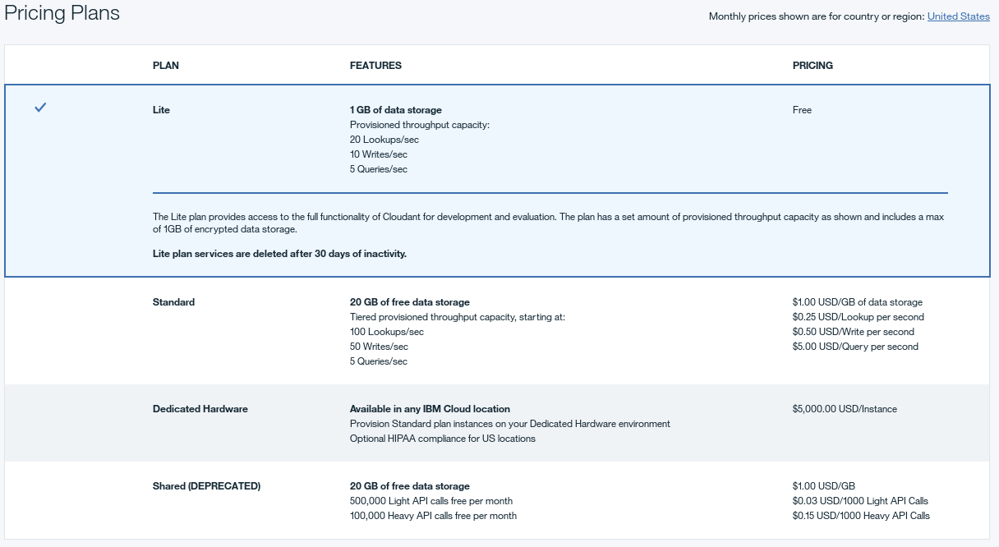

---

copyright:
  years: 2015, 2018
lastupdated: "2018-04-11"

---

{:new_window: target="_blank"}
{:shortdesc: .shortdesc}
{:screen: .screen}
{:codeblock: .codeblock}
{:pre: .pre}

<!-- Acrolinx: 2017-02-23 -->

# {{site.data.keyword.Bluemix_notm}} Public
{: #ibm-cloud-public}

{{site.data.keyword.cloudantfull}} Public is {{site.data.keyword.cloudant_short_notm}}'s most 
feature-rich offering, receiving updates and new features first. Pricing is based on 
your throughput and storage requirements, making it suitable for any 
required load. 

There is a free [Lite plan](#lite-plan) with a fixed amount of 
throughput capacity and data for development and evaluation purposes. There 
is also a paid [Standard plan](#standard-plan) which offers configurable provisioned throughput 
capacity and data storage pricing that scales as your application requirements 
change.  An optional [Dedicated Hardware plan](#dedicated-hardware-plan) is also available for an 
additional monthly fee to run one or more of your Standard plan instances 
on a dedicated hardware environment. The dedicated hardware environment 
is for your sole use, and if a Dedicated Hardware plan instance is provisioned 
within a US location, you can optionally select a [HIPAA ](https://en.wikipedia.org/wiki/Health_Insurance_Portability_and_Accountability_Act){:new_window} 
compliant configuration.

The following table summarizes the provisioned throughput capacity and disk 
space configuration for the plans:

<table border='1'>

<tr>
<th>Plans</th><th>Lite</th><th colspan='4'>Standard</th>
</tr>
<tr>
<td>Base Price (per hour)</td>
<td>$0.00</td>
<td colspan='4'>See <a href="https://www.ibm.com/cloud/cloudant/pricing" target="_blank">Pricing details </a>.</td>
</tr>
<tr>
<td>Provisioned Throughput Capacity (Lookups per second)</td>
<td>20</td>
<td>100</td>
<td>1,000</td>
<td>5,000</td>
<td>20,000</td>
</tr>
<tr>
<td>Provisioned Throughput Capacity (Writes per second)</td>
<td>10</td>
<td>50</td>
<td>500</td>
<td>2,500</td>
<td>10,000</td>
</tr>
<tr>
<td>Provisioned Throughput Capacity (Queries per second)</td>
<td>5</td>
<td>5</td>
<td>50</td>
<td>250</td>
<td>1,000</td>
</tr>
<tr>
<td>Disk Space Included</td>
<td>1 GB</td>
<td colspan='4'>20 GB</td>
</tr>
<tr>
<td>Disk Overage (per GB/hour)</td>
<td>Not available</td>
<td colspan='4'>See <a href="https://www.ibm.com/cloud/cloudant/pricing" target="_blank">Pricing details </a>.</td>
</tr>

</table>

## Plans

You can select which plan to use when you
[provision your {{site.data.keyword.cloudant_short_notm}} service instance](#provisioning-a-cloudant-instance-on-bluemix).
By default,
the [Lite plan](#lite-plan) is selected.

### Lite plan

The Lite plan is free,
but limits you to a maximum of 1 GB of data storage.
Limits also apply to the provisioned throughput capacity for lookups,
writes, and queries. 

Storage usage is checked daily. If you exceed your storage limit, HTTP requests to the account receive a 
402 status code with the error message, "Account has exceeded its data usage quota. An upgrade to a paid plan is required."
A banner also appears on the {{site.data.keyword.cloudant_short_notm}} dashboard to inform you. You can still read and delete data. However, to write new data, 
you must either upgrade to a paid account or delete data and wait until the next check runs for your account to be reactivated. 

If you would like to store more than one GB of data,
or to have a greater throughput capacity,
move to the [Standard plan](#standard-plan).

### Standard plan

The Standard plan includes 20 GB of data storage.
If you store more than 20 GB,
you are charged a defined cost per GB per hour.
See the [Pricing ](https://www.ibm.com/cloud/cloudant/pricing){:new_window} information for the current cost.
On the Standard plan,
you can also change the amount of provisioned throughput capacity for lookups,
writes,
and queries.

### Dedicated hardware plan

You can optionally run your Standard plan instances on a dedicated hardware environment in 
any [{{site.data.keyword.IBM}} data center ](https://www.ibm.com/cloud-computing/bluemix/data-centers) 
for a monthly fee. You purchase a single dedicated hardware plan for a given location 
and can provision one or more Standard plan instances on it. This plan is necessary for 
HIPAA compliance and must be selected at provisioning time. Note that the Dedicated 
Hardware plan is not available to {{site.data.keyword.Bluemix_notm}} Dedicated customers and is only available for {{site.data.keyword.Bluemix_notm}} 
Public customers.

If you require bring-your-own-key (BYOK) for encryption-at-rest, this is enabled via {{site.data.keyword.cloud}} Key 
Protect. {{site.data.keyword.cloudant_short_notm}} supports this feature for new {{site.data.keyword.cloudant_short_notm}} 
[Dedicated hardware plan](https://console.bluemix.net/docs/services/Cloudant/offerings/bluemix.html#ibm-cloud-public) 
instances deployed in all regions. First, create an instance of the Dedicated 
Hardware plan via the [{{site.data.keyword.cloud_notm}} Catalog](https://console.bluemix.net/catalog/). Then submit a 
support ticket and our support team will coordinate getting your new Dedicated Hardware instance's 
encryption-at-rest encryption keys managed via your Key Protect instance.

## Provisioned throughput capacity
{: #provisioned-throughput-capacity}
Throughput provision is identified and measured as one of three kinds of events:

1.	A lookup,
    which is a read of a specific document,
    based on the `_id` of the document.
2.	A write,
    which is the creation,
    modification,
    or deletion of an individual document,
    or any update due to an index build.
3.	A query,
    which is a request made to one of the {{site.data.keyword.cloudant_short_notm}} query endpoints,
    including the following types:
	-	Primary Index ([`_all_docs`](../api/database.html#get-documents))
	-	MapReduce View ([`_view`](../api/creating_views.html#using-views))
	-	Search Index ([`_search`](../api/search.html#queries))
	-	Geospatial Index ([`_geo`](../api/cloudant-geo.html#querying-a-cloudant-geo-index))
	-	{{site.data.keyword.cloudant_short_notm}} Query ([`_find`](../api/cloudant_query.html#finding-documents-using-an-index))

The measurement of throughput is a simple count of the number of events of each type,
per second,
where the second is a _sliding_ window.
If your account exceeds the number of throughput events that are provisioned for the plan,
requests are rejected until the number of events within the sliding window
no longer exceeds the number that is provisioned.
It might help to think of the sliding 1-second window as being any consecutive period of 1,000 milliseconds.

For example,
if you are on the Standard plan with provision for 200 lookups per second,
your account might make a maximum of 200 lookup requests during a consecutive period of 1,000 milliseconds (1 second).
Subsequent lookup requests made during the sliding 1,000-millisecond period
are rejected until the number of lookup requests in that period drops to less than 200 again.

When a request is rejected because the number of events is exceeded,
applications receive a [`429` Too Many Requests](../api/http.html#429)
response.

Recent versions of the supported client libraries (for [Java](../libraries/supported.html#java),
[Node.js](../libraries/supported.html#node-js),
and [Python](../libraries/supported.html#python) languages) help you handle a `429` response.
For example,
the Java library throws a
[`TooManyRequestsException` ](http://static.javadoc.io/com.cloudant/cloudant-client/2.5.1/com/cloudant/client/org/lightcouch/TooManyRequestsException.html){:new_window}.

By default,
the supported client libraries do not automatically attempt to retry
a request when a `429` response is received.

It is better to ensure that your application handles `429` responses correctly.
The reason is that the number of retries is limited;
regularly transgressing the number of requests is a strong indicator
for moving to a different plan configuration.

>   **Note**: If you are porting an existing application,
    it might not be able to handle a `429` response.
    As part of your migration verification,
    check that your application handles `429` responses correctly.

In summary,
you must ensure that your application is able to handle a [`429`](../api/http.html#429) response correctly.

### Viewing and changing capacity

You can see details of the throughput capacity within the plans available for your account.
You can select the level of provisioning that you want to use,
through the Account tab of your {{site.data.keyword.cloudant_short_notm}} account Dashboard.

To move to a different throughput capacity,
select the provisioning you want,
then click the `Change Capacity` option button.
You are asked to confirm the change,
and reminded that the provisioning change can take up to 24 hours to complete.

### Monitoring usage 

Information about your usage is available in the Current Operations pane of the Monitoring tab within your {{site.data.keyword.cloudant_short_notm}} Dashboard. 

Details are provided there,
illustrating your current [throughput](#provisioned-throughput-capacity),
and quantity of [stored data](#disk-space-included).

Monitoring helps you recognize that a change to the provisioning in your plan might be advisable.
For example,
if you frequently approach the maximum number of database lookups,
then you can modify the provisioning through the [Service pane](#servicetier) on the Account tab of the Dashboard.

## Data usage

### Disk space included

This value is the storage capacity included in the plan.
It is used for both data and index storage.

### Disk overage

All Standard and Lite plan service instances are monitored for disk space used.
If the account uses more than the amount of storage that is provided in your plan configuration,
it is considered to 'overflow'.
Overflow causes the account to be billed at the indicated price for each extra GB used beyond the plan allocation.

The extra amount of money that you must pay for using more disk space than is provided in the plan is called an 'overage'.
Overage is calculated on an hourly basis.
It is not possible to overflow the disk space available in the Lite plan.

For example,
assume that your Standard plan instance increases disk usage to 107 GB for half a day (12 hours).
This change means that your instance caused overflow of 87 GB more than the 20 GB plan allocation,
for 12 hours.
Therefore,
you would be billed an overage charge based on 87 GB x 12 hours = 1044 GB hours for that extra space.

Overage is calculated by using the maximum number of GB more than the plan allocation during a particular hour within the billing cycle.

### Disk overage example

Assume that you start a month of 30 days with a Standard plan service instance that uses 9 GB of storage.
Next,
your storage increases to 21.5 GB for 15 minutes during the hour beginning at 02:00 of day 3.
The instance drops back to 9.5 GB for the next 10 minutes of hour 02:00,
then increases to 108 GB for the next 25 minutes of hour 02:00.
Finally,
your instance finishes the hour and indeed the rest of the month by dropping down to 28 GB.

This pattern means the maximum number of GB more than the plan allocation was 88 GB during hour 2 of day 3.
For hour 03:00 of day 3,
and for the rest of the month,
your instance was 8 GB more than the plan allocation.

Therefore,
for hour 02:00 of day 3,
you will be billed an overage based on 88 GB x 1 hour = 88 GB hours.

For hour 03:00 of day 3 to the end of day 3,
you will be billed an overage based on 8 GB x 21 hours = 168 GB hours.

For hour 00:00 of day 4 to the end of the month (of 30 days),
you will be billed an overage based on 8 GB x 24 hours x 27 days = 5184 GB hours.

The total overage bill for the month would be based on a total of 88 + 168 + 5184 = 5440 GB hours.

## Request and document size limits

{{site.data.keyword.cloudant_short_notm}} JSON documents and requests have the 
following maximum size limits: 

Limit | Maximum Size
------|-------------
Individual Document Size | 1 MB
Single Attachment Size | 10 MB
Request Body Size | 11 MB

Exceeding any of these limits results in a [413 response](../api/http.html#413).

It is recommended that you store binary attachments, or large JSON blobs, 
in object storage and save a link to the location in a 
{{site.data.keyword.cloudant_short_notm}} JSON document.   

When replicating, documents or attachments larger than these limits will not be 
replicated to the target database. More information about how to detect replication
errors is available [here](../api/replication.html#replication-errors).

## Locations and tenancy

By default, all Lite and Standard plans are deployed on multi-tenant 
environments. As part of your plan selection, you can choose from the 
following {{site.data.keyword.Bluemix_notm}} Public regions:

-   US East
-   US South
-   United Kingdom
-   Sydney
-   Germany&Dagger;

Dedicated Hardware plan instances can be deployed in most 
[{{site.data.keyword.IBM_notm}} data center locations ](https://www.ibm.com/cloud-computing/bluemix/data-centers). 
See the drop-down menu in the {{site.data.keyword.Bluemix_notm}} catalog for an up-to-date list of available locations.

&Dagger;All {{site.data.keyword.cloudant_short_notm}} instances deployed from the 
{{site.data.keyword.Bluemix_notm}} Public Germany region will be 
deployed in EU-managed environments. Any {{site.data.keyword.cloudant_short_notm}} 
account or API key generated 
outside of an EU-managed environment cannot be granted access to an EU-managed 
{{site.data.keyword.cloudant_short_notm}} instance.

## Security, encryption, and compliance

All plans are provided on servers with
[at-rest ](https://en.wikipedia.org/wiki/Data_at_rest){:new_window} disk encryption.
Access is encrypted over a network connection by using HTTPS.
For more detail,
see [{{site.data.keyword.Bluemix_notm}} Security ](https://console.bluemix.net/docs/services/Cloudant/offerings/security.html#security){:new_window}.

The plans also offer
[Security Compliance Certification ](https://cloudant.com/product/cloudant-features/cloudant-compliance/){:new_window}.
[HIPAA ](https://en.wikipedia.org/wiki/Health_Insurance_Portability_and_Accountability_Act){:new_window}
compliance requires a [Dedicated environment](#dedicated-hardware-plan),
so request this environment as part of the [provisioning process](#provisioning-a-cloudant-instance-on-bluemix).

If you require bring-your-own-key (BYOK) for encryption-at-rest, this is enabled via {{site.data.keyword.cloud}} Key 
Protect. {{site.data.keyword.cloudant_short_notm}} supports this feature for new {{site.data.keyword.cloudant_short_notm}} 
[Dedicated Hardware plan](https://console.bluemix.net/docs/services/Cloudant/offerings/bluemix.html#ibm-cloud-public) 
instances deployed in all regions. First, create an instance of the Dedicated 
Hardware plan via the [{{site.data.keyword.cloud_notm}} Catalog](https://console.bluemix.net/catalog/). Then submit a 
support ticket and our support team will coordinate getting your new Dedicated Hardware instance's 
encryption-at-rest encryption keys managed via your Key Protect instance.

## High availability, disaster recovery, and backup

To provide high availability (HA) and disaster recovery (DR) within a data center, all data is 
stored in triplicate across three separate physical servers in a cluster. You can provision 
accounts in multiple data centers, then use continuous data replication to provide HA/DR across 
data centers. {{site.data.keyword.cloudant_short_notm}} data is not automatically backed up, but supported tooling is 
provided to handle backups. Review the 
[Disaster Recovery and Backup guide ](https://console.bluemix.net/docs/services/Cloudant/guides/disaster-recovery-and-backup.html#disaster-recovery-and-backup) 
to explore all HA, DR, and backup considerations to meet your application requirements. 

## Support

Support for Standard and Dedicated plan service instances is optional.
It is provided by purchasing "{{site.data.keyword.Bluemix}} Standard Support".
Support is not available for the Lite plan.

A pricing calculator for {{site.data.keyword.Bluemix_notm}} Standard Support is available
[here ](https://console.ng.bluemix.net/?direct=classic/#/pricing/cloudOEPaneId=pricing&paneId=pricingSheet){:new_window}.
Information about the details of the Support Service Level Agreement (SLA) is available
[here ](http://www-03.ibm.com/software/sla/sladb.nsf/pdf/6606-08/$file/i126-6606-08_05-2016_en_US.pdf){:new_window}.

## Provisioning a {{site.data.keyword.cloudant_short_notm}} instance on {{site.data.keyword.Bluemix_notm}}

You can provision a {{site.data.keyword.cloudant_short_notm}} Lite or Standard plan instance on {{site.data.keyword.Bluemix}} in two ways:

- Using the Dashboard. A tutorial describing the process is available [here ](https://console.bluemix.net/docs/services/Cloudant/tutorials/create_service.html#creating-a-cloudant-instance-on-bluemix){:new_window}.
- Using the Cloud Foundry command tool. A tutorial describing the process is available [here ](https://console.bluemix.net/docs/services/Cloudant/tutorials/create_service_cli.html#creating-a-cloudant-instance-on-bluemix-using-the-cloud-foundry-tools){:new_window}.
 
To create and leverage a {{site.data.keyword.cloudant_short_notm}} Dedicated Hardware plan instance, follow the tutorial describing the process [here ](https://console.bluemix.net/docs/services/Cloudant/tutorials/create_dedicated_hardware_plan.html#creating-and-leveraging-a-cloudant-dedicated-hardware-plan-instance-on-bluemix){:new_window}.

