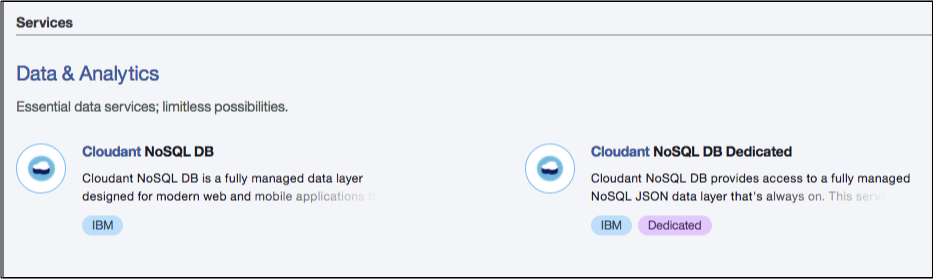

---

copyright:
  years: 2015, 2020
lastupdated: "2020-04-08"

keywords: hardware capacity, location, tenancy, security, encryption, compliance, high availability, disaster recovery, backup

subcollection: cloudant

---

{:new_window: target="_blank"}
{:shortdesc: .shortdesc}
{:screen: .screen}
{:codeblock: .codeblock}
{:pre: .pre}
{:tip: .tip}
{:note: .note}
{:important: .important}
{:deprecated: .deprecated}
{:external: target="_blank" .external}

<!-- Acrolinx: 2020-03-16 -->

# {{site.data.keyword.cloud_notm}} Dedicated
{: #ibm-cloud-dedicated}

{{site.data.keyword.cloudantfull}} for ({{site.data.keyword.cloud}} Dedicated) is 
an optional add-on to an {{site.data.keyword.cloud_notm}} Dedicated environment. The optional add-on for 
{{site.data.keyword.cloudant_short_notm}} Dedicated in {{site.data.keyword.cloud_notm}} Dedicated is priced based on the hardware capacity that is 
allocated to the environment. You can buy it by contacting your {{site.data.keyword.IBM}} sales representative.  
{: shortdesc}

{{site.data.keyword.cloud_notm}} Dedicated customers can also choose to use {{site.data.keyword.cloudant_short_notm}} in {{site.data.keyword.cloud_notm}} Public 
via the syndicated catalog, including the Lite and Standard plan instances. {{site.data.keyword.cloud_notm}} Dedicated users aren't eligible to buy the Dedicated Hardware plan from the 
{{site.data.keyword.cloud_notm}} Public catalog. {{site.data.keyword.cloud_notm}} Dedicated users must leverage {{site.data.keyword.cloudant_short_notm}} Dedicated on 
{{site.data.keyword.cloud_notm}} Dedicated if dedicated hardware is required.   

The following screen capture shows where you select the Dedicated Hardware plan on the {{site.data.keyword.cloud_notm}} Dashboard when you create a resource.  

{: caption="Figure 1. {{site.data.keyword.cloudant_short_notm}} Dedicated Hardware plan" caption-side="bottom"}

## Hardware capacity 
{: #hardware-capacity}

{{site.data.keyword.cloudant_short_notm}} within {{site.data.keyword.cloud_notm}} Dedicated is purchased via an "{{site.data.keyword.cloud_notm}} Dedicated 
{{site.data.keyword.cloudant_short_notm}} 1.6 TB Capacity" part, which includes a clustered {{site.data.keyword.cloudant_short_notm}} environment 
that consists of three database nodes and two load balancers. Each database node 
includes 1.6 TB on SSDs, and since all data is stored in triplicate, this
storage equates to 1.6 TB of unique disk space across the cluster. Expansion of an 
environment can be accomplished by buying more "{{site.data.keyword.cloud_notm}} Dedicated 
{{site.data.keyword.cloudant_short_notm}} 1.6 TB Capacity" parts, which can be used to expand the 
{{site.data.keyword.cloudant_short_notm}} cluster in multiples of three database nodes. Customers can also 
choose to have multiple separate {{site.data.keyword.cloudant_short_notm}} environments rather than 
expanding a single environment.

## Locations and tenancy in a Dedicated environment
{: #locations-and-tenancy-in-a-dedicated-environment}

The {{site.data.keyword.cloudant_short_notm}} Dedicated environment within an {{site.data.keyword.cloud_notm}} Dedicated environment is on hardware 
that is designated for sole use by the {{site.data.keyword.cloud_notm}} Dedicated customer. The customer can provision 
one or more instances of {{site.data.keyword.cloudant_short_notm}} on the specific environment, and each instance of {{site.data.keyword.cloudant_short_notm}} 
shares the underlying hardware resources that make up the {{site.data.keyword.cloudant_short_notm}} environment. 

## Security, encryption, and compliance 
{: #security-encryption-and-compliance}

All plans are provided on servers with [at rest](https://en.wikipedia.org/wiki/Data_at_rest){: new_window}{: external}
disk encryption. Access is over the public network connection and encrypted by 
using HTTPS. For more detail, see [Security](/docs/Cloudant?topic=cloudant-security#security){: new_window}{: external}. 
IP whitelisting is available upon request to {{site.data.keyword.cloudant_short_notm}} Support and applies to 
the whole {{site.data.keyword.cloudant_short_notm}} environment, and not at the instance level.  

The plan also offers [Compliance Certification](/docs/Cloudant?topic=cloudant-compliance#compliance). 

[HIPAA](https://en.wikipedia.org/wiki/Health_Insurance_Portability_and_Accountability_Act){: new_window}{: external} 
compliance is available upon request, so request HIPAA compliance during the purchase process with an {{site.data.keyword.IBM_notm}} sales representative. 

## High availability, disaster recovery, and backup 
{: #high-availability-disaster-recovery-and-backup}

To provide high availability (HA) and disaster recovery (DR) within a data center, all data is stored in triplicate 
across three separate physical servers in a cluster. When available, you can provision accounts in multiple locations, 
then use continuous data replication to provide HA/DR across data centers. {{site.data.keyword.cloudant_short_notm}} data isn't automatically 
backed up, but supported tooling is provided to handle backups. Review the 
[Disaster recovery and backup](/docs/Cloudant?topic=cloudant-disaster-recovery-and-backup#disaster-recovery-and-backup) guide
to explore all HA, DR, and backup considerations to meet your application requirements.
