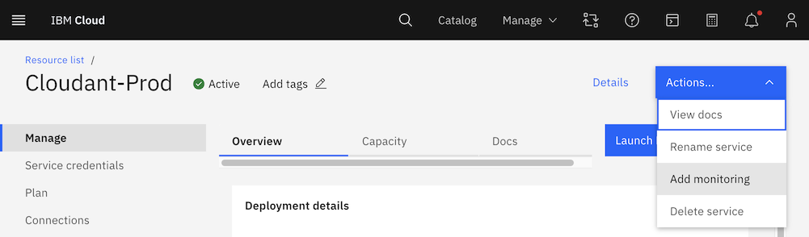
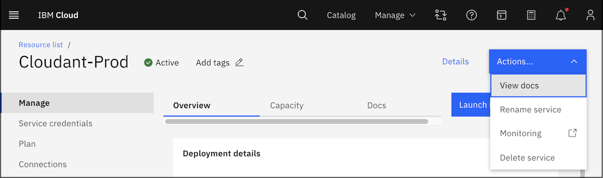
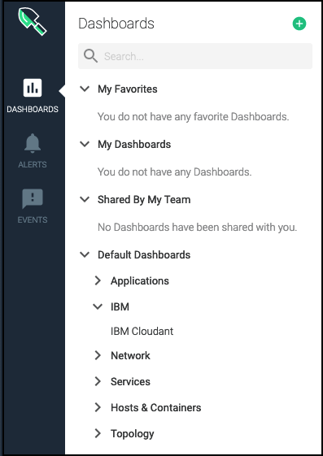

---

copyright:
  years: 2020, 2023
lastupdated: "2023-01-03"

keywords: cloud monitoring, monitoring, platform metrics, observability page, enable platform metrics, view metrics, launch monitoring

subcollection: Cloudant

---

{{site.data.keyword.attribute-definition-list}}

# {{site.data.keyword.mon_full_notm}} integration
{: #monitor-ibm-cloud-pm}

{{site.data.keyword.mon_full}} is a third-party, cloud-native, and container-intelligent management system that you can include as part of your {{site.data.keyword.cloud}} architecture. Use it to gain operational visibility into the performance and health of your applications, services, and platforms. It offers administrators, DevOps teams, and developers full-stack telemetry with advanced features to monitor and troubleshoot, define alerts, and design custom dashboards.
{: shortdesc}

Currently, {{site.data.keyword.mon_full_notm}} integration is available for {{site.data.keyword.cloudant_short_notm}} deployments according to the following table:

| Deployment Region | {{site.data.keyword.mon_full_notm}} Region |
|----------|-----------|
| `Chennai` | `Tokyo` |
| `Dallas` | `Dallas` |
| `Frankfurt` | `Frankfurt` |
| `London` | `London` |
| `Osaka` | `Osaka` |
| `São Paulo` | `São Paulo` |
| `Seoul` | `Tokyo` |
| `Sydney` | `Sydney` |
| `Tokyo` | `Tokyo` |
| `Washington DC` | `Washington DC` |
{: caption="Table 1. {{site.data.keyword.mon_full_notm}} regions" caption-side="top"}

## Platform metrics overview
{: #platform_metrics-pm}

You can configure only one instance of the {{site.data.keyword.mon_full}} service per region to collect platform metrics.
- To configure the Monitoring instance, you must turn on the *platform metrics* configuration setting.
- If a Monitoring instance in a region is already enabled to collect platform metrics, metrics from enabled-monitoring services are collected automatically and available for monitoring through this instance. For more information about enabled-monitoring services, see [{{site.data.keyword.cloud}} services](https://www.ibm.com/cloud/services).

To monitor platform metrics, check that the Monitoring instance is provisioned in the same region where the {{site.data.keyword.cloud_notm}} instance is provisioned.
{: important}

## Enabling platform metrics from the {{site.data.keyword.cloud_notm}} Dashboard
{: #enable_platform_metrics-pm}

Complete the following steps to configure platform metrics:

1. Log in to {{site.data.keyword.cloud_notm}}.

    The {{site.data.keyword.cloud_notm}} Dashboard opens.

2. Click **View all** in the Resource summary section of the dashboard.

3. In the *Services* section, click the {{site.data.keyword.cloud_notm}} instance that you plan to monitor.

    The {{site.data.keyword.cloud_notm}} UI *Manage* page opens.

4. Click **Actions** > **Add monitoring** to configure *platform metrics* in the region of your {{site.data.keyword.cloud_notm}} instance.

    If the menu choices include the **Monitoring** option, then your instance is already configured for platform metrics.
    {: note}

    {: caption="Figure 1. Monitoring menu" caption-side="bottom"}

5. Provision an instance of the {{site.data.keyword.mon_full_notm}} service.

   After you provision the Monitoring instance, the *Observability* page opens. To continue working with {{site.data.keyword.cloud_notm}}, go back to the {{site.data.keyword.cloud_notm}} UI.
   {: note}

## Viewing metrics
{: #view_metrics}

To monitor {{site.data.keyword.cloudant_short_notm}} metrics, you must launch the {{site.data.keyword.mon_full_notm}} web UI instance that is enabled for platform metrics in the region where your {{site.data.keyword.cloud_notm}} instance is available.
{: important}

You can use different options to launch the {{site.data.keyword.mon_full_notm}} web UI and monitor metrics that are described in the following section.

### Launching {{site.data.keyword.mon_full_notm}} web UI from the {{site.data.keyword.cloudant_short_notm}} Dashboard
{: #view_metrics_opt1}

Complete the following steps to launch the {{site.data.keyword.mon_full_notm}} web UI from the {{site.data.keyword.cloud_notm}} Dashboard:

1. Log in to {{site.data.keyword.cloud_notm}}.

    The {{site.data.keyword.cloud_notm}} Dashboard opens.

2. Click **View all** in the Resource summary section of the dashboard.

3. In the *Services* section, click the {{site.data.keyword.cloudant_short_notm}} instance that you plan to monitor.

    The {{site.data.keyword.cloudant_short_notm}} *Manage* page opens.

4. Click **Actions**, and select **Monitoring**.

    {: caption="Figure 2. Monitoring menu" caption-side="bottom"}

    A new tab opens in your browser and shows the *Default* dashboard that is named **{{site.data.keyword.cloudant_short_notm}}** within the context of your {{site.data.keyword.cloudant_short_notm}} instance.

### Launching {{site.data.keyword.mon_full_notm}} web UI from the Observability page
{: #view_metrics_opt2}

Complete the following steps to launch the {{site.data.keyword.mon_full_notm}} web UI from the *Observability* page:

1. [Launch the {{site.data.keyword.mon_full_notm}} web UI](/docs/monitoring?topic=monitoring-launch).
2. Click **DASHBOARDS**.
3. In the **Default Dashboards** section, expand **{{site.data.keyword.IBM_notm}}**.
4. Choose the {{site.data.keyword.cloudant_short_notm}} Dashboard from the list.

    To access your deployment's {{site.data.keyword.mon_full_notm}} Dashboard from {{site.data.keyword.mon_full_notm}}, it's in the sidebar, under {{site.data.keyword.IBM_notm}}.

    {: caption="Figure 3. {{site.data.keyword.cloudant_short_notm}} Dashboard" caption-side="bottom"}

    Next, change the scope or make a copy of the *Default* dashboard to monitor an {{site.data.keyword.cloudant_short_notm}} instance.

## {{site.data.keyword.cloudant_short_notm}} metrics dictionary
{: #metrics_dictionary-pm}

### HTTP request count
{: #ibm_cloudant_http_requests_total-pm}

The number of HTTP requests made against an {{site.data.keyword.cloudant_short_notm}} instance:

| Metadata | Description |
|----------|-------------|
| `Metric Name` | `ibm_cloudant_http_requests_total`|
| `Metric Type` | `counter` |
| `Value Type`  | `none` |
| `Segment By` | `Service instance, Service instance name` |
{: caption="Table 2. HTTP request count metric metadata" caption-side="top"}

### Rate-limited operations
{: #ibm_cloudant_rate_limited_operations-pm}

The number of operations that were rate-limited:

| Metadata | Description |
|----------|-------------|
| `Metric Name` | `ibm_cloudant_rate_limited_operations`|
| `Metric Type` | `counter` |
| `Value Type`  | `none` |
| `Segment By` | `Service instance, Service instance name, Cloudant operation type` |
{: caption="Table 3. Rate-limited operations metric metadata" caption-side="top"}

## Attributes for segmentation
{: #attributes-pm}

### Global Attributes
{: #global-attributes-pm}

The following attributes are available for segmenting all the metrics that are listed previously:

| Attribute | Name | Description |
|-----------|----------------|-----------------------|
| `Cloud Type` | `ibm_ctype` | The cloud type is a value of public, dedicated, or local. |
| `Location` | `ibm_location` | The location of the monitored resource, which can be a region, data center, or global. |
| `Resource` | `ibm_resource` | The resource that is measured by the service, typically an identifying name, or GUID. |
| `Scope` | `ibm_scope` | The scope is the account, organization, or space GUID associated with this metric. |
| `Service name` | `ibm_service_name` | Name of the service that generates this metric. |
{: caption="Table 4. Global attributes" caption-side="top"}

### More Attributes
{: #additional-attributes}

The following attributes are available for segmenting one or more attributes as described in the previous reference. See the individual metrics for segmentation options in the following table:

| Attribute | Name | Description |
|-----------|----------------|-----------------------|
| `Cloudant operation type` | `ibm_cloudant_operation_type` | The Cloudant billable operation type. |
| `Service instance` | `ibm_service_instance` | The service instance segment identifies the instance that the metric is associated with. |
| `Service instance name` | `ibm_service_instance_name` | The service instance name provides the user-provided name of the service instance, which isn't necessarily a unique value that depends on the name that is provided by the user. |
| `Resource group name` | `ibm_resource_group_name` | The resource group name provides the user-provided name of the resource group where the service instance was created. |
| `Resource group` | `ibm_resource_group_id` | The unique ID of the resource group where the service instance was created. |
{: caption="Table 5. More attributes" caption-side="top"}

## {{site.data.keyword.cloudant_short_notm}} Dashboard's dictionary
{: #dashboards_dictionary-pm}

The following table outlines the pre-defined dashboards that you can use to monitor {{site.data.keyword.cloudant_short_notm}} metrics:

| Dashboard name        | Description    |
|-----------------------|----------------|
| `IBM Cloudant`   | The default dashboard that opens when you launch {{site.data.keyword.mon_full_notm}} web UI from your service instance UI. |
{: caption="Table 6. Pre-defined dashboard" caption-side="top"}

The *Default* dashboard cannot be changed.
{: important}

