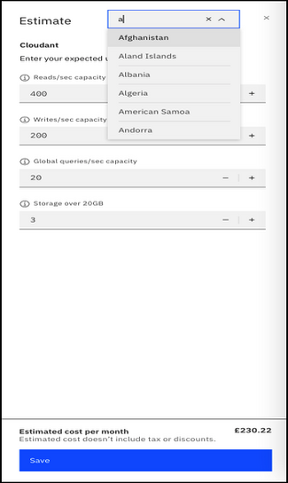
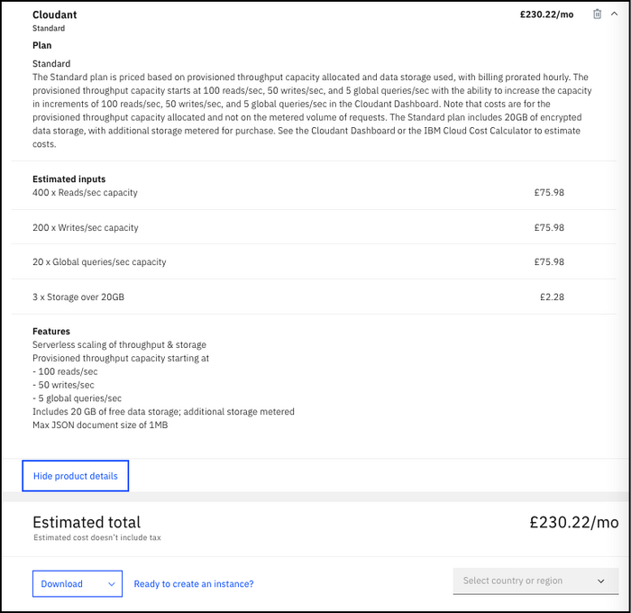
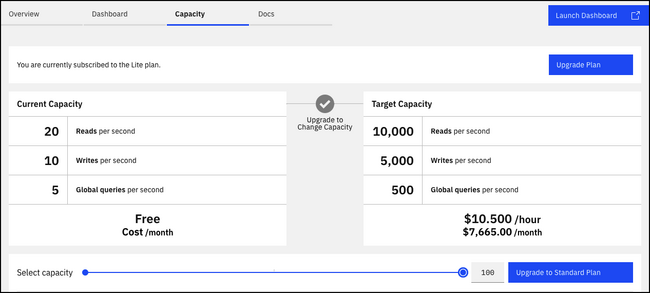
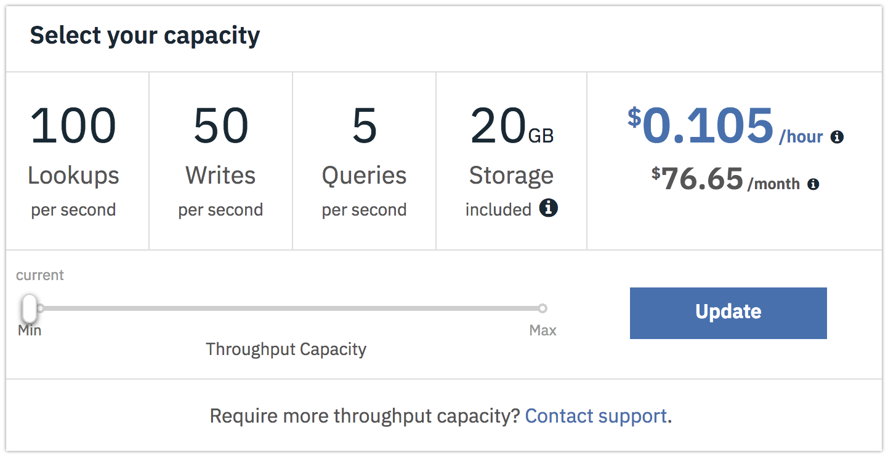
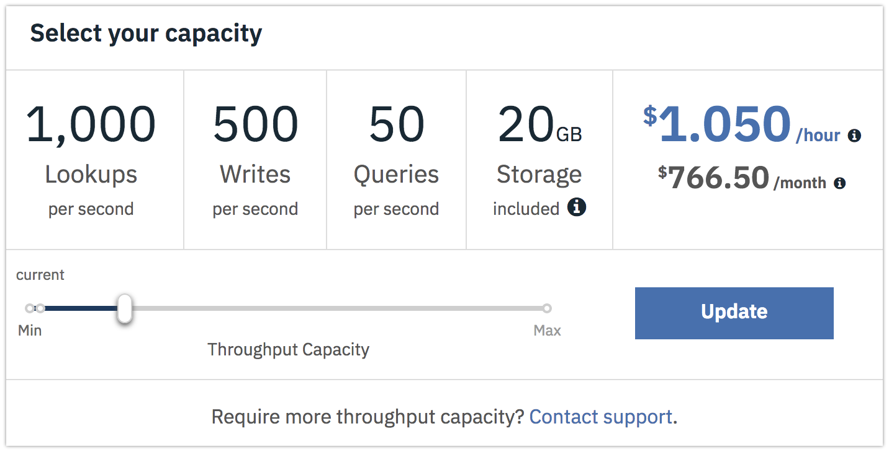
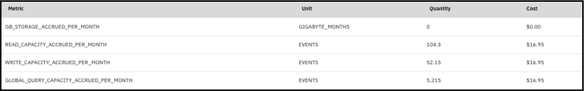

---

copyright:
  years: 2015, 2021
lastupdated: "2021-11-01"

keywords: pricing examples, data usage, ibm cloud usage dashboard, data usage pricing

subcollection: Cloudant

---

{:new_window: target="_blank"}
{:shortdesc: .shortdesc}
{:screen: .screen}
{:codeblock: .codeblock}
{:pre: .pre}
{:note: .note}
{:important: .important}
{:deprecated: .deprecated}
{:external: target="_blank" .external}
{:video: .video}

# Pricing
{: #pricing}

{{site.data.keyword.cloudantfull}} is priced based on the provisioned throughput capacity that you allocate for your instance, and the amount of data storage consumed. With {{site.data.keyword.cloudant_short_notm}}, you can scale your provisioned throughput capacity up and down, and pay pro-rated hourly. The provisioned throughput capacity is a reserved number of reads per second, writes per second, and global queries per second allocated to an instance. The throughput capacity setting is the maximum usage level for a given second. You can't exceed the reserved capacity for either reads, writes, or global queries. If you do, an HTTP 429 status code occurs that indicates the application is trying to exceed its provisioned throughput capacity allowance.
{: shortdesc}

The following table shows example hourly pricing for various provisioned throughput capacity settings. You can toggle the capacity in granular blocks of 100 reads per second, 50 writes per second, and 5 global queries per second on an hourly basis. An approximate monthly cost is also shown for each setting that assumes an average of 730 hours in a month. The prices that are shown are in USD. 
 
{: caption="Figure 1. Pricing spreadsheet" caption-side="bottom"}

You can use the {{site.data.keyword.cloud_notm}} pricing calculator to see estimated costs in other currencies by clicking **Add to estimate** from the {{site.data.keyword.cloudant_short_notm}} catalog tile. Specify storage, capacity, and select the country whose currency you want to see. See the calculator in the following screen capture. 
 
{: caption="Figure 2. Pricing calculator" caption-side="bottom"}

Click **Calculate cost** and **Save**. Now, click **Review estimate**. Expand the estimate to see more details. If you save multiple estimates, you can then click **Review estimate** and compare them. See a sample estimate in the following screen capture. 
 
{: caption="Figure 3. Review estimate" caption-side="bottom"}

You can launch the {{site.data.keyword.cloud_notm}} Dashboard. Click **Resource list** > **Services** > **your instance** > **Manage** > **Capacity** to view and change the provisioned throughput capacity, and see the hourly and approximate monthly costs: 

{: caption="Figure 4. Slider" caption-side="bottom"}

## Pricing examples 
{: #pricing-examples}

Let's assume you're building a mobile app with {{site.data.keyword.cloudant_short_notm}} and don't yet know the capacity 
that you might need. In this case, the {{site.data.keyword.cloudant_short_notm}} team recommends that you start with the lowest provisioned throughput 
capacity and increase it as needed by your application's usage over time. {{site.data.keyword.cloudant_short_notm}} bills 
pro-rated hourly and changing the provisioned throughput capacity doesn't incur downtime. 

For the mobile app example, you start with the minimum provisioned throughput capacity for 
the Standard plan that is 100 reads per second, 50 writes per second, and 5 global queries per second. The cost for 
this capacity is $0.105 per hour. The 100 reads per second, 50 writes per second, and 5 global queries per second are 
a block of provisioned throughput capacity. When you need to scale up (or down), you 
can scale in increments of these blocks of capacity. Assuming the instance has less than 
the 20 GB of storage that is included in the Standard plan, no storage costs are incurred. On the 
{{site.data.keyword.cloudant_short_notm}} Dashboard's > **Account** > **Capacity** tab, the 
provisioned throughput capacity setting looks like this screen capture:

{: caption="Figure 5. {{site.data.keyword.cloudant_short_notm}} Dashboard Capacity tab" caption-side="bottom"}

The capacity slider shows the hourly cost of the provisioned throughput capacity of 100 reads per second, 50 writes per second, and 5 global queries per second in USD of $0.105 per hour. The slider shows a rough cost per month of $76.65. The monthly amount is an estimate based on an average of 730 hours per month. The cost in any month can be slightly different depending on the number of hours in the month.

See the following example equation: 

- $0.105 per hour \* 1 block (of 100 reads per second, 50 writes per second, and 5 global queries per second provisioned throughput capacity) \* 730 hours (approximate hours in a month)
- Total = $76.65

Reads, writes, and global queries can't be scaled independently. Use the slider to select the number of blocks of provisioned throughput capacity based on the maximum limit of either reads per second, writes per second, or global queries per second required for your application. For example, if your application requires 1,000 reads per second, use the slider to select the capacity that offers 1,000 reads per second, 500 writes per second, and 50 global queries per second. Select this capacity even if you don't need the corresponding number of writes or global queries. 
 
{: caption="Figure 6. {{site.data.keyword.cloudant_short_notm}} Dashboard Capacity tab with more capacity selected" caption-side="bottom"}

How do you estimate the total cost for provisioned throughput capacity per month of 1,000 reads, 500 writes, and 50 global queries? 

- $0.105 per hour \* 10 blocks (of 100 reads per second, 50 writes per second, and 5 global queries per second provisioned throughput capacity) \* 730 hours (approximate hours in a month).
- Alternatively, the slider shows you the provisioned throughput capacity of 1000 reads per second, 500 writes per second, and 50 global queries per second costs $1.050 per hour \* 730 hours.
- Total = $766.50.

## Data usage pricing
{: #data-usage-pricing}

What about pricing for data overage? How does that work?

Plan | Storage included | Overage limit
-----|------------------|--------------
Lite | 1 GB |  Your account is blocked from writing new data until you delete enough data to be under the 1-GB limit, or upgrade to a higher plan.
Standard | 20 GB | Extra storage costs $0.0014 per GB per hour, which is approximately $1 per GB per month.
{: caption="Table 1. Pricing for data overage" caption-side="top"}

## {{site.data.keyword.cloud_notm}} Usage Dashboard 
{: #usage-dashboard}

How does data populate the {{site.data.keyword.cloud_notm}} Usage Dashboard?

Current and historical usage bills can be seen in the {{site.data.keyword.cloud_notm}} Dashboard, under **Manage** > **Billing and usage** > **Usage**. This view shows the totals for usage that are accrued during a particular month at the service, plan, or instance level.  The Estimated Total reflects the bill so far for the month or for past complete months. It shows only the hourly costs that are accrued up to that point for the current month. By the end of the month, you see that your average provisioned throughput capacity for the month is reflected in the `LOOKUPS_PER_MONTH`, `WRITES_PER_MONTH`, and `QUERIES_PER_MONTH` fields. (Note lookups are now called reads and queries are now called global queries.) The `STORAGE_MANAGED_PER_MONTH` field shows only the storage that is charged and doesn't include the 20 GB that are included in the Standard plan. In the following example, a quantity of 20+ GB reflects an average of 40 GB of data in the instance for the month. When you use less than 20 GB of storage, the dashboard shows 0 GB since you didn't go over the limit. 
 
{: caption="Figure 7. Usage metrics with higher STORAGE MANAGED PER MONTH" caption-side="bottom"}

