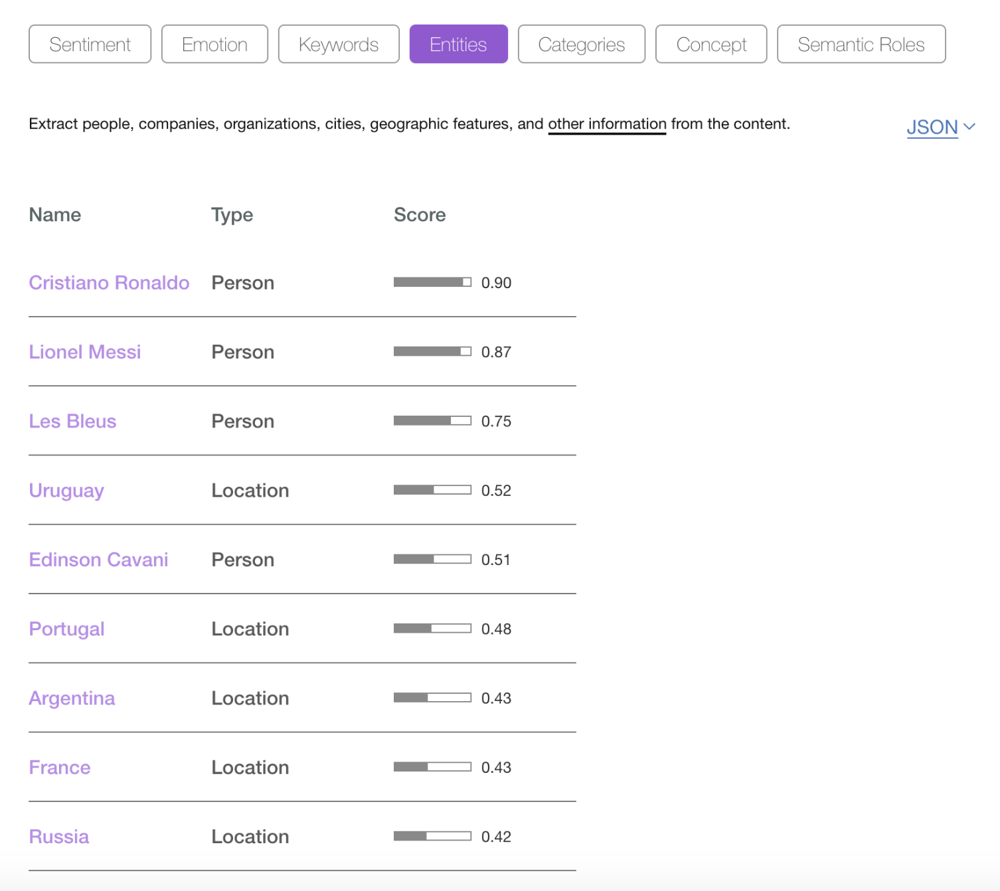

---

copyright:
  years: 2019, 2021
lastupdated: "2021-07-02"

keywords: search analyzers, keyword analyzer, simple analyzer, white space analyzer, classic analyzer, english analyzer, entity extraction, store option, include_docs option

subcollection: Cloudant

---

{:new_window: target="_blank"}
{:shortdesc: .shortdesc}
{:screen: .screen}
{:codeblock: .codeblock}
{:pre: .pre}
{:tip: .tip}
{:note: .note}
{:important: .important}
{:deprecated: .deprecated}
{:external: target="_blank" .external}

<!-- Acrolinx: 2021-04-09 -->

# Search analyzers
{: #search-analyzers}

{{site.data.keyword.cloudant_short_notm}} Search is the free-text search technology that is built into the {{site.data.keyword.cloudantfull}} database that is powered by [Apache Lucene](http://lucene.apache.org/){: new_window}{: external}. 

When you create an {{site.data.keyword.cloudant_short_notm}} Search index, you must consider which fields from your documents need to be indexed, and how they are to be indexed.
{: shortdesc}

One aspect of the indexing process is the choice of analyzer. An analyzer is code that can have the following effect:

- Make the search case-insensitive by ensuring the string is lowercase.
- Tokenize the string by breaking a sentence into individual words.
- Stem the words by removing language-specific word endings, for example, farmer becomes farm.
- Remove stop words by ignoring words like *a*, *is*, or *if*, which can make the index smaller and more efficient.

At indexing-time, source data is processed by using the analyzer logic sorts and stores data in the index. At query-time, the search terms are processed by using the same analyzer code before it interrogates the index.

## Testing the analyzer
{: #testing-the-analyzer}

If you want to see the effect of each analyzer, use the [{{site.data.keyword.cloudant_short_notm}} Search API call](/docs/Cloudant?topic=Cloudant-search#testing-analyzer-tokenization) that applies to one of the built-in Lucene analyzers with a supplied string.

To look at each analyzer in turn, you can pass the following string to each analyzer to measure the effect:

```sh
"My name is Chris Wright-Smith. I live at 21a Front Street, Durham, UK - my email is chris7767@aol.com."
```
{: screen}

### Standard analyzer
{: #standard-analyzer}

The Standard analyzer changes the string in the following ways: 

- Removes punctuation.
- Splits words based on spaces and punctuation.
- Removes stop words, including "is" and "at".
- Changes words to use lowercase letters.
- Note how "aol.com" stays intact.

```json
{"tokens":["my", "name", "chris", "wright", "smith", "i", "live", "21a", "front", "street", "durham", "uk", "my", "email", "chris7767", "aol.com"]}
```
{: screen}

### Keyword analyzer
{: #keyword-analyzer}

With the Keyword analyzer, the string stays intact. See the following example:

```json
{"tokens":["My name is Chris Wright-Smith. I live at 21a Front Street, Durham, UK - my email is chris7767@aol.com."]}
```
{: screen}

### Simple analyzer
{: #simple-analyzer}

The Simple analyzer changes the string in the following ways:

- Removes punctuation.
- Splits words based on spaces and punctuation.
- No stop words removed (notice "is" and "at").
- Changes words to use lowercase letters.
- Note how `chris7767` changes to `chris` and `21a` changes to `a`.

```json
{"tokens":["my", "name", "is", "chris", "wright", "smith", "i", "live", "at", "a", "front", "street", "durham", "uk", "my", "email", "is", "chris", "aol","com"]}
```
{: screen}

### White space analyzer
{: #whitespace-analyzer}

The White space analyzer changes the string in the following ways:

- Removes some punctuation.
- Splits words on spaces.
- No stop words removed (notice "is" and "at").
- Words remain case-sensitive.
- Note how email stays intact.

```json
{"tokens":["My", "name", "is", "Chris", "Wright-Smith.", "I", "live", "at", "21a", "Front", "Street,", "Durham,", "UK", "-" , "my" ,"email", "is", "chris7767@aol.com."]}
```
{: screen}
 
### Classic analyzer
{: #classic-analyzer}

The Classic analyzer changes the string in the following ways:

- Removes punctuation.
- Splits words based on spaces and punctuation.
- Removes stop words (no "is" or "at").
- Changes words to use lowercase letters.
- Note how email stays intact.

```json
{"tokens":["my", "name", "chris", "wright", "smith", "i", "live", "21a", "front", "street", "durham", "uk", "my", "email", "chris7767@aol.com"]}
```
{: screen}

### English analyzer
{: #english-analyzer}

The English analyzer changes the string in the following ways:

- Removes punctuation.
- Splits words based on spaces and punctuation.
- Stems words (notice "`chris`" changes to "`chri`").
- Removes stop words (no "is" or "at").
- Changes words to use lowercase letters.
- Note how email stays intact.

```json
{"tokens":["my", "name","chri", "wright", "smith", "i", "live", "21a", "front", "street", "durham", "uk", "my", "email", "chris7767","aol.com"]}
```
{: screen}


Language-specific analyzers make the most changes to the source data. See the following two examples: 

```sh
The quick brown fox jumped over the lazy dog.
{"tokens":["quick","brown","fox","jump","over","lazi","dog"]}

Four score and seven years ago our fathers brought forth, on this continent, a new nation, conceived in Liberty, and dedicated to the proposition that all men are created equal.
{"tokens":["four","score","seven","year","ago","our","father","brought","forth","contin","new","nation","conceiv","liberti","dedic","proposit","all","men","creat","equal"]}
```
{: screen}

## Which analyzer must I pick?
{: #which-analyzer-must-i-pick}

It depends on your data. If your data is structured (email addresses, postal codes, names, and so on) in separate fields, then select an analyzer that retains the data you need to search.

Only index the fields that you need. Keeping the index small helps to improve performance.

Consider the common data sources and look at the best analyzer choices.

### Names
{: #names-sa}

It's likely that name fields must use an analyzer that doesn't stem words. The White space analyzer keeps the words' case (meaning the search terms must be full, case-sensitive matches) and leaves double-barreled names intact. If you want to split up double-barreled names, then the Standard analyzer can do the job.

### Email addresses
{: #email-addresses-sa}

The built-in email analyzer serves this purpose, which changes everything to lowercase and then behaves like the Keyword analyzer. 

### Unique ID
{: #unique-id}

Order numbers, payment references, and UUIDs such as "A1324S", "PayPal0000445", and "ABC-1412-BBG" must be kept without any pre-processing, so the Keyword analyzer is preferred.

### Country codes
{: #country-codes}

Country codes like "UK" must also use the Keyword analyzer to prevent the removal of "stopwords" that match the country codes, for example, "IN" for India. The Keyword analyzer is case-sensitive.

### Text
{: #text-sa}

It is best to process a block of free-form text with a language-specific analyzer, such as the English analyzer, or in a more general case, the Standard analyzer.

## Which option is best? 
{: #store-true-include_docs=true}

When {{site.data.keyword.cloudant_short_notm}} returns data from a search, you can choose between the following options: `store: true` or `include_docs=true`. See the following descriptions: 

1. At index-time, choose the `{store: true}` option. This option indicates that the field you're dealing with needs to be stored inside the index. A field can be "stored" even if it isn't used for indexing itself. For example, you might want to "store" a telephone number, even if your search algorithm doesn't include searching by phone number. 
2. At query-time, pass `?include_docs=true` to indicate to {{site.data.keyword.cloud_notm}} that you want the entire body of each matching document to be returned.

The first option means you have a larger index, but it's the fastest way of retrieving data. The second option keeps the index small, but adds extra query-time work for {{site.data.keyword.cloud_notm}} as it must fetch document bodies after the search result set is calculated. This process can be slower to run and adds a further burden to the {{site.data.keyword.cloud_notm}} cluster.

If possible, choose the first option use the following guidelines: 

- Index only the fields that you want to be searchable.
- Store only the fields that you need to retrieve at query-time.

## Entity extraction
{: #entity-extraction}

Providing a good search experience depends on the alignment of your users' search needs with structure in the data. Running lots of unstructured data with an indexing engine gets you only so far. If you can add further structure to unstructured data, then the search experience benefits since fewer "false positives" are returned. Look at this example:

```sh
"Edinson Cavani scored two superb goals as Uruguay beat Portugal to set up a World Cup quarter-final meeting with France. Defeat for the European champions finished Cristiano Ronaldo's hopes of success in Russia just hours after Lionel Messi and Argentina were knocked out, beaten 4-3 by Les Bleus."

Source: BBC News https://www.bbc.co.uk/sport/football/44439361
```
{: screen}

From this snippet, I would manually extract the following "entities".

- Edinson Cavani - a footballer
- Uruguay - a country
- Portugal - another country
- World Cup - a football competition
- Cristiano Ronaldo - a footballer
- Russia - a country
- Lionel Messi - a footballer 
- Argentina - a country
- Les Bleus - a nickname of the French national football team

Entity extraction is the process of locating known entities (given a database of such entities) and storing the entities in the search engine instead of, or as well as, the source text. The [Watson Natural Language and Understanding API](https://www.ibm.com/watson/services/natural-language-understanding/) can be fed raw text and returns entities it knows about (you can provide your own entity model for your domain-specific application):

{: caption="Figure 1. Analyzers" caption-side="bottom"}

As well as entities, the API can also place the article in a hierarchy of categories. In this case, Watson suggests the following categories:

- Travel, tourist destinations france
- Sports, soccer
- Sports, football

You can pre-process your raw data by calling the Watson API for each document and storing a list of entities, concepts, and categories in your {{site.data.keyword.cloud_notm}} document. This pre-processing provides automatic metadata about your free-text information. It can also provide an easier means to search and navigate your app.
