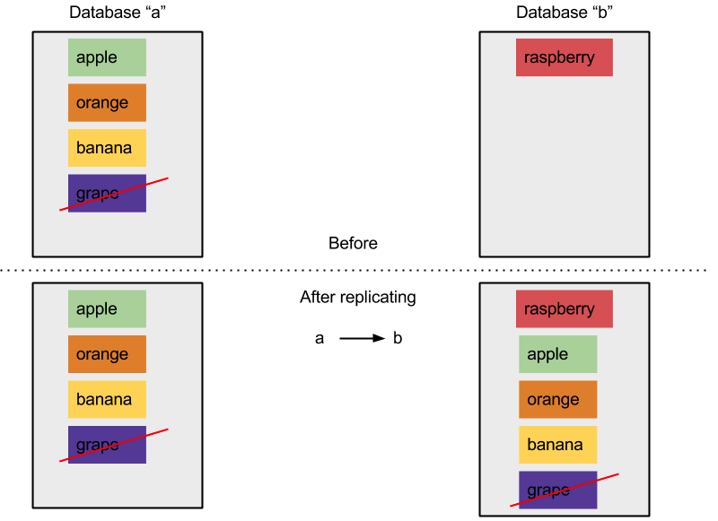
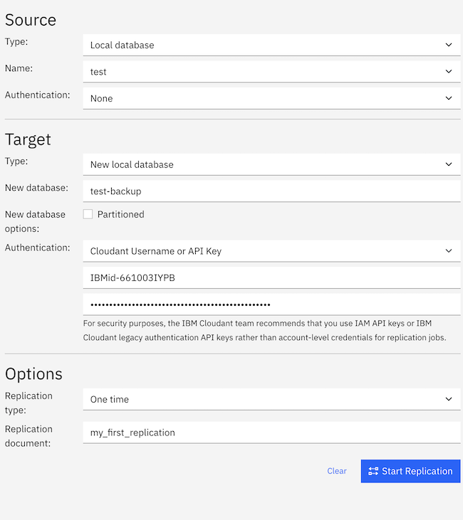
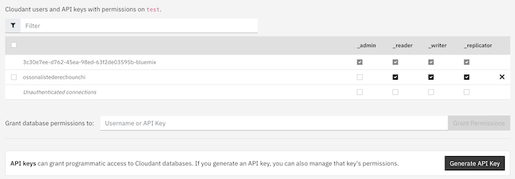
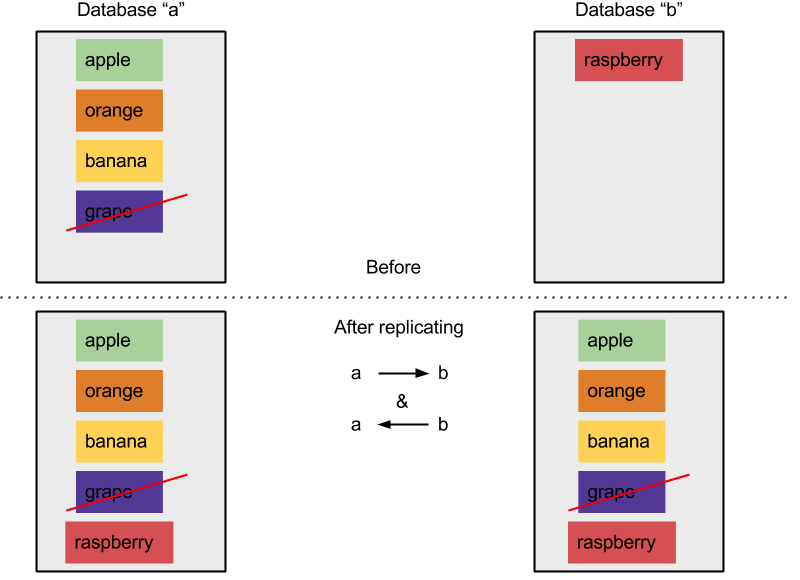

---

copyright:
  years: 2015, 2021
lastupdated: "2021-11-02"

keywords: start replicating with dashboard, run replication across different accounts, run replication on source or destination, start replication with api, checkpoints, permissions, two-way replication, continuous replication, monitoring replication, canceling replication, filtered replication, changes feed, pitfalls, tuning replication speed

subcollection: Cloudant

---

{:new_window: target="_blank"}
{:shortdesc: .shortdesc}
{:screen: .screen}
{:codeblock: .codeblock}
{:pre: .pre}
{:tip: .tip}
{:note: .note}
{:important: .important}
{:deprecated: .deprecated}
{:external: target="_blank" .external}

# What is replication?
{: #replication-guide}

Data can be copied from one database to another in the same {{site.data.keyword.cloudantfull}} account,
across accounts and across data centers.
{: shortdesc}

In this documentation, when a feature, or an aspect of a feature, applies only to Transaction Engine, you see this tag .
{: important}

Data can even be replicated to and from an {{site.data.keyword.cloudant_short_notm}} account and a mobile device by
using [{{site.data.keyword.cloudant_short_notm}} Sync](https://www.ibm.com/cloud/learn/offline-first){: external}
or [PouchDB](http://pouchdb.com/){: external}.
Replication can run in one direction or in both directions,
as a "single shot" or continuous operation,
and can be finely tuned by using parameters.

{{site.data.keyword.cloudant_short_notm}}’s replication protocol is compatible with a range of other databases and libraries,
making it a great fit for Internet of Things (IoT) and mobile applications.

{{site.data.keyword.cloudant_short_notm}} is a distributed JSON data store with an HTTP API.
{{site.data.keyword.cloudant_short_notm}} can be run as a service on multiple clouds,
or in your server rack.
Documents are stored in databases and can grow to any size as {{site.data.keyword.cloudant_short_notm}} shards its data across many nodes.
Replication is the copying of data from a source database to a target database.
The source and target databases do not need to be on the same {{site.data.keyword.cloudant_short_notm}} account,
or even in the same data center. 

{: caption="Figure 1. Replication in pictures" caption-side="bottom"}

Replication is complete when the most recent version of each document in the source transfers to the destination database.
Transfers include new documents,
updates to existing documents,
and deletions.
Only the most recent version of a document remains after replication;
older versions are omitted.

The source database remains unaltered by replication,
apart from checkpoint data that is written to it to allow partial replications to resume from the last known position.
Any pre-existing data in the destination database remains.

## How to start replicating with the dashboard
{: #how-to-start-replicating-with-the-dashboard}

The {{site.data.keyword.cloudant_short_notm}} Dashboard provides a convenient user interface to trigger replication.
Click `Replication` on the {{site.data.keyword.cloudant_short_notm}} Dashboard, and click `Start Replication`.
Complete the following Replication form:

{: caption="Figure 2. Replication form" caption-side="bottom"}

For security purposes, the {{site.data.keyword.cloudant_short_notm}} team recommends that you use IAM API keys or  {{site.data.keyword.cloudant_short_notm}} legacy authentication [API keys](/docs/Cloudant?topic=Cloudant-work-with-your-account#api-keys) rather than account-level credentials for replication jobs. For more information, see [Managing access](/docs/Cloudant?topic=Cloudant-managing-access-for-cloudant) or legacy [authentication](/docs/Cloudant?topic=Cloudant-work-with-your-account#authentication) and [authorization](/docs/Cloudant?topic=Cloudant-work-with-your-account#authorization) documentation.
{: important}

Using the form, define the source and target databases,
then click `Start Replication`. 

{: caption="Figure 3. Running state" caption-side="bottom"}

The status of each replication task can be seen by clicking `Replication`.
Each job changes state from `Running` to `Completed` as it progresses. 

{: caption="Figure 4. Completed state" caption-side="bottom"}

## How to replicate across different {{site.data.keyword.cloudant_short_notm}} accounts
{: #how-to-run-replication-across-different-ibm-cloudant-accounts}

The source and target of a replication are URLs of {{site.data.keyword.cloudant_short_notm}} databases,
as shown in the following example.

See the following example that defines source and target URLs for replication:

```json
{
    "source": "https://myfirstaccount.cloudant.com/a",
    "target": "https://mysecondaccount.cloudant.com/b"
}
```
{: codeblock}

The source and target do not need to be on the same account.
The source and target database names do not need to match.
You must be authorized to access both the source and target,
and you must be authorized to write to the target.

## Is replication run on the source or the destination?
{: #is-replication-run-on-the-source-or-the-destination}

Replication can be started at either the source or the destination end.
This choice means that you can decide whether account A is pushing data to account B,
or account B is pulling data from account A.
In some cases,
it might not be possible to run replication in either configuration,
for example when one account is behind a firewall.
Replication happens over HTTP or HTTPS and so no non-standard ports need be opened.
The decision as to which device starts replication is yours.

## How does replication affect the list of changes?
{: #how-does-replication-affect-the-list-of-changes-}

You can get a list of changes made to a document by using
the [`_changes` endpoint](/docs/Cloudant?topic=Cloudant-databases#get-changes).
However,
the distributed nature of {{site.data.keyword.cloudant_short_notm}} databases
means that the response that is provided by the `_changes` feed
cannot be a simple list of changes that occurred after a particular date and time.

The [CAP Theorem](/docs/Cloudant?topic=Cloudant-cap-theorem#cap-theorem) discussion makes it clear that
{{site.data.keyword.cloudant_short_notm}} uses an "eventually consistent" model.
This model means you might get different results when you ask two different replicas of a database for a document at the same time. This can happen when one of the database copies is still waiting to finish replication. 

Eventually,
the database copies complete their replication
so that all the changes to a document are present in each copy.

This "eventual consistency" model has two characteristics that affect a list of changes:

1. A change that affects a document almost certainly takes place at different times in different copies of the database.
2. The order in which changes affect documents might differ between different copies of the database, depending on when and from where the replication took place.

A consequence of the first characteristic is that,
when you ask for a list of changes,
it is meaningless to ask for a list of changes after a specific point in time.
The reason is that the list of changes might be supplied by a different database copy,
which resulted in document updates at different times.
However,
it *is* meaningful to ask for a list of changes after a specific change,
which is specified by using a sequence identifier.

An extra consequence of the first characteristic is that
it might be necessary to "look back" at preceding changes to agree on the list of changes.
In other words,
to get a list of changes,
you start from the most recent change that the database copies agree on.
The point of agreement between database copies is identified within
{{site.data.keyword.cloudant_short_notm}} by using the [checkpoint](#checkpoints) mechanism
that enables replication between database copies to be synchronized.

Finally, when you look at a list of changes, they might be presented in a different order in subsequent requests. The order depends on how documents were changed between different database copies.
In other words,
an initial list of changes might report changes `A`,
`B`,
then `C` in that order.
But a subsequent list of changes might report changes `C`,
`A`,
then `B` in that order.
All the changes are listed,
but in a different order.
This difference is because the sequence of changes that are received during replication
might vary between two different copies of the database.

### What does "eventual consistency" mean for the list of changes?
{: #what-eventual-consistency-means-for-the-list-of-changes}

When you request a list of changes,
the response you get might vary depending on which database copy supplies the list.

The `since` option obtains a list of changes after a specific update sequence identifier. The list always includes changes after the update, but changes before the update might also be included.
The reason is that the database copy that responds to the list request must ensure that it
lists the changes,
consistent with all the replicas.
To achieve that consistency,
the database copy might have to start the list of changes from the point
when all the copies agreed.
This point is identified by using checkpoints.

Therefore,
an application that uses the `_changes` feed must
be ['idempotent'](http://www.eaipatterns.com/IdempotentReceiver.html){: external}. Idempotency means that the application must be able safely to receive the same data multiple times,
and potentially in a different order for repeated requests.

## Checkpoints
{: #checkpoints}

Internally,
the replication process writes its state in "checkpoint" documents that are stored
in both the source and destination databases.
Checkpoints allow a replication task to be resumed from where it stopped,
without having to start from the beginning.
Checkpoint creation can be prevented by supplying the
[`"use_checkpoints": false`](/apidocs/cloudant#postreplicate){: external} option when you request replication.
It is helpful to leave the feature on if your replication is to resume efficiently from its last known position.

## Permissions
{: #permissions}

Admin access is necessary to insert a document into the `_replicator` database.
The login credentials that are supplied in the source and target parameters do not require full admin permissions.
It is sufficient if the credentials perform the following tasks:

- Write documents at the destination end.
- Write checkpoint documents at both ends.

{{site.data.keyword.cloudant_short_notm}} has a special `_replicator` user permission.
This permission allows checkpoint documents to be created,
but does not allow the creation of ordinary documents in a database.
In general,
[create API keys](/docs/Cloudant?topic=Cloudant-work-with-your-account#creating-api-keys) that have:

- `_reader` and `_replicator` access at the source side.
- `_reader` and `_writer` access at the destination side.

API keys can be created and configured within the {{site.data.keyword.cloudant_short_notm}} Dashboard,
on a per-database basis. 

{: caption="Figure 5. {{site.data.keyword.cloudant_short_notm}} users and API keys with permissions" caption-side="bottom"}

They can also be created [programmatically](/apidocs/cloudant#introduction) by using the {{site.data.keyword.cloudant_short_notm}} API.

For security purposes, the {{site.data.keyword.cloudant_short_notm}} team recommends that you use IAM API keys or {{site.data.keyword.cloudant_short_notm}} legacy authentication [API keys](/docs/Cloudant?topic=Cloudant-work-with-your-account#api-keys) rather than account-level credentials for replication jobs. For more information, see [Managing access](/docs/Cloudant?topic=Cloudant-managing-access-for-cloudant) or legacy [authentication](/docs/Cloudant?topic=Cloudant-work-with-your-account#authentication), and [authorization](/docs/Cloudant?topic=Cloudant-work-with-your-account#authorization) documentation.
{: important}

## Two-way replication
{: #two-way-replication}

Data can be copied in both directions in a process that is known as two-way replication or synchronization.
You enable this synchronization by setting up two separate replication processes,
one taking the data from A to B,
the other taking data from B to A.
Both replication processes work independently,
with data moved seamlessly in both directions. 

{: caption="Figure 6. Two-way replication" caption-side="bottom"}

## Discussion about continuous replication
{: #discussion-about-continuous-replication}

So far,
the discussion deals only with one-shot replication,
which finishes when all of the source data is written to the target database.
With continuous replication,
data flows continuously.
All subsequent changes to the source database are transmitted to the target database in real time.

Continuous replication is triggered by clicking the `Make this replication continuous` check box when you define a replication task in the {{site.data.keyword.cloudant_short_notm}} Dashboard,
or by setting the [`continuous`](/apidocs/cloudant#postreplicate){: external} flag in the {{site.data.keyword.cloudant_short_notm}} API.

Two-way replication can be made continuous in one or both of the directions,
by setting the `continuous` flag.

See the following example that uses HTTP to start a continuous replication:

```http
POST /_replicator HTTP/1.1
Content-Type: application/json
Host: $ACCOUNT.cloudant.com
Authorization: ...
```
{: codeblock}

See the following example that uses the command line to start a continuous replication:

```sh
curl -X POST \
    -H "Content-type: application/json" \
    "https://$ACCOUNT.cloudant.com/_replicator" \
    -d @continuous-replication.json
```
{: codeblock}

See the following example of a JSON document that defines a continuous replication:

```json
{
    "_id": "weekly_continuous_backup",
    "source": "https://$ACCOUNT:$PASSWORD@$ACCOUNT1.cloudant.com/source",
    "target": "https://$ACCOUNT:$PASSWORD@$ACCOUNT2.cloudant.com/destination",
    "continuous": true
}
```
{: codeblock}

## Other replication use cases
{: #other-replication-use-cases}

{{site.data.keyword.cloudant_short_notm}}’s replication protocol is compatible with other databases and libraries for various real-world applications.

### Apache CouchDB
{: #apache-couchdb}

[Apache CouchDB](http://couchdb.apache.org/){: external} is an open source database
that can communicate with {{site.data.keyword.cloudant_short_notm}},
and that requires minimal setup.
The following applications are included:

-   Backup - Replicate your data from {{site.data.keyword.cloudant_short_notm}} to your own CouchDB databases
    and take nightly snapshots of your data for archiving purposes.
    Send the data to a backup service such as
    [Amazon Glacier](https://aws.amazon.com/glacier/){: external} for safe keeping.
-   Local-first data collection - Write your data to local Apache CouchDB first,
    then replicate it to {{site.data.keyword.cloudant_short_notm}} for long-term storage,
    aggregation,
    and analysis.

### PouchDB
{: #pouchdb}

[PouchDB](http://pouchdb.com/){: external} is an open source,
in-browser database that allows data to be replicated in both directions between the browser and {{site.data.keyword.cloudant_short_notm}}.
Storing the data in a web browser on the client side allows web applications to function
even without an internet connection.
PouchDB can synchronize any changed data to and from {{site.data.keyword.cloudant_short_notm}} when an internet connection is present.
Setting up replication from the client side requires a few lines of JavaScript.

See the following example JavaScript that uses PouchDB to enable replication:

```javascript
var db = new PouchDB("myfirstdatabase");
var URL = "https://u:p@username.cloudant.com/my_database");
db.sync(URL, { live: true });
```
{: codeblock}

### {{site.data.keyword.cloudant_short_notm}} Sync
{: #cloudantsync}

[{{site.data.keyword.cloudant_short_notm}} Sync](https://www.ibm.com/cloud/learn/offline-first){: external} is a set of libraries
for iOS and Android that allows data to be stored locally in a mobile device
and synchronized with {{site.data.keyword.cloudant_short_notm}} when mobile connectivity permits.
As with [PouchDB](#pouchdb),
setting up replication requires a few lines of code.

See the following example JavaScript that uses {{site.data.keyword.cloudant_short_notm}} Sync to enable replication:

```javascript
URI uri = new URI("https://u:p@username.cloudant.com/my_database");
Datastore ds = manager.openDatastore("my_datastore");
// Replicate from the local to remote database
Replicator replicator = ReplicatorFactory.oneway(ds, uri);
// Fire-and-forget (there are easy ways to monitor the state too)
replicator.start();
```
{: codeblock}

{{site.data.keyword.cloudant_short_notm}} Sync is used widely in mobile applications, such as iPhone and Android games. The application's state is persisted to {{site.data.keyword.cloudant_short_notm}} by replication, but the data is also available on the device for offline use.

## Filtered replications
{: #filtered-replications-repl-guide}

It is useful to be able to remove some data during the replication process,
when you replicate one database to another, as you can see in the following examples:

- Removing all traces of deleted documents, making the target database smaller than the source.
- Segregating data into smaller chunks, such as storing UK data in one database and US data in another.

### Replication filter functions
{: #replication-filter-functions}

{{site.data.keyword.cloudant_short_notm}}’s filtered replication allows the definition of a JavaScript function that uses the return value
to determine whether each document in a database is to be filtered or not.
[Filter functions](/docs/Cloudant?topic=Cloudant-design-documents#filter-functions) are stored
in [design documents](/docs/Cloudant?topic=Cloudant-design-documents#design-documents).

See the following example filter function for replicating non-deleted documents:

```javascript
function(doc, req) {
    if (doc._deleted) {
        return false;
    }
    return true;
}
```
{: codeblock}

When a replication job starts,
a filter function’s name is specified as a combination of the design document where it is stored,
and the filter function’s name.
You can also specify a `query_params` value.
This value is an object that contains properties that are passed to the
filter function in the `query` field of its second (`req`) argument.

See the following example that uses HTTP to start a filtered replication:

```http
POST /_replicator HTTP/1.1
Content-Type: application/json
Host: $ACCOUNT.cloudant.com
Authorization: ...
```
{: codeblock}

See the following example that uses the command line to start a filtered replication:

```sh
curl -X POST \
    -H "Content-type: application/json" \
    "https://$ACCOUNT.cloudant.com/_replicator" \
    -d @filtered-replication.json
```
{: codeblock}

See the following example of a JSON document that defines a filtered replication:

```json
{
    "_id": "weekly_backup",
    "source": "https://$ACCOUNT:$PASSWORD@$ACCOUNT1.cloudant.com/source",
    "target": "https://$ACCOUNT:$PASSWORD@$ACCOUNT2.cloudant.com/destination",
    "filter": "mydesigndoc/myfilter",
    "query_params": {
        "foo": "bar",
        "baz": 5
    }
}
```
{: codeblock}

## Changes feed
{: #changes-feed}

{{site.data.keyword.cloudant_short_notm}} publishes the adds,
edits,
and deletes affecting a database through a single HTTP feed from
the [`_changes` endpoint](/docs/Cloudant?topic=Cloudant-databases#get-changes).
This feed can be used by your application to trigger events.
You can access the feed by using HTTP or `curl`,
as shown in the examples.
Using the `feed=continuous` option means that the stream provides you with
every change that is necessary to get the most recent version of every document in the database.

See the following example that uses HTTP to query the changes feed:

```http
GET /$DATABASE/_changes?feed=continuous HTTP/1.1
Host: $ACCOUNT.cloudant.com
Authorization: ...
```
{: codeblock}

See the following example that uses the command line to query the changes feed:

```sh
curl "https://$ACCOUNT.cloudant.com/$DATABASE/_changes?feed=continuous"
```
{: codeblock}

The changes are described by using one line per change.
Each change consists of:

1.  A string that contains a sequence number (`seq`).
2.  A string that contains the ID of the document that was changed.
3.  An array of changes.

To see the document body itself,
append `&include_docs=true` to the curl command.

Each change is described by using the format that is shown in the following (abbreviated) example.

See the following example `_changes` feed:

```json
{
    "seq":"11-g1A...c1Q",
    "id":"6f8ab9fa52c117eb76240daa1a55827f",
    "changes":[
        {
          "rev":"1-619d7981d7027274a4b88810d318a7b1"
        }
    ]
}
```
{: codeblock}

To join the changes feed from a known position,
pass a [`since` argument](/docs/Cloudant?topic=Cloudant-databases#the-since-argument) with the sequence number you want to start from.

See the following example (abbreviated) that uses HTTP to supply the `since` option to join a `_changes` feed at a known position:

```http
GET /$DATABASE/_changes?feed=continuous&include_docs=true&since=11-g1A...c1Q HTTP/1.1
HOST: $ACCOUNT.cloudant.com
Authorization: ...
```
{: codeblock}

See the following example (abbreviated) that uses the command line to supply the `since` option to join a `_changes` feed at a known position:

```sh
curl "https://$ACCOUNT.cloudant.com/$DATABASE/_changes?feed=continuous&include_docs=true&since=11-g1A...c1Q"
```
{: codeblock}

To rejoin the changes feed from the current moment in time,
set `since=now`.

See the following example that uses HTTP to supply `since=now` to join a `_changes` feed at the current moment in time:

```http
GET /$DATABASE/_changes?feed=continuous&include_docs=true&since=now HTTP/1.1
Host: $ACCOUNT.cloudant.com
Authorization: ...
```
{: codeblock}

See the following example that uses the command line to supply `since=now` to join a `_changes` feed at the current moment in time:

```sh
curl "https://$ACCOUNT.cloudant.com/$DATABASE/_changes?feed=continuous&include_docs=true&since=now"
```
{: codeblock}

See the following example that uses JavaScript to supply `since=now` to join a `_changes` feed at the current moment in time:

```javascript
var feed = db.follow({since: "now", include_docs: true})
feed.on('change', function (change) {
    console.log("change: ", change);
})
feed.follow();
```
{: codeblock}

Accessing the `_changes` data programmatically is straightforward.
For example,
use the [{{site.data.keyword.cloudant_short_notm}} Node.js library](/docs/Cloudant?topic=Cloudant-client-libraries#node-js-supported)
to follow changes with a few lines of code.

The following list includes some example use cases:

- Adding items to a message queue to trigger actions within your application, such as sending a customer email.
- Update an in-memory database to record live counts of activity.
- Writing data to a text file to push data into an SQL database.

The changes feed can be filtered with a filter function,
by using a similar technique to [filtering during replication](#filtered-replications-repl-guide).

See the following example that uses HTTP to filter the changes feed:

```http
GET /$DATABASE/_changes?feed=continuous&include_docs=true&since=now&filter=mydesigndoc/myfilter HTTP/1.1
Host: $ACCOUNT.cloudant.com
Authorization: ...
```
{: codeblock}

See the following example that uses the command line to filter the changes feed:

```sh
curl "https://$ACCOUNT.cloudant.com/$DATABASE/_changes?feed=continuous&include_docs=true&since=now&filter=mydesigndoc/myfilter"
```
{: codeblock}

The ordering of documents within the `_changes` feed is not always the same. In other words, changes might not appear in strict time order. The reason is that data is returned from multiple {{site.data.keyword.cloudant_short_notm}} nodes, and eventual consistency rules apply.
{: tip}

## Replication pitfalls
{: #replication-pitfalls}

To replicate successfully, the sum of the document size and all attachment sizes must be less than the maximum request size of the target cluster. For example, if the maximum HTTP request size is 11 MB, then the following scenarios apply:

Document size | Attachment size | Total size | Replicates?
--------------|----------------------|------------|------------
1 MB | Five 2-MB attachments | 11 MB | Yes
1 MB | One 10-MB attachment | 11 MB | Yes
0 MB | One hundred 1-MB attachments | 100 MB | No
{: caption="Table 2. Various scenarios based on maximum HTTP request size 11 MB" caption-side="top"}

Several considerations apply when you use replication.

### Incorrect user permissions
{: #incorrect-user-permissions}

For replication to proceed optimally when you replicate from database "a" to database "b",
the credentials that are supplied must have:

- `_reader` and `_replicator` permissions on database "a".
- `_writer` permissions on database "b".

API keys are generated in the {{site.data.keyword.cloudant_short_notm}} Dashboard or through the [API](/apidocs/cloudant){: external}.
Each key can be given individual permissions that relate to a specific {{site.data.keyword.cloudant_short_notm}} database.
{{site.data.keyword.cloudant_short_notm}} must be able to write its checkpoint documents at the "read" end of replication,
otherwise no state is saved and replication cannot resume from where it stopped.
If the state is not saved,
it can lead to performance problems when replication of large data sets resumes.
The reason is that without checkpoints,
the replication process restarts from the beginning each time that it is resumed.

### Replication document is conflicted
{: #replication-document-is-conflicted}

Another consequence of setting user permissions incorrectly is that the `_replicator` document becomes conflicted.
The `_replicator` document records the current state of the replication process.
In an extreme case,
the document can become huge because it contains many unresolved conflicts.
Such a large document uses much of the available space and causes extra server load.

You can check the size of your `_replicator` database by sending a `GET` request to the `/_replicator` endpoint:

```http
GET https://$ACCOUNT.cloudant.com/_replicator
```
{: codeblock}

In the returned JSON,
look for the `disk_size` value.
If the value indicates a size of over 1 GB,
email support@cloudant.com for further advice.

You can check an individual `_replicator` document for conflicts,
as shown in the following example:

```http
GET https://$ACCOUNT.cloudant.com/_replicator/<<docid>>?conflicts=true
```
{: codeblock}

If you want to cancel all replications and start with a new,
clean `_replicator` database,
delete then re-create the `replicator` database.

See the following example that uses HTTP to remove and re-create the `_replicator` database:

```http
DELETE /_replicator HTTP/1.1
HOST: $ACCOUNT.cloudant.com
Authorization: ...

PUT /_replicator HTTP/1.1
HOST: $ACCOUNT.cloudant.com
Authorization: ...
```
{: codeblock}

See the following example that uses the command line to remove and re-create the `_replicator` database:

```sh
curl -X DELETE "https://$ACCOUNT.cloudant.com/_replicator"
curl -X PUT "https://$ACCOUNT.cloudant.com/_replicator"
```
{: codeblock}

### Many simultaneous replications
{: #many-simultaneous-replications}

It is easy to forget that you previously set up replication between two databases,
and so create extra replication processes in error.
Each replication job is independent of the other,
so {{site.data.keyword.cloudant_short_notm}} does not prevent you from doing creating extra replication processes.
However, each replication task uses up system resources.

You can check your "active replications" in the {{site.data.keyword.cloudant_short_notm}} Dashboard
to ensure that no unwanted replication tasks are in progress.
Delete any `_replicator` documents that are no longer needed.

## Tuning replication speed
{: #tuning-replication-speed}

By default,
{{site.data.keyword.cloudant_short_notm}} replication runs at an appropriate rate to get the data from the source to the target
without adversely affecting performance.
Choosing between replication rate and cluster performance for other tasks is a tradeoff.
Your use case might require faster replication at the expense of other {{site.data.keyword.cloudant_short_notm}} services.
Alternatively,
you might require cluster performance to take priority,
with replication treated as a background process.

[Advanced replication API options](/docs/Cloudant?topic=Cloudant-advanced-replication#advanced-replication) are available. These options enable an increase or decrease in the amount of computing power that is used during replication, as shown in the following examples:

- If your documents contain attachments, you might want to consider reducing the batch_size and increasing the worker_processes, to accommodate larger documents in smaller batches.
- If you have many tiny documents, then you might consider increasing the [`worker_process`](/docs/Cloudant?topic=Cloudant-advanced-replication#performance-related-options) and [`http_connections`](/docs/Cloudant?topic=Cloudant-advanced-replication#performance-related-options) values.
- If you want to run replication with minimal impact, setting `worker_processes` and `http_connections` to 1 might be appropriate.
- For more information, see [Consumption of Read and Write Operations by Replication](/docs/Cloudant?topic=Cloudant-ibm-cloud-public#consumption-of-read-and-write-operations-by-replication) or [Consumption of Read and Write Operations by Replication for {{site.data.keyword.cloudant_short_notm}} on Transaction Engine](/docs/Cloudant?topic=Cloudant-pricing-te#replication-throughput-te).

For further assistance about the best configuration for your use case,
email support@cloudant.com.
