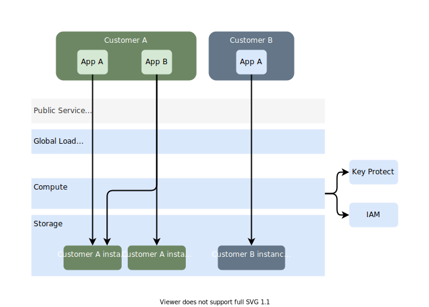
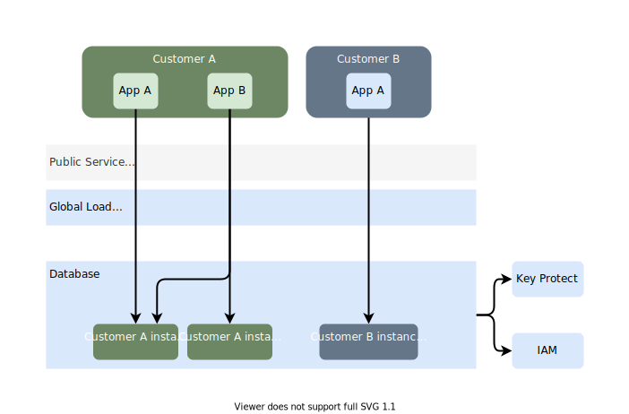

---

copyright:
  years: 2020
lastupdated: "2020-12-23"

keywords: public isolation for cloudant, compute isolation for cloudant, cloudant architecture, workload isolation in cloudant

---

{:new_window: target="_blank"}
{:shortdesc: .shortdesc}
{:screen: .screen}
{:codeblock: .codeblock}
{:pre: .pre}
{:tip: .tip}
{:note: .note}
{:important: .important}
{:deprecated: .deprecated}
{:external: target="_blank" .external}

<!-- Acrolinx: 2020-12-23 -->

# Learning about {{site.data.keyword.cloudant_short_notm}} architecture and workload isolation
{: #compute-isolation}

Review the following sample architecture for {{site.data.keyword.cloudantfull}}, and learn more about different isolation levels so that you can choose the solution that best meets the requirements of the workloads that you want to run in the cloud. 
{: shortdesc}

## {{site.data.keyword.cloudant_short_notm}} isolation models and architecture
{: #isolation-models-architecture}

{{site.data.keyword.cloudant_short_notm}} is a multi-tenant-capable database system with mechanisms in place to distribute any shared resources like CPU or I/O fairly amongst the active tenants. {{site.data.keyword.cloudant_short_notm}} implements isolation in the database layer itself, and not by relying on containers. Instances are isolated from each other for access control, meaning that it is not possible to read or write data in one instance from another. 

Workload isolation is an important consideration for many customers. To enable you to select the best {{site.data.keyword.cloudant_short_notm}} plan choice for your workload isolation requirements, see the following architectural information: 

1.  Standard on Transaction Engine plan, which offers our most cost-effective and robust isolation.

2.  Standard and Lite plans on Multi-Tenant Hardware, which offer excellent isolation.

3.  Standard plan provisioned on a Dedicated Hardware plan instance, which offers improved isolation over Standard on Multi-Tenant Hardware. 

### Standard on Transaction Engine
{: #standard-txe}

The Standard on Transaction Engine plan uses improved compute and storage layer technologies to provide strong security guarantees and resource isolation while using a shared underlying infrastructure. The plan has provisioned throughput rate-limiting applied, along with other resource and access isolation mechanisms within the database layer itself. 

{: caption="Figure 1. Data isolation on {{site.data.keyword.cloudant_short_notm}} Standard on Transaction Engine plan" caption-side="bottom"} 

Standard on Transaction Engine uses a two-tier architecture which separates the compute and data storage layers. Only the compute layer is able to view unencrypted customer document content; document content is encrypted within the compute layer using an {{site.data.keyword.IBM}} owned and managed encryption key specific to each database. Database names and document IDs remain unencrypted in the compute layer. 

The data storage layer is a shared key-value store. In addition to document content being encrypted before arriving at the storage layer, each Standard on Transaction Engine instance is given its own dedicated region of this key-value space to further isolate data. Disk encryption is then used to further secure database names and document IDs, using an {{site.data.keyword.IBM_notm}} owned and managed encryption key. 

Data in motion is encrypted throughout its lifetime. 

### Standard and Lite
{: #standard-and-lite}

Standard and Lite plans are provisioned onto large, shared {{site.data.keyword.cloudant_short_notm}} database deployments where customers share compute and storage resource. Standard and Lite plans have provisioned throughput rate-limiting applied, along with other resource and access isolation mechanisms within the database layer itself. Together, these provide strong security guarantees alongside robust resource separation within the shared environment. 

{: caption="Figure 2. Data isolation on {{site.data.keyword.cloudant_short_notm}} Standard plan" caption-side="bottom"} 

Disk encryption is used to provide encryption at rest using an {{site.data.keyword.IBM_notm}} owned and managed encryption key. Customer data resides in different files on disk. 

### Standard on Dedicated Hardware
{: standard-on-dedicated-hardware}

A Dedicated Hardware instance offers improved storage and compute isolation for your most valuable data, including use of BYOK. After provisioning a Dedicated Hardware instance, you may provision many Standard plan instances onto this Dedicated Hardware instance to store your data. While these Standard plan instances share the Dedicated Hardware's compute and storage, the instances do not share these with other customers. 

{: caption="Figure 3. Data isolation on {{site.data.keyword.cloudant_short_notm}} Standard plan when using Dedicated Hardware" caption-side="bottom"} 

Disk encryption is used to provide encryption at rest. In the Dedicated Hardware plan, customers can use their own keys using {{site.data.keyword.cloud}} Key Protect's BYOK functionality to further secure their data. 

Dedicated Hardware instances provide IP allowlisting and private network utilization to secure network access. 

Data and resource isolation between the Standard plan instances on a Dedicated Hardware instance is provided using the same robust mechanisms used within the multi-tenant deployment option. 
