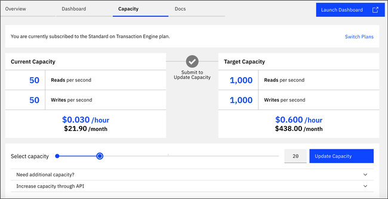
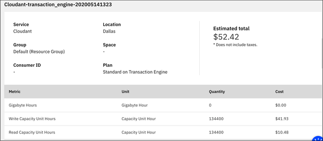
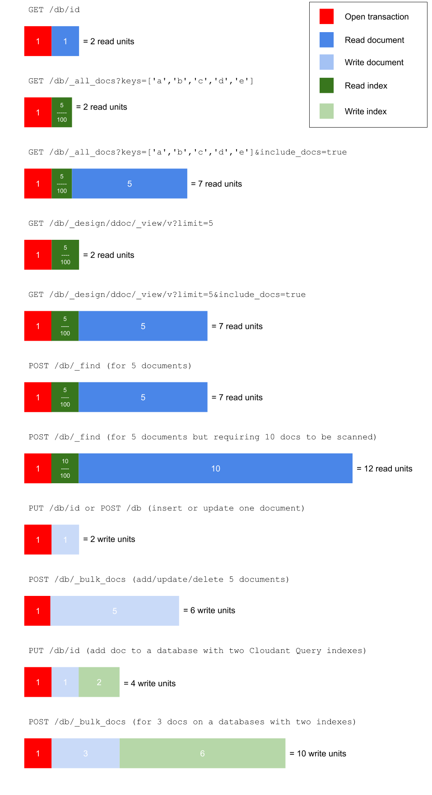

---

copyright:
  years: 2020, 2022
lastupdated: "2022-08-05"

keywords: pricing examples, data usage, ibm cloud usage dashboard, operation cost, bulk, api call, purge data, indexes, mapreduce, databases

subcollection: Cloudant

---

{{site.data.keyword.attribute-definition-list}}

# Pricing
{: #pricing-te}

The {{site.data.keyword.cloudant_short_notm}} on Transaction Engine service ends on 1 February 2023. You can no longer create new instances of {{site.data.keyword.cloudant_short_notm}} on Transaction Engine. On 1 February 2023, all instances of {{site.data.keyword.cloudant_short_notm}} on Transaction Engine will be permanently disabled and deprovisioned. Users of existing instances need to migrate from the service before the end of service date. You can find guidance on migrating from {{site.data.keyword.cloudant_short_notm}} on Transaction Engine to {{site.data.keyword.cloudant_short_notm}} Standard here: [Migrating from TXE](https://blog.cloudant.com/2022/01/14/Migrating-from-Cloudant-TXE-to-Standard ){: external}.
{: important}

[{{site.data.keyword.cloudantfull}} on Transaction Engine](/docs/Cloudant?topic=Cloudant-overview-te) is the latest incarnation of the {{site.data.keyword.cloudant_short_notm}} JSON document store that runs as a service in {{site.data.keyword.cloud}}. 
{: shortdesc}

{{site.data.keyword.cloudant_short_notm}} on Transaction Engine differs from the *Classic* {{site.data.keyword.cloudant_short_notm}} product, as a glance at the [feature comparison chart](/docs/Cloudant?topic=Cloudant-feature-comparison) shows, but it also has a different pricing model.

{{site.data.keyword.cloudant_short_notm}} Transaction Engine's pricing structure is closely aligned with the performance characteristics of the database. In other words, database operations that are cheap (in terms of the number of read/write units they consume) are relatively easy for the database to execute and are performant and scalable. 

This document explores the implicit *incentives* that the pricing model is presenting to the developer. If you follow incentives you get fast, scalable performance at the lowest price.

{{site.data.keyword.cloudant_short_notm}} Standard on Transaction Engine plan is pro-rated hourly and priced based on two things:

1. The provisioned throughput capacity that you allocate for your instance.
2. The amount of data storage consumed.

## Provisioned Throughput Capacity
{: #provisioned-throughput-capacity-te}

You can scale your provisioned throughput capacity up and down in granular blocks of 50 reads per second and 50 writes per second. You then pay a pro-rated hourly fee based on the peak capacity for the hour. The provisioned throughput capacity is based on read and write capacity, or in other words, the ability to do a specific number of reads per second or writes per second. No separate global query capacity exists in the Standard on Transaction Engine plan as global queries are counted as reads. For each hour that an instance is provisioned, a specific number of read capacity units and write capacity units are submitted for usage.  So at the minimum capacity setting in an hour, 50 Read Capacity Unit Hours and 50 Write Capacity Unit Hours are submitted. Further accumulation of Capacity Unit Hours quantities occurs for each hour and quantity of capacity set. See the catalog for pricing for read and write capacity.

Read and write capacity can't be scaled independently. Use the slider to select the number of blocks of provisioned throughput capacity based on the maximum limit of either reads per second or writes per second required for your application. For example, if your application requires 1,000 reads per second, use the slider to select the capacity that offers 1,000 reads per second and 1,000 writes per second. You must make this selection even if you don't need the corresponding number of writes.

You can't exceed the reserved capacity for either reads or writes. If you do, an HTTP 429 status code occurs that indicates the application is trying to exceed its provisioned throughput capacity allowance.

Go to the {{site.data.keyword.cloud_notm}} Dashboard and select the instance, then select **Manage** > **Capacity** to view and change the provisioned throughput capacity. See the hourly and approximate monthly costs for each setting as shown in the following example. 

{: caption="Figure 1. Capacity slider" caption-side="bottom"}

## Read requests
{: #read-requests-te}

Read requests execute queries or read documents on database content. A read
request consumes read units as shown in the following list:

- 1 read unit to open the request's transaction.
- A further 1 read unit for each document read.
- A further 1/100th of a read unit for each row of an index read.

Any fraction in the total cost is rounded up to the next full read unit.

To properly estimate cost, it's important to know what constitutes reading an
index row, and how that relates to the results the client receives in the HTTP
response. See the difference by index type in the following list:

- For view indexes, each row includes both key and value.
- For Mango indexes, each row is not seen by the client, but includes a document ID that is used internally to complete processing of the query. As further processing is required, the number of rows that are read from an index can differ significantly from the number of results the response contains. 

## Write requests
{: #write-requests-te}

Write requests create, update, or delete documents. They consume write units in the following way:

- 1 write unit to open the request's transaction.
- A further 1 write unit for each document written. This write unit includes writing the document content and the entries into the automatic primary and sequence indexes.
- A further 1 write unit for each row of an index written during foreground indexing of user-defined indexes (currently only Mango indexes support foreground indexing).

Therefore, writing a single document amplifies, in terms of write units
that are consumed, the amount of foreground indexing it causes. Foreground and
background indexing are discussed next.

## Updating indexes
{: #updating-indexes-te}

As well as serving requests, {{site.data.keyword.cloudant_short_notm}} needs to build indexes to serve queries. A
database can contain many indexes. {{site.data.keyword.cloudant_short_notm}} updates indexes in the following ways.

- Foreground indexing happens within a document write transaction. It costs one write unit per row that is emitted into an index. Only Mango indexes support foreground indexing.
- Background indexing is further discussed later and is used in the follow way:
    - To keep view and search indexes up to date with document writes. It is
      guaranteed to happen after a document is written but before non-stale queries to an index occur.
    - To build newly created indexes of any type. Background indexing and indexing units.

Background indexing is used to keep view indexes up to date with
document writes and to build newly created indexes of any type.

- Background indexing consumes indexing units.
    - Each document read to build an index during background indexing costs one
      indexing unit. A document is read when it is created, updated, or deleted.
    - Each row emitted to an index during background indexing costs one indexing
      unit.
- Each account includes a number of indexing units, which is set in proportion to the write unit throughput of an account. Indexing units are not charged for separately.
- The amount of indexing unit throughput is a multiple of the write unit throughput for an account. It is designed to allow a moderate number of indexes to be kept up to date when you maintain maximum write throughput, as a few new indexes to be created.
    - In the case where you have many indexes, it is possible to write
      documents fast enough to exhaust background indexing capacity, meaning
      that indexes may never "catch up with new writes. If indexes are failing
      to keep up to date sufficiently quickly, provision more write capacity to
      your account to increase the amount of indexing unit throughput
      provisioned for your account.
    - Creating an index of any type (Mango or view) consumes a
      large amount of indexing unit throughput while the index is initially
      being built. As a result, all existing documents in a database need to
      be read and added to the index. Create only one new index
      at a time to allow each new index to be built in a timely manner. If you attempt to build several new indexes in parallel, it is likely to cause
      problems where indexes fall behind writes.

## Replication
{: #replication-throughput-te}

[Replication](/docs/Cloudant?topic=Cloudant-replication-guide) between two databases consumes read capacity on the source database and write capacity on the target database. The replicator is aware of the rate limits in {{site.data.keyword.cloudant_short_notm}} and employs staggered retry logic when encountering `429` responses associated with hitting the provisioned throughput capacity limits set for the instance.  

Using the default parameters to replicate a database with a large backlog of documents creates a single replication job. This job consumes almost 650 reads per second on the source database and batches of 500 - 1000 writes per second on the target database. 

Users can reduce the approximate read and write throughput that is consumed by a replication job by adjusting the [performance-related options](/docs/Cloudant?topic=Cloudant-advanced-replication#performance-related-options) that are associated with [tuning replication speed](/docs/Cloudant?topic=Cloudant-replication-guide#tuning-replication-speed). The following table provides recommended options for users who want to reduce the read capacity consumed on the source database:

| `http_connections` | `worker_processes` | Approximate reads per second on source database |
|------------------|--------------|------------|
| 2 | 1 | 35 | 
| 6 | 2 | 170 |
| 12 | 3 | 360 | 
| 20 | 4 | 650 (This value is the default.) |
{: caption="Table 1. Options" caption-side="top"}

Write capacity that is consumed on the target database can be adjusted by using the `worker_batch_size` parameter. The default is 500 documents in a batch write. This parameter can be adjusted down to reduce the peak write throughpsut that is seen on the batch writes. 

## Examples
{: #request-examples-te}

Here you see samples of how many units some example requests
consume.

| Request | Unit Total |
|---------|------------|
| Read a single document by using `GET /{DATABASE}/{ID}`. | One unit to open the transaction. </br>One unit to read the {ID} document. </br>Two read units total. |
| Read five documents by using `_bulk_get`. | One unit to open the transaction. </br>Five units to read five documents. </br>Six read units total. |
| Query a view that returns seven results. | One unit to open the transaction. </br>7/100 = 0.07 of a unit to read seven rows. </br>1.07 read units total, which is rounded up to two read units for the request. |
| Query a view that returns seven results and retrieves the documents by using `include_docs=true`. | One unit to open the transaction. </br>7/100 = 0.07 of a unit to read seven rows. </br>Seven units to read seven documents. </br>8.07 read units total, which is rounded up to nine read units for the request. |
| Mango query that returns seven results and can be satisfied with an index, which is the optimal way to use Mango indexes. | One unit to open the transaction. </br>7/100 = 0.07 of a unit to read seven rows. </br>Seven units to read seven documents (Mango always reads the documents to return them to you). </br>8.07 read units total, which is rounded up to nine read units for the request. |
| Mango query that returns seven results and is partially satisfied with an index but requires further processing on the documents themselves (for example, when a regex is used). The part of the query's selector that can be satisfied by using the index reads 26 rows, then 26 documents need to be read. After you apply the regex in the selector, 19 documents are discarded from the initial result set. | One unit to open the transaction. </br>26/100 = 0.26 read units to read 26 rows. </br>Twenty-six units to read 26 documents (Mango always reads the documents to return them to you). </br>27.26 read units total, which is rounded up to 28 read units for the request. |
| Query `_all_docs` by using a `limit` of 200 and retrieves the documents by using `include_docs=true`. | One unit to open the transaction. </br>200/100 = 2 units to read 200 rows. </br>Two hundred units to read 200 documents. </br>Two hundred and three read units total. | 
{: class="simple-tab-table"}
{: caption="Table 2. Read units" caption-side="top"}
{: #units-example1}
{: tab-title="Read units"}
{: tab-group="Units-examples"}

| Request | Unit Total |
|---------|------------|
| Write a single document that uses `POST /{DB}/{ID}` (whether creating or updating the document) to a database with no Mango indexes. | One unit to open the transaction. </br>One unit to write the document. </br>Two units total. |
| Write five documents that use `_bulk_docs` to a database with no Mango indexes. | One unit to open the transaction. </br>Five units to write the document. </br>Six units total. |
| Write a single document by using `POST /{DB}/{ID}` (whether creating or updating the document) to a database with two Mango indexes that each emit a single row per document. | </br>One unit to open the transaction. </br>One unit to write the document. </br>Two units to write two Mango index rows (one per index). </br>Four units total. |
| Write five documents by using `_bulk_docs` to a database with two Mango indexes that each emit a single row per document. | One unit to open the transaction. </br>Five units to write the document. </br>Ten units to write two Mango index rows (one per index).</br>Sixteen units total. |
{: caption="Table 2. Write units" caption-side="top"}
{: #units-example2}
{: tab-title="Write units"}
{: tab-group="Units-examples"}
{: class="simple-tab-table"}

## Data Storage
{: #data-storage-te}

Data is metered and usage submitted hourly and based on the Gigabyte Hours metric. For each hour, only storage higher than the free allotment of 25 GB is submitted for usage. For example, if you use 30 GB of storage in the instance in an hour, then 5-Gigabyte Hours of storage usage are submitted. Storage is inclusive of both the raw JSON document size as well as the size of the indexes in each database in the instance. See the catalog for pricing for storage.

## Pricing examples
{: #pricing-examples-te}

Let's assume you're building a mobile app with {{site.data.keyword.cloudant_short_notm}} and don't yet know the capacity
that you might need. In this case, start with the lowest provisioned throughput
capacity and increase it as needed by your application's usage over time. {{site.data.keyword.cloudant_short_notm}} bills
pro-rated hourly and changing the provisioned throughput capacity doesn't incur downtime.

For the mobile app example, you start with the minimum provisioned throughput capacity for
the Standard on Transaction Engine plan that is 50 reads per second and 50 writes per second. As shown in the catalog, a read capacity unit costs $0.00012 per hour and a write capacity unit costs $0.00048 per hour. A block of 50 reads per second and 50 writes per second of capacity costs 50 reads per second * $0.00012 per hour + 50 writes per second * $0.00048 per hour = $0.030 per hour. When you need to scale up (or down), you
can scale in increments of these blocks of capacity. Assuming the instance has less than
the 25 GB of storage that is included in the Standard on Transaction Engine plan, no storage costs are incurred.

See the following example equation:

- $0.030 per hour \* 1 block (of 50 reads per second and 50 writes per second provisioned throughput capacity) \* 730 hours (approximate hours in a month).
- Total = $21.90.

How do you estimate the total cost for provisioned throughput capacity per month of 1,000 reads per second and 1,000 writes per second?

- $0.030 per hour \* 20 blocks (of 50 reads per second and 50 writes per second provisioned throughput capacity) \* 730 hours (approximate hours in a month).
- Alternatively, the slider shows you the provisioned throughput capacity of 1000 reads per second and 1000 writes per second costs $0.600 per hour \* 730 hours.
- Total = $438.00.


## Data usage pricing
{: #data-usage-pricing-te}

What about pricing for data overage? How does that work?

| Plan | Storage Included | Overage Limit |
|-----|------------------|--------------|
| Standard on Transaction Engine | 25 GB | Extra storage costs $0.000342 per GB per hour, which is approximately $0.25 per GB per month. |
{: caption="Table 3. Data overage pricing" caption-side="top"}

## {{site.data.keyword.cloud_notm}} Usage Dashboard
{: #usage-dashboard-te}

How does data display in the {{site.data.keyword.cloud_notm}} Usage Dashboard?

Current and historical usage bills can be seen in the {{site.data.keyword.cloud_notm}} Dashboard, under **Manage** -> **Billing and usage** -> **Usage**. This view shows the totals for usage that are accrued during a particular month at the service, plan, or instance level. The Estimated Total reflects the bill so far for the month or for the  past complete months. It shows only the hourly costs that are accrued up to that point for the current month. By the end of the month, you can see that your total provisioned throughput capacity for the month is reflected in the `Read Capacity Unit Hours` and `Write Capacity Unit Hours`. The `Gigabyte Hours` field shows only the storage that was billed for any hour the instance exceeded the free allotment of 25 GB.

In the following example, a quantity of 0-Gigabyte Hours reflects that the instance never exceeded 25 GB for the month. Additionally, you see the total accumulation of read capacity unit hours and write capacity unit hours that are submitted at that point in the month.  As an example, an instance with 100 reads per second and 100 writes per second for a month with 730 hours would have 730,000 read capacity unit hours and 730,000 write capacity unit hours. These hours are submitted by the end of the month. 
 
{: caption="Figure 2. Usage example" caption-side="bottom"}

## More explanation about how pricing works
{: #how-does-pricing-work-on-cloudant-txe}

In addition, an {{site.data.keyword.cloudant_short_notm}} Transaction Engine plan comes with a number of read units and write units that are provisioned for your use every second. The number of read/write units you provision is determined by how much you pay and how much you can change up and down over time. You can either alter the position of the slider in the {{site.data.keyword.cloud_notm}} dashboard or by using an [API call](/docs/Cloudant?topic=Cloudant-capacity). You can see an example in the following image:

{: video controls loop}

Each {{site.data.keyword.cloudant_short_notm}} operation consumes a different number of read/write units based on how complex it is. It's in your interest to try to achieve your application's goals while it consumes the fewest units possible.

This chart shows the cost of common {{site.data.keyword.cloudant_short_notm}} operations, with a color-coded guide to how the price is calculated:

{: caption="Figure 4. {{site.data.keyword.cloudant_short_notm}} Transaction Engine pricing" caption-side="bottom"}

Let's unpack this diagram and draw out the incentives that {{site.data.keyword.cloudant_short_notm}} includes with the product and which *best practices* you are being driven toward.

### Bulk over piecemeal API calls
{: #bulk-over-piecemeal-api-calls}

Notice that every {{site.data.keyword.cloudant_short_notm}} operation expends one read/write unit to `open the transaction` with the underlying key-value store (indicated by a red icon on the diagram). In other words, the API calls that write, update, delete, or fetch a single document cost two units each - one to open the transaction the other to perform the database operation. The bulk APIs are cheaper because a database transaction is opened once and is able to service several reads or writes.

- If you have more than one document to fetch by their ID, use `GET /db/_all_docs?keys=["id1","id2"...]` instead of fetching them individually.
- If you have more than one document to insert, update, or delete, use `POST /db/_bulk_docs` instead of an API call per document.

### Indexing is important for {{site.data.keyword.cloudant_short_notm}} Query
{: #indexing-is-important-for-cloudant-query}

Using the `POST /db/_find` endpoint to query a database becomes expensive if the query is not backed by a supporting secondary index. The query isn't charged based on the number of documents that are returned but based on the *number of documents that are scanned* to get the answer. If a query has to churn through hundreds of cancelled orders before it finds the completed orders, then the query is too expensive and might exhaust your provisioned read allocation.

The best practice is to [create indexes](/apidocs/cloudant#postindex){: external} on the fields your query is searching for. A query that exactly aligns with a secondary index consumes only one read unit per returned document. Creating the appropriate index for your data takes skill. Read some advice on [index design and optimization](https://blog.cloudant.com/2020/04/24/Optimising-Cloudant-Queries.html).

### Deleting databases is the cleanest way to purge old unwanted data
{: #delete-databases-to-purge-unwanted-date}

Deleting a single document with `DELETE /db/id?rev=<rev>` costs 2 write units. It's cheaper per document to use `POST /db/_bulk_docs` to do multiple deletions, but the most efficient way to purge many documents in bulk is to delete entire databases.

The "time-boxed databases" approach detailed in the [Time-series Data Storage](https://blog.cloudant.com/2019/04/08/Time-series-data-storage.html) blog has merit in all flavors of {{site.data.keyword.cloudant_short_notm}}. It allows older data to be cleanly archived and deleted with full recovery of disk space.

### The fewer indexes the better
{: #the-fewer-indexes-the-better}

Writes and bulk writes are charged not only on the number of documents that are written but the number of {{site.data.keyword.cloudant_short_notm}} Query secondary indexes that are defined. As a result, each document write needs to be processed and written out into each index. The more indexes that you have, the more expensive each write costs, so the fewer indexes the better. It is worth exploring the technique for using [a handful of indexes that service many use cases](https://blog.cloudant.com/2019/05/10/Optimal-Cloudant-Indexing.html).

### Using the `_id` field as a free index
{: #using-the-id-field-as-a-free-index}

Storing data in the `_id` field rather than by using {{site.data.keyword.cloudant_short_notm}}'s auto-generated IDs can give you a "free" index for range querying, as shown in the following list:

- [Use a time-sortable ID](https://blog.cloudant.com/2018/08/24/Time-sortable-document-ids.html) to get time-ordered documents.
- Although no "partitioned databases" feature exists in {{site.data.keyword.cloudant_short_notm}} Transaction Engine, you can use IDs of the form `<deviceid>:<time-sortable-id>` to create a database that is sorted by device ID and time without secondary indexing. Judicious use of `startkey`/`endkey` with the `GET /db/_all_docs` allows the retrieval of readings from a known device ID in date order.
- If you have something unique about each document in your own domain, then use that instead of an auto-generated ID.

### Using `?include_docs=true` with MapReduce adds expense
{: #?include_docs=true-and-mapreduce-adds-expense}

Fetching keys and values from a MapReduce view is cheap (1 read unit to open the transaction and one read unit per *100* key-values). Adding `?include_docs=true` to fetch the associated document body adds the extra expense of one read unit per document fetched.

### Projecting data into a MapReduce view
{: #projecting-data-into-a-mapreduce-view}

The cheapest thing that {{site.data.keyword.cloudant_short_notm}} Transaction Engine does is reading key-values from a MapReduce view, incentivizing you to *project* data into the index's value to avoid having to use `?include_docs=true`. See the following example:

```js
function (doc) {
  // create an index keyed on userId/date whose value is a part of the document as an object
  emit([doc.userId, doc.date], { status: doc.status, description: doc.description })
}
```
{: codeblock}

Fetching data from a view like this is fast, cheap, and scalable.

### Bulk operations have a limit of 2000 documents
{: #bulk-operations-limit-2000-documents}

{{site.data.keyword.cloudant_short_notm}} Transaction Engine returns a maximum of 2000 documents or view rows at a time. Use the `page_size` parameter and the `bookmark` parameter to page through a result set and ask only for the documents needed. 

For more information, see [pagination in {{site.data.keyword.cloudant_short_notm}} Transaction Engine](/docs/Cloudant?topic=Cloudant-pagination-te).
