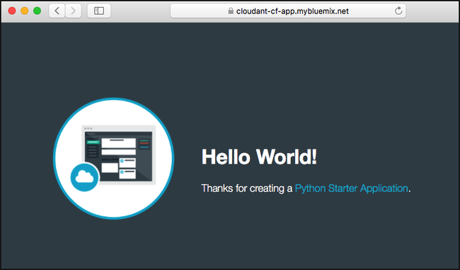

---

copyright:
  years: 2017, 2019
lastupdated: "2019-04-25"

keywords: connect to ibm cloud, upload application, test sample application, confirm database details

subcollection: cloudant

---

{:new_window: target="_blank"}
{:shortdesc: .shortdesc}
{:screen: .screen}
{:codeblock: .codeblock}
{:pre: .pre}
{:tip: .tip}
{:note: .note}
{:important: .important}
{:deprecated: .deprecated}

<!-- Acrolinx: 2017-05-10 -->

# Creating a simple {{site.data.keyword.cloud_notm}} application to access an {{site.data.keyword.cloudant_short_notm}} database: uploading the application
{: #creating-a-simple-ibm-cloud-application-to-access-an-ibm-cloudant-database-uploading-the-application}

This section of the tutorial describes how to upload an
{{site.data.keyword.cloud}} application.
{: shortdesc}

## Connecting to {{site.data.keyword.cloud_notm}}
{: #connecting-to-ibm-cloud}

The first task is to connect to {{site.data.keyword.cloud_notm}}.

The {{site.data.keyword.cloud_notm}} CLI needs to know which URL to use for making API calls. For example, when you upload an application, the {{site.data.keyword.cloud_notm}} toolkit uses the `ibmcloud api` command to manage the API endpoint. For more information about the `ibmcloud api` command, see [Getting started with the {{site.data.keyword.cloud_notm}} CLI ](https://cloud.ibm.com/docs/cli?topic=cloud-cli-ibmcloud-cli){: new_window}.

Use the following command to tell Cloud Foundry the URL to use:

```sh
ibmcloud api https://api.ng.bluemix.net
```
{: pre}

Expect a result similar to the following output:

```
Invoking 'cf api https://api.ng.bluemix.net'...

Setting api endpoint to https://api.ng.bluemix.net...
OK

API endpoint:   https://api.ng.bluemix.net
API version:    2.54.0
Not logged in. Use 'ibmcloud login' to log in.
```
{: codeblock}

Cloud Foundry now knows where to send API calls for managing applications.

The next step is to log in to your {{site.data.keyword.cloud_notm}} application environment.
You must supply the following account details:

-   Your user name, which is specified as the '`-u`' parameter.
-   Your organization name, which is specified as the '`-o`' parameter.
-   Your space, which is specified as the '`-s`' parameter.

  The account details are available on your {{site.data.keyword.cloud_notm}} dashboard, when you log in through a web browser, as shown in the following example:
  {: tip}

  

Use a command similar to the following example to log in to your
{{site.data.keyword.cloud_notm}} application environment.
Notice that you are asked to enter your account password.

```sh
ibmcloud login -u Adrian.Warman@uk.ibm.com -o Adrian.Warman@uk.ibm.com -s dev
```
{: pre}

Expect a result similar to the following output:

```
Invoking 'cf login -u Adrian.Warman@uk.ibm.com -o Adrian.Warman@uk.ibm.com -s dev'...

API endpoint: https://api.ng.bluemix.net

Password> 
Authenticating...
OK

Targeted org Adrian.Warman@uk.ibm.com

Targeted space dev
                
API endpoint:   https://api.ng.bluemix.net (API version: 2.54.0)
User:           adrian.warman@uk.ibm.com
Org:            Adrian.Warman@uk.ibm.com
Space:          dev
```
{: codeblock}

## Uploading the application
{: #uploading-the-application}

The {{site.data.keyword.cloudant_short_notm}} Foundry toolkit now knows how to connect to the {{site.data.keyword.cloud_notm}} environment.

The next step is to upload the application itself.
Details of an {{site.data.keyword.cloud_notm}} application
are provided in the [manifest file](/docs/services/Cloudant?topic=cloudant-creating-a-simple-ibm-cloud-application-to-access-an-ibm-cloudant-database-the-application-environment#the-manifest.yml-file).

Use a command similar to the following example to log in to upload your
{{site.data.keyword.cloud_notm}} application.

```sh
cf push "Cloudant Python"
```
{: pre}

A sequence of result messages is displayed.

```
Using manifest file /..../BMXDemo/manifest.yml

Updating app {{site.data.keyword.cloudant_short_notm}} Python in org Adrian.Warman@uk.ibm.com / space dev as Adrian.Warman@uk.ibm.com...
OK
```
{: codeblock}

The Cloud Foundry toolkit located the manifest file,
and is preparing to upload the application by using the connection
and identification details you provided [earlier](#uploading-the-application).

```
Using route Cloudant-Python.mybluemix.net
Uploading Cloudant Python...
Uploading app files from: /..../BMXDemo
Uploading 1.5K, 3 files
Done uploading               
OK
Binding service {{site.data.keyword.cloudant_short_notm}} Service 2017 to app {{site.data.keyword.cloudant_short_notm}} Python in org Adrian.Warman@uk.ibm.com / space dev as Adrian.Warman@uk.ibm.com...
OK
```
{: codeblock}

The application was uploaded successfully,
and a connection made with the {{site.data.keyword.cloudant_short_notm}} database instance.

```
Starting app {{site.data.keyword.cloudant_short_notm}} Python in org Adrian.Warman@uk.ibm.com / space dev as Adrian.Warman@uk.ibm.com...
-----> Downloaded app package (4.0K)
-----> Downloaded app buildpack cache (29M)
-------> Buildpack version 1.5.5
     $ pip install -r requirements.txt
DEPRECATION: --allow-all-external has been deprecated and will be removed in the future. Due to changes in the repository protocol, it no longer has any effect.
       Collecting cloudant==2.3.1 (from -r requirements.txt (line 1))
         Downloading cloudant-2.3.1-py2-none-any.whl (63kB)
       Collecting requests<3.0.0,>=2.7.0 (from cloudant==2.3.1->-r requirements.txt (line 1))
         Downloading requests-2.12.4-py2.py3-none-any.whl (576kB)
       Installing collected packages: requests, cloudant
       Successfully installed cloudant-2.3.1 requests-2.12.4
You are using pip version 8.1.1, however version 9.0.1 is available.
You should consider upgrading via the 'pip install --upgrade pip' command.
You are using pip version 8.1.1, however version 9.0.1 is available.
You should consider upgrading via the 'pip install --upgrade pip' command.
-----> Uploading droplet (30M)

0 of 1 instances running, 1 starting
1 of 1 instances running

App started


OK

App {{site.data.keyword.cloudant_short_notm}} Python was started using this command `python server.py`
```
{: codeblock}

The application starts automatically.
As part of the startup,
a check is made to ensure that all requirements are met,
by evaluating the contents of the [requirements.txt file](/docs/services/Cloudant?topic=cloudant-creating-a-simple-ibm-cloud-application-to-access-an-ibm-cloudant-database-the-application-environment#the-requirements.txt-file).

After you upload and start the application,
some simple system checks are run to confirm that the application is running correctly
as far as {{site.data.keyword.cloud_notm}} is concerned.

```
Showing health and status for app {{site.data.keyword.cloudant_short_notm}} Python in org Adrian.Warman@uk.ibm.com / space dev as Adrian.Warman@uk.ibm.com...
OK

requested state: started
instances: 1/1
usage: 128M x 1 instances
urls: Cloudant-Python.mybluemix.net
last uploaded: Thu Dec 22 15:58:18 UTC 2016
stack: cflinuxfs2
buildpack: python 1.5.5

     state     since                    cpu    memory          disk           details
#0   running   2016-12-22 03:59:21 PM   0.0%   49.9M of 128M   110.6M of 1G
```
{: codeblock}

## Testing the sample application
{: #testing-the-sample-application}

Now, test your application and verify that it is running properly. 

1.  From the {{site.data.keyword.cloud_notm}} dashboard, go to the **Menu** icon > **Resource List**, and open your application. Under Cloud Foundry Apps, click `Cloudant CF app` to open the details page.<br/>  


2.  On the `Cloudant CF app` details page, click `Routes` and click the `Cloudant-CF-app.mybluemix.net` link. <br/>


3. A new brower window opens at `https://cloudant-cf-app.mybluemix.net/`. The message verifies that the application is running. It says, "Hello World! Thanks for creating a Python Starter Application."<br/>



### Confirming the database details
{: #confirming-the-database-details}

From the {{site.data.keyword.cloud_notm}} dashboard, go to the **Menu** icon > **Resource List**, and open your service instance. Go to the `Manage` tab, and click `Launch Cloudant Dashboard`.<br/>


To find your {{site.data.keyword.cloudant_short_notm}} service page,
refer to the details in the [Creating an {{site.data.keyword.cloudant_short_notm}} instance tutorial](/docs/services/Cloudant?topic=cloudant-creating-an-ibm-cloudant-instance-on-ibm-cloud#locating-your-service-credentials).
{: note}

When the dashboard opens,
you can see that the application
created the '`databasedemo`' database:<br/>


The database contains a single document,
created by the application.
To verify the presence of the document,
click the database name within the dashboard.
A list of options for the database appears.
When you select the `All documents` tab,
details for a single document appear:<br/>


To see the contents of the document,
click the `Edit` icon,
which appears as an image of a pencil:<br/>


When the contents of the document appear,
you can see each of the fields that were created by the tutorial application.<br/>
<br/>
In particular,
the `rightNow` field has the date and time the document was created.
This value corresponds to the time that was recorded within the
[application log file](#testing-the-sample-application).

The next step in the tutorial is to [operate and maintain the application](/docs/services/Cloudant?topic=cloudant-creating-a-simple-ibm-cloud-application-to-access-an-ibm-cloudant-database-maintaining-and-troubleshooting#creating-a-simple-ibm-cloud-application-to-access-an-ibm-cloudant-database-maintaining-and-troubleshooting),
for example when you start,
stop,
and debug the application.