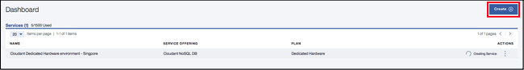

---

copyright:
  years: 2015, 2018
lastupdated: "2018-12-10"

---

{:new_window: target="_blank"}
{:shortdesc: .shortdesc}
{:screen: .screen}
{:codeblock: .codeblock}
{:pre: .pre}
{:tip: .tip}

<!-- Acrolinx: 2017-05-10 -->


# Creating and leveraging an {{site.data.keyword.cloudant_short_notm}} Dedicated Hardware plan instance on {{site.data.keyword.cloud_notm}}

This tutorial shows you how to create an {{site.data.keyword.cloudantfull}} Dedicated Hardware plan instance 
that uses the {{site.data.keyword.cloud}} dashboard, and shows you how to subsequently provision one or 
more Standard plan instances to run on it by using either the {{site.data.keyword.cloud_notm}} Catalog or the {{site.data.keyword.cloud_notm}} CLI. 

Creating an {{site.data.keyword.cloudant_short_notm}} Dedicated Hardware plan instance results in the provisioning 
of an {{site.data.keyword.cloudant_short_notm}} environment on dedicated hardware for your sole use. A service 
instance is created in the {{site.data.keyword.cloud_notm}} dashboard, but you cannot 
access the Dedicated Hardware plan instance directly and will not have 
any Service Credentials for it. You can use an {{site.data.keyword.cloudant_short_notm}} Dedicated Hardware 
plan instance after it is created by provisioning one or more Standard plan 
instances on it.

## Creating an {{site.data.keyword.cloudant_short_notm}} Dedicated Hardware plan instance

1.  Log in to your {{site.data.keyword.cloud_notm}} account.<br/>
    The {{site.data.keyword.cloud_notm}} dashboard can be found at:
    [http://bluemix.net ](http://bluemix.net){:new_window}.
    After authenticating with your user name and password,
    you are presented with the {{site.data.keyword.cloud_notm}} dashboard. Click `Catalog` from the menu:<br/>
    

2.  Click `Databases` from the left menu and `Cloudant` from the list of database services.<br/>
     <br/>

3.  Select the `Dedicated Hardware` plan from the list of pricing plans at the bottom of the page:<br/>
    
    
4.  Fill out the following parameters at the top of the page: <br/>
    -   Enter a service name.<br/>
    -   Specify the region/location where you want to deploy.<br/>
    -   Select a resource group.</br>
    -   Select a location for deployment.<br/>
    -   Select `yes` or `no` to answer whether HIPAA is required.<br/> 
    
    HIPAA is only valid for U.S. locations. {{site.data.keyword.IBM}} can provision a Dedicated Hardware plan environment to implement HIPAA controls. An environment is only provisioned upon confirmation of a Business Associate Agreement (BAA) that is established with {{site.data.keyword.IBM_notm}}. See [Enabling the HIPAA Supported setting](https://console.bluemix.net/docs/account/account_settings.html#enabling-the-hipaa-supported-setting) and the Service Description terms for more details. Provisioning a cluster to manage HIPAA data can take longer than the estimated 5-day period.
    {: tip}

    
        
5.  Click the `Create` button to start the provisioning process. <br/>

    Billing is prorated daily so make sure that you want to provision and pay for an environment before clicking the **Create** button.
    {: tip}

    

    During provisioning, a spinning wheel appears next to the instance in your {{site.data.keyword.cloud_notm}} dashboard. A request is sent to provision a Dedicated Hardware plan instance on bare metal servers. Provisioning time is asynchronous and can take up to 5 days. 
    {: tip}   

    
    
## Provisioning a Standard plan instance on a Dedicated Hardware environment

1.  Log in to your {{site.data.keyword.cloud_notm}} account.<br/>
    The {{site.data.keyword.cloud_notm}} dashboard can be found at:
    [http://bluemix.net ](http://bluemix.net){:new_window}.
    After authenticating with your user name and password,
    you are presented with the {{site.data.keyword.cloud_notm}} dashboard. Click `Catalog` from the menu:<br/>
    

2.  Click `Databases` from the left menu and `Cloudant` from the list of database services.<br/>
     <br/>
    The page for creating a service appears.<br/>  

3.  Click `Standard` from the pricing plans. <br/>
    
    
    You cannot provision a Lite plan instance on a Dedicated Hardware environment.
    {: tip}
    
4.  Fill out the following parameters: <br/>
    -   Enter a service name.<br/>
    -   Specify the region/location where you want to deploy. <br/>
    -   Select a resource group. </br>
    -   Select an authentication method.</br>
    -   Select an environment.</br>
    
    
5.  Click the `Create` button.<br/>
    After a few seconds, the instance is provisioned on the environment you selected.<br/>
    
    
6.  Obtain your Service Credentials and access the {{site.data.keyword.cloudant_short_notm}} Dashboard as you do for a multi-tenant {{site.data.keyword.cloudant_short_notm}} instance. 
    
    For more information, see [how to locate your service credentials](../tutorials/create_service.html#locating-your-service-credentials){:new_window}. 
    
## Provisioning a Standard plan instance on a Dedicated Hardware environment with the {{site.data.keyword.cloud_notm}} CLI

To use the {{site.data.keyword.cloud_notm}} CLI, you must be logged in. For more information about how to log in and set a target resource group, see [Logging in to your {{site.data.keyword.cloud_notm}} account](create_service_cli.html#logging-in-to-your-ibm-cloud-account){:new_window}. 

To create an {{site.data.keyword.cloudant_short_notm}} Standard plan instance on your {{site.data.keyword.cloudant_short_notm}} Dedicated Hardware plan environment, the basic command format is as follows:


Field | Description
------|------------
`NAME`| An arbitrary name you assign the instance.
`SERVICE_NAME` | `cloudantnosqldb`
`PLAN_NAME` | Standard plan
`LOCATION` |  The location where you want to deploy, for example, us-south, us-east, or eu-gb. 

See the following example command: 

```sh
ibmcloud resource service-instance-create NAME SERVICE_NAME SERVICE_PLAN_NAME LOCATION [-p, --parameters @JSON_FILE | JSON_STRING ]
```

{{site.data.keyword.cloudant_short_notm}} instances that are deployed on Dedicated Hardware environments take two more parameters:

Parameter | Description
----------|------------
`environment_crn` | This parameter must be set to the CRN of the {{site.data.keyword.cloudant_short_notm}} Dedicated Hardware plan instance. You can determine what the CRN is by looking at the example CLI command in the Manage tab of the {{site.data.keyword.cloudant_short_notm}} Dedicated Hardware plan instance in the {{site.data.keyword.cloud_notm}} Dashboard. Or you can determine what the CRN is by using the `ibmcloud resource service-instance SERVICE_INSTANCE_NAME` command. 
`legacyCredentials` | An optional parameter that defaults to true and dictates whether the instance uses both legacy and IAM credentials or IAM credentials only. See the [IAM guide ](../guides/iam.html#ibm-cloud-identity-and-access-management-iam-){:new_window} for more details on choosing an authentication method.

See the following example command: 

```sh
ibmcloud resource service-instance-create cloudant_on_ded_hardware_cli cloudantnosqldb standard us-south -p '{"environment_crn":"crn:v1:bluemix:public:cloudantnosqldb:us-south:a/b43434444bb7e2abb0841ca25d28ee4c:301a3118-7678-4d99-b1b7-4d45cf5f7b29::","legacyCredentials":false}'
```
     
