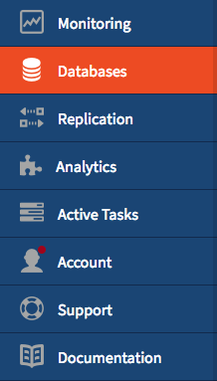
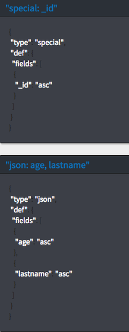
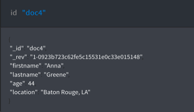
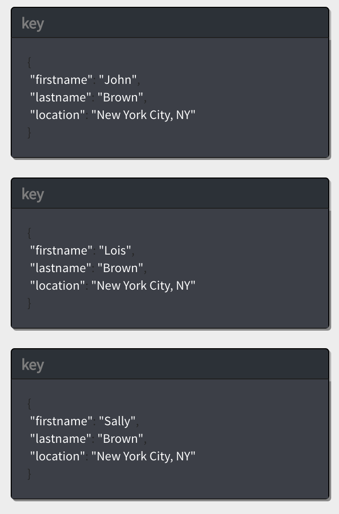
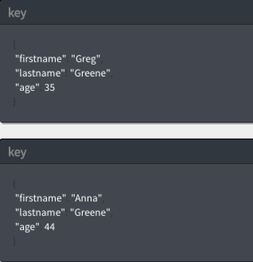

---

copyright:
  years: 2017
lastupdated: "2017-06-21"

---
{:new_window: target="_blank"}
{:shortdesc: .shortdesc}
{:screen: .screen}
{:codeblock: .codeblock}
{:pre: .pre}

# Creating a Cloudant Query

This tutorial demonstrates how to create a database, populate it 
with documents, create an index, and use the index to query the database.

Exercises for both the  Command line 
and  Cloudant Dashboard are provided. The
Cloudant Dashboard exercises give you a visual example of each task. You can follow the links 
throughout the tutorial for more information.

To begin, you create the `query-demo` database and some documents that 
contain the data for these exercises.

## Assumptions

Before you begin, follow these steps to prepare for the tutorial:

<ol><li><a href="https://console.ng.bluemix.net/registration/">Create a Bluemix account</a>.</li>
<li>Log in to the <a href="https://console.ng.bluemix.net/catalog/services/cloudant-nosql-db">Cloudant Dashboard</a>.</li>
<li><a href="https://console.ng.bluemix.net/docs/services/Cloudant/tutorials/create_service.html#creating-a-cloudant-instance-on-bluemix">Create a Cloudant instance on Bluemix</a>.</li>
<li>(Optional) <a href="../guides/acurl.html#authorized-curl-acurl-">Create an acurl alias</a> to make it easier and faster to run commands from the command line.</li>
<li>Replace the <code>$ACCOUNT</code> variable in the commands that are included in the exercises 
with the user name you use to log in to Cloudant Dashboard. If you decide not to set up <code>acurl</code>, 
use the following URL instead of the one provided in the exercises. 
<p><code>curl https://$USERNAME:$PASSWORD@$ACCOUNT.cloudant.com/query-demo</code></p></li>
</ol>

## Creating a database

In this section, you create the `query-demo` [database](../api/database.html#create) that 
is the database that we use in this tutorial.

 Command line</img>  

<ol><li>Create a database by running this command.
<p><code>acurl https://$ACCOUNT.cloudant.com/query-demo -X PUT</code></p></li>
<li>See the results. 
<p><code>{"ok":true}</code></p></li></ol>

 Cloudant Dashboard</img> 

<ol><li>Open the Cloudant service instance that you created. </li>
<li>Select the Databases tab. 
<p></img></p></li>
<li>Click <b>Create Database</b>. </li>
<li>Enter <code>query-demo</code> and click <b>Create</b>.
<p>The <code>query-demo</code> database automatically opens.</p>
</li>
</ol>

## Creating documents in the database

The [documents](../api/document.html#documents") 
that you create in this exercise contain the data that you use to query the `query-demo` database in later exercises. 

 Command line</img> 

<ol><li>Copy the sample text to a data file named <code>bulkcreate.dat</code> to create all five documents.
<p><pre>{
"docs": 
   [
	{ 
		"_id": "doc1",
		"firstname": "Sally",
		"lastname": "Brown",
		"age": 16,
		"location": "New York City, NY"
    },
     { 
		"_id": "doc2",
        "firstname": "John",
	    "lastname": "Brown",
	    "age": 21,
        "location": "New York City, NY"
    },
     {
		"_id": "doc3",
		"firstname": "Greg",
		"lastname": "Greene",
		"age": 35,
		"location": "San Diego, CA"
    },
     {
		"_id": "doc4",
		"firstname": "Anna",
		"lastname": "Greene",
		"age": 44,
		"location": "Baton Rouge, LA"
    },
     {
		"_id": "doc5",
		"firstname": "Lois",
		"lastname": "Brown",
		"age": 33,
		"location": "Syracuse, NY"
    }
  ]
}</pre></p></li>
<li>Run this command to create the documents. 
<p><code>acurl https://$ACCOUNT.cloudant.com/query-demo/_bulk_docs -X POST -H "Content-Type: application/json" -d \@bulkcreate.dat</code></p>
<p><b>Note</b>: Notice that the '@' symbol, used to indicate that the data 
is included in a file, is identified by the supplied name.</p></li>
<li>See the results. 
<p><pre>[{"ok":true,
"id":"doc1","rev":"1-57a08e644ca8c1bb8d8931240427162e"},
{"ok":true,"id":"doc2","rev":"1-bf51eef712165a9999a52a97e2209ac0"},
{"ok":true,"id":"doc3","rev":"1-9c9f9b893fcdd1cbe09420bc4e62cc71"},
{"ok":true,"id":"doc4","rev":"1-6aa4873443ddce569b27ab35d7bf78a2"},
{"ok":true,"id":"doc5","rev":"1-d881d863052cd9681650773206c0d65a"}]</pre></p>
</li></ol>

 Cloudant Dashboard</img> 

<ol>
<li>Click <b>+</b> and select <b>New Doc</b>.
<p>The New Document window opens. </p></li>
<li><a name="step2"></a> To create a document, copy the following sample text and replace the existing text in the new document.
<p><i>First sample document</i>:</p>
<p><pre>{ 
        "firstname": "Sally",
        "lastname": "Brown",
        "age": 16,
        "location": "New York City, NY",
        "_id": "doc1"
     }</pre></p>
</li>
<li>Repeat <a href="#step2">step 2</a> to add the remaining documents to the database.
<p><i>Second sample document</i>:</p>
<p><pre>{ 
        "firstname": "John",
        "lastname": "Brown",
        "age": 21,
        "location": "New York City, NY",
        "_id": "doc2"
     }</pre></p>
<p><i>Third sample document</i>:</p>
<p><pre> {
        "firstname": "Greg",
        "lastname": "Greene",
        "age": 35,
		"location": "San Diego, CA",
        "_id": "doc3"
     }
</pre>
</p>
<p><i>Fourth sample document</i>:</p>
<p><pre>{
        "firstname": "Anna",
        "lastname": "Greene",
        "age": 44,
		"location": "Baton Rouge, LA",
        "_id": "doc4"
     }</pre>
</p>
<p><i>Fifth sample document</i>:</p>
<p><pre>{
        "firstname": "Lois",
        "lastname": "Brown",
        "age": 33,
        "location": "New York City, NY",
        "_id": "doc5"
     }
</pre></p>
<p>The `query-demo` database was created. You can see the documents in the right pane.</p>
<p></img></p></li>
</ol>

## Creating an index

Cloudant provides views and indexes to query the database. A view runs a query that is saved to the database, and 
the result is called the result set. When you submit a query to the view, your query searches 
the result set. An index is a way to structure data that improves retrieval time. 

You can use the primary index that comes with Cloudant, or secondary indexes like views 
(MapReduce), search indexes, Cloudant Geospatial queries, or Cloudant Query as described 
in the following list: 

*	Primary index – look up a document or list of documents by ID.  
*	[View](../api/creating_views.html#views-mapreduce-) – search for information in the database that matches the search criteria that you specify, such as counts, sums, averages, and other mathematical functions. The criteria you can search is specified in the view's definition. Views use the MapReduce paradigm. 
*	[Search index](../api/search.html#search) – search one or more fields, large amounts of text, or use wildcards, fuzzy search, or facets with [Lucene Query Parser Syntax](http://lucene.apache.org/core/4_3_0/queryparser/org/apache/lucene/queryparser/classic/package-summary.html#Overview). 
*	[Cloudant Geospatial](../api/cloudant-geo.html#cloudant-geospatial) – search for documents based on a spatial relationship. 
*	[Cloudant Query](../api/cloudant_query.html#query) – use Mongo-style query syntax to search for documents by using logical operators. Cloudant Query is a combination of a view and a search index. We use Cloudant Query in this tutorial. 

Since the queries you create in this tutorial search for both `lastname` and `firstname`, you must
create two indexes. The field you search for must be the first field listed in the index. If an 
index is not specified in the query, Cloudant chooses the best index to use. 

 Command line</img> 

To create the first index: 

<ol><li>Copy the sample JSON into a data file named <code>query-index1.dat</code>.
<p>
<pre>{
  "index": {
    "fields": [
         "lastname",
         "firstname",  
         "location", 
         "age"
    ]
  },
  "name": "query-index1",
  "type": "json"
}</pre></p></li>
<li>Run this command to create an index.
<p><code>acurl https://$ACCOUNT.cloudant.com/query-demo/_index -X POST -H "Content-Type: application/json" -d \@query-index1.dat</code></p></li>
<li>See the results. 
<p><pre>{"result":"created",
"id":"_design/752c7031f3eaee0f907d18e1424ad387459bfc1d",
"name":"query-index1"}</pre></p>
</li></ol>

To create the second index: 

<ol><li>Copy the sample JSON into a data file named <code>query-index2.dat</code>.
<p>
<pre>{
  "index": {
    "fields": [
         "firstname",
         "lastname",  
         "location", 
         "age"
    ]
  },
  "name": "query-index2",
  "type": "json"
}</pre></p></li>
<li>Run this command to create an index.
<p><code>acurl https://$ACCOUNT.cloudant.com/query-demo/_index -X POST -H "Content-Type: application/json" -d \@query-index2.dat</code></p></li>
<li>See the results. 
<p><pre>{"result":"created",
"id":"_design/752c7031f3eaee0f907d18e1424ad387459bfc1d",
"name":"query-index2"}</pre></p>
</li></ol>

 Cloudant Dashboard</img> 

To create the first index:

<ol><li>Click <b>+</b> > <b>Query Indexes</b> on either the All Documents or Design Documents tab.</li>
<li>Paste the sample JSON into the Index field.
<p><pre>
{
  "index": {
    "fields": [
         "lastname",
         "firstname",  
         "location", 
         "age"
    ]
  },
  "name": "query-index1",
  "type": "json"
}</pre></p>
<p>The index was created. You can see the it in the right pane. </p>
<p></img></p>
</li></ol>

To create the second index:

<ol><li>Click <b>+</b> > <b>Query Indexes</b>.</li>
<li>Paste the sample JSON into the Index field.
<p><pre>
{
  "index": {
    "fields": [
         "firstname",
         "lastname",  
         "location", 
         "age"
    ]
  },
  "name": "query-index2",
  "type": "json"
}</pre></p>
<p>The index was created. You can see the it in the right pane. </p>
<p></img></p>
</li></ol>

Notice that the first entry in the first index is `lastname`, and the first entry 
in the second index is `firstname`. When you create a query, the field you search 
for must be listed first in the index. In the following three queries we run, one 
query searches for first name and two queries search for last name.

## Creating a query

Queries allow you to extract your data from Cloudant. A well-written 
[query](../api/cloudant_query.html#query) can narrow your search and 
its results to include only the data you want. 

This exercise shows you how to write and run a simple query, query with two fields, 
and query with an [operator](../api/cloudant_query.html#cloudant_query.html#operators). 
You query with an operator by specifying at least one field and its corresponding value. 
The query then uses this value to search the database for matches. 

For anything but the most simple query, add the JSON to a data file and run it from the command line.

### Running a simple query

This query searches for any documents whose `firstname` field contains the value `Sally`. 

 Command line</img> 

1.  Copy the sample JSON into a data file named `query1.dat`.
    ```json
    {
      "selector": {
            "firstname" : "Sally"            
         }        
    }        
    ```    
    {:codeblock}
2.  Run this command to query the database.

    <code>acurl https://$ACCOUNT.cloudant.com/query-demo/_find -X POST -H "Content-Type: application/json" -d \@query1.dat</code>

3.  See the query results.

     ```json
     {"docs":
       [
            {"_id":"doc1",
            "_rev":"3-751ab049e8b5dd1ba045cea010a33a72",
            "firstname":"Sally",
            "lastname":"Brown",
            "age":16,
            "location":"New York City, NY"}
        ]
    }
    ```

 Cloudant Dashboard</img> 

<ol><li>Click the <b>Query</b> tab.</li>
<li>Copy and paste the sample JSON into the Cloudant Query window. 
<p><pre>{
  "selector": {
     "firstname" : "Sally"            
   }        
}   </pre></p></li>
<li>Click <b>Run Query</b>.
<p>The query results appear in the right pane.</p>
<p></img></p>
</li></ol>

### Running a query with two fields

This example uses two fields to find everyone that is named Brown who lives in New York City, NY.

```json
{
    "selector": {
            "lastname": "Brown",
            "location": "New York City, NY" 
        }                
    }        
```    
{:codeblock}

You can tailor the results to meet your needs. 
The `fields` parameter specifies the fields to include with the results. In this case, the 
results include the first name, last name, and location. The results are sorted by first 
name in ascending order based on the values in the `sort` parameter.

```json
  "fields" : [ "lastname", "firstname", "location" ],
  "sort" : [ { "lastname": "asc"},
			 { "firstname": "asc"} ]      
```  
{:codeblock}

 Command line</img> 

1.  Copy the sample JSON into a data file named `query2.dat`.
    ```json
    {
        "selector": {
            "lastname": "Brown",
            "location": "New York City, NY" 
         },
            "fields": ["firstname", "lastname", "location" ],
              "sort": [ { "lastname": "asc"},
			            { "firstname": "asc"} ] 
     }
    ```
    {:codeblock}
    
2.  Run this command to query the database.

    <code>acurl https://$ACCOUNT.cloudant.com/query-demo/_find -X POST -H "Content-Type: application/json" -d \@query2.dat</code>

3.  See the query results.

    ```json
         {"docs":[
            {"firstname":"John","lastname":"Brown","location":"New York City, NY"},
            {"firstname":"Sally","lastname":"Brown","location":"New York City, NY"}]
         }
    ```
    {:codeblock}
    
 Cloudant Dashboard</img> 

<ol><li>Click the <b>Query</b> tab.</li>
<li>Copy and paste the sample JSON into the Cloudant Query window.  
<p><pre>
{
    "selector": {
       "lastname": "Brown",
       "location": "New York City, NY" 
            },
         "fields": ["firstname", "lastname", "location" ],
           "sort": [ { "lastname": "asc"},
		  	         { "firstname": "asc"} ]  
}
</pre></p></li>
<li>Click <b>Run Query</b>.
<p>The query results appear in the right pane.</p>
<p></img></p>
</li></ol>

### Running a query with operators

In this example, the $eq (equal) and $gt (greater than) operators are used to search 
for documents that contain the last name `Greene` and an age that is greater than `30`.
 

```json
{ "selector": {
    "lastname": {"$eq": "Greene"},
         "age": {"$gt": 30}
 }
```   
{:codeblock}

 Command line</img> 

1.  Copy this sample JSON to a file named `query3.dat`.
    ```json
    { "selector": {
        "lastname": {"$eq": "Greene"},
             "age": {"$gt": 30}
        },
            "fields" : [ "firstname","lastname", "age" ],
               "sort": [ { "lastname": "asc"},
			             { "firstname": "asc"} ]  
      }
    ```
2. Run this query:

    <code>acurl https://$ACCOUNT.cloudant.com/query-demo/_find -X POST -H "Content-Type: application/json" -d \@query3.dat</code>

3.  See the query results.

    ```json
    {"docs":[
            {"firstname":"Anna","lastname":"Greene","age":44},
            {"firstname":"Greg","lastname":"Greene","age":35} ]
       }
    ```
    {:codeblock}

 Cloudant Dashboard</img> 

<ol><li>Click the <b>Query</b> tab.</li>
<li>Copy and paste the sample JSON into the Cloudant Query window.
<p><pre>
    { "selector": {
        "lastname": {"$eq": "Greene"},
             "age": {"$gt": 30}
        },
            "fields" : [ "firstname","lastname", "age" ],
               "sort": [ { "lastname": "asc"},
			             { "firstname": "asc"} ]   
      }</pre></p></li>
<li>Click **Run Query**.
<p>The query results appear in the right pane.</p>
<p></img></p></li></ol>

For more information about Cloudant, see the [Cloudant Documentation](https://console.bluemix.net/docs/services/Cloudant/cloudant.html#overview).


