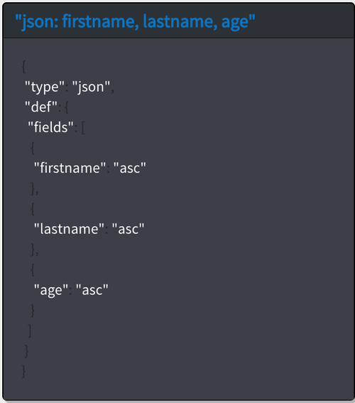

---

copyright:
  years: 2017
lastupdated: "2017-09-28"

---
{:new_window: target="_blank"}
{:shortdesc: .shortdesc}
{:screen: .screen}
{:codeblock: .codeblock}
{:pre: .pre}

# Creating a Cloudant Query

This tutorial demonstrates how to create a database, populate it
with documents, create an index, and use the index to query the database.

Exercises for both the  _Command line_
and  _Cloudant Dashboard_ are provided. The
Cloudant Dashboard exercises give you a visual example of each task. You can follow the links
throughout the tutorial for more information.

To begin, you create the `query-demo` database and some documents that
contain the data for these exercises.

## Assumptions

Before you begin, follow these steps to prepare for the tutorial:

1.  [Create a Bluemix account ](https://console.ng.bluemix.net/registration/){:new_window}.
2.  Log in to the
  [Cloudant Dashboard ](https://console.ng.bluemix.net/catalog/services/cloudant-nosql-db){:new_window}.
3.  [Create a Cloudant instance on Bluemix](create_service.html#creating-a-cloudant-instance-on-bluemix).
4.  (Optional) [Create an acurl alias](../guides/acurl.html#authorized-curl-acurl-) to make it easier and faster to run commands from the command line.
5.  Replace the `$ACCOUNT` variable in the commands that are included in the exercises with the user name you use to log in to Cloudant Dashboard.
  If you decide not to set up `acurl`,
  use the following URL instead of the one provided in the exercises:
  ``` sh
  curl https://$USERNAME:$PASSWORD@$ACCOUNT.cloudant.com/query-demo
  ```
  {:codeblock}

## Creating a database

In this section, you create the `query-demo` [database](../api/database.html#create) that
is the database that we use in this tutorial.

> **Note:** In this tutorial,
  we use the `acurl` alias rather than the `curl` command.
  The `acurl` alias is created using steps described [here](../guides/acurl.html#authorized-curl-acurl-).
  If you prefer to use the `curl` command,
  or another method for invoking API endpoints,
  substitute your command in the tutorial,
  along with the parameters required by your command,
  such as username and password.

 _Command line_

1.  Create a database by running this command:
  ``` sh
  acurl https://$ACCOUNT.cloudant.com/query-demo -X PUT
  ```
  {:codeblock}
2.  Review the results:
  ```json
  {
    "ok": true
  }
  ```
  {:codeblock}

 _Cloudant Dashboard_

1.  Open the Cloudant service instance that you created.
2.  Select the Databases tab:

  
3.  Click **Create Database**.
4.  Enter `query-demo` and click **Create**.

  The `query-demo` database automatically opens.

## Creating documents in the database

The [documents](../api/document.html#documents)
that you create in this exercise contain the data that you use to query the `query-demo` database in later exercises.

 _Command line_

1.  Copy the sample text to a data file named `bulkcreate.dat` to create five documents:
  ```json
  {
    "docs":
    [
      {
        "_id": "doc1",
        "firstname": "Sally",
        "lastname": "Brown",
        "age": 16,
        "location": "New York City, NY"
      },
      {
        "_id": "doc2",
        "firstname": "John",
        "lastname": "Brown",
        "age": 21,
        "location": "New York City, NY"
      },
      {
        "_id": "doc3",
        "firstname": "Greg",
        "lastname": "Greene",
        "age": 35,
        "location": "San Diego, CA"
      },
      {
        "_id": "doc4",
        "firstname": "Anna",
        "lastname": "Greene",
        "age": 44,
        "location": "Baton Rouge, LA"
      },
      {
        "_id": "doc5",
        "firstname": "Lois",
        "lastname": "Brown",
        "age": 33,
        "location": "Syracuse, NY"
      }
    ]
  }
  ```
  {:codeblock}

2.  Run this command to create the documents:
  ```sh
  acurl https://$ACCOUNT.cloudant.com/query-demo/_bulk_docs -X POST -H "Content-Type: application/json" -d \@bulkcreate.dat
  ```
  {:codeblock}

  **Note:** Notice that the '`@`' symbol, used to indicate that the data
  is included in a file, is identified by the supplied name.
3.  Review the results:
  ```json
  [
    {
      "ok":true,
      "id":"doc1",
      "rev":"1-57a08e644ca8c1bb8d8931240427162e"
    },
    {
      "ok":true,
      "id":"doc2",
      "rev":"1-bf51eef712165a9999a52a97e2209ac0"
    },
    {
      "ok":true,
      "id":"doc3",
      "rev":"1-9c9f9b893fcdd1cbe09420bc4e62cc71"
    },
    {
      "ok":true,
      "id":"doc4",
      "rev":"1-6aa4873443ddce569b27ab35d7bf78a2"
    },
    {
      "ok":true,
      "id":"doc5",
      "rev":"1-d881d863052cd9681650773206c0d65a"
    }
  ]
  ```
  {:codeblock}

 _Cloudant Dashboard_

1.  Click **`+`** and select **New Doc**. The 'New Document' window opens.
2.  To create a document, copy the following sample text and replace the existing text in the new document.

  _First sample document_:
  ```json
  {
    "firstname": "Sally",
    "lastname": "Brown",
    "age": 16,
    "location": "New York City, NY",
    "_id": "doc1"
  }
  ```
  {:codeblock}

3.  Repeat step 2 to add the remaining documents to the database.

  _Second sample document_:
  ```json
  {
    "firstname": "John",
    "lastname": "Brown",
    "age": 21,
    "location": "New York City, NY",
    "_id": "doc2"
  }
  ```
  {:codeblock}

  _Third sample document_:
  ```json
  {
    "firstname": "Greg",
    "lastname": "Greene",
    "age": 35,
    "location": "San Diego, CA",
    "_id": "doc3"
  }
  ```
  {:codeblock}

  _Fourth sample document_:
  ```json
  {
    "firstname": "Anna",
    "lastname": "Greene",
    "age": 44,
    "location": "Baton Rouge, LA",
    "_id": "doc4"
  }
  ```
  {:codeblock}

  _Fifth sample document_:
  ```json
  {
    "firstname": "Lois",
    "lastname": "Brown",
    "age": 33,
    "location": "New York City, NY",
    "_id": "doc5"
  }
  ```
  {:codeblock}

  The `query-demo` database was created. You can see the documents in the right pane.

  

  

  

  

        

## Creating an index

Cloudant provides views and indexes to query the database. A view runs a query that is saved to the database, and
the result is called the result set. When you submit a query to the view, your query searches
the result set. An index is a way to structure data that improves retrieval time.

You can use the primary index that comes with Cloudant, or secondary indexes like views
(MapReduce), search indexes, Cloudant Geospatial queries, or Cloudant Query as described
in the following list:

*	Primary index – look up a document or list of documents by ID.  
*	[View](../api/creating_views.html#views-mapreduce-) – search for information in the database that matches the search criteria that you specify, such as counts, sums, averages, and other mathematical functions. The criteria you can search is specified in the view's definition. Views use the MapReduce paradigm.
*	[Search index](../api/search.html#search) – search one or more fields, large amounts of text, or use wildcards, fuzzy search, or facets with [Lucene Query Parser Syntax ](http://lucene.apache.org/core/4_3_0/queryparser/org/apache/lucene/queryparser/classic/package-summary.html#Overview){:new_window}.
*	[Cloudant Geospatial](../api/cloudant-geo.html#cloudant-geospatial) – search for documents based on a spatial relationship.
*	[Cloudant Query](../api/cloudant_query.html#query) – use Mongo-style query syntax to search for documents by using logical operators. Cloudant Query is a combination of a view and a search index. We use Cloudant Query in this tutorial.

> **Note:** If there is no available defined index that matches the specified query, then Cloudant
> uses the `_all_docs` index.

An index is not mandatory if your query does not define the `sort` parameter. However, if you have a usable index, 
it makes your query run faster. If you do use the `sort` parameter in your query, you must either have a JSON index
with that field defined or a text index that contains that field. In this exercise, we create two indexes for 
the queries defined in later exercises. 

To create an index:

 _Command line_

1.  Copy the following sample JSON data into a file named `query-index.dat`.
  ```json
  {
    "index": {
      "fields": [
        "age",
        "firstname",
        "lastname"
      ]
    },
    "name": "query-index",
    "type": "json"
  }
  ```
  {:codeblock}

2.  Run the following command to create an index:
  ```sh
  acurl https://$ACCOUNT.cloudant.com/query-demo/_index -X POST -H "Content-Type: application/json" -d \@query-index.dat
  ```
  {:codeblock}

3.  Review the results:
  ```json
  {   "result":"created",
        "id":"_design/b49192e296762d45a841ee7bade3ae7c0e33427c",
        "name":"query-index"
     }  
  ```
  {:codeblock}


 _Cloudant Dashboard_

1.  Click **`+` > Query Indexes** on either the **All Documents** or **Design Documents** tab.
2.  Paste the following sample JSON data into the **Index** field:
  ```json
  {
    "index": {
      "fields": [
        "age",
        "firstname",
        "lastname"
      ]
    },
    "name": "query-index",
    "type": "json"
  }
  ```
  {:codeblock}
3. Click the **Create Index** button.

   The index was created. You can see it in the right pane.
   
  


## Creating a query

Queries allow you to extract your data from Cloudant. A well-written
[query](../api/cloudant_query.html#query) can narrow your search and
its results to include only the data you want.

This exercise shows you how to write and run a simple query, query with two fields,
and query with an [operator](../api/cloudant_query.html#cloudant_query.html#operators).
You query with an operator by specifying at least one field and its corresponding value.
The query then uses this value to search the database for matches.

For anything but the most simple query, add the JSON to a data file and run it from the command line.

### Running a simple query

This example demonstrates how Cloudant Query uses the `query-index` to find the
`lastname` and filters the results in memory to find the `firstaname`.   

 _Command line_

1.  Copy the following sample JSON into a data file named `query1.dat`.
  ```json
    {
      "selector": {
            "lastname" : "Greene",
            "firstname" : "Anna"            
         }        
    }       
  ```    
  {:codeblock}

2.  Run the following command to query the database:
  ```sh
  acurl https://$ACCOUNT.cloudant.com/query-demo/_find -X POST -H "Content-Type: application/json" -d \@query1.dat
  ```
  {:codeblock}

3.  Review the query results:
  ```json
  {
    "docs": [
      {
        "_id":"doc4",
        "_rev":"3-751ab049e8b5dd1ba045cea010a33a72",
            "firstname":"Anna",
            "lastname":"Greene",
            "age":44,
            "location":"Baton Rouge, LA"
      }
    ]
  }
  ```
  {:codeblock}

 _Cloudant Dashboard_

1.  Click the **Query** tab.
2.  Copy and paste the following sample JSON into the Cloudant Query window:
  ```json
   {
      "selector": {
            "lastname" : "Greene",
            "firstname" : "Anna"            
         }        
   }
  ```
  {:codeblock}

3.  Click **Run Query**.

  The query results appear in the right pane.

  

### Running a query with two fields

This example uses two fields to find everyone that is named `Brown` who lives in `New York City, NY`.

We describe the search by using a ['selector' expression](../api/cloudant_query.html#selector-syntax)
that looks like the following example:
```json
  {
    "selector": {
      "lastname": "Brown",
      "location": "New York City, NY"
    }
  }
```
{:codeblock}

We can tailor the results to meet our needs
by adding more details within the selector expression.
The `fields` parameter specifies the fields to include with the results. In our example, the
results include the first name, last name, and location. The extra details look like the following example:
```json
{
  ...
  "fields" : [
    "lastname",
    "firstname",
    "location"
  ]
}
```  
{:codeblock}

 _Command line_

1.  Copy the sample JSON into a data file named `query2.dat`.
  ```json
  {
    "selector": {
      "lastname": "Brown",
      "location": "New York City, NY"
    },
    "fields": [
      "firstname",
      "lastname",
      "location"
    ]
  }
  ```
  {:codeblock}

2.  Run the following command to query the database:
  ```sh
  acurl https://$ACCOUNT.cloudant.com/query-demo/_find -X POST -H "Content-Type: application/json" -d \@query2.dat
  ```
  {:codeblock}

3.  Review the query results:
  ```json
  {
    "docs":  [
        { 
            "firstname":"John",
            "lastname":"Brown",
            "location":"New York City, NY"
        },
        {   
            "firstname":"Lois",
            "lastname":"Brown",
            "location":"New York City, NY"
        },
        {
            "firstname":"Sally",
            "lastname":"Brown",
            "location":"New York City, NY"
         }
     ]
  }
  ```
  {:codeblock}

 _Cloudant Dashboard_

1.  Click the **Query** tab.
2.  Copy and paste the following sample JSON into the Cloudant Query window:
  ```json
  {
    "selector": {
      "lastname": "Brown",
      "location": "New York City, NY"
    },
    "fields": [
      "firstname",
      "lastname",
      "location"
    ]  
  }
  ```
  {:codeblock}

3.  Click **Run Query**.

  The query results appear in the right pane.

  

### Running a query with operators

In this example, the `$eq` (equal) and `$gt` (greater than) operators are used to search
for documents that contain the last name `Greene` and an age that is greater than `30`.

We use a selector expression like the following example:
```json
{
  "selector": {
    "lastname": {
      "$eq": "Greene"
    },
    "age": {
      "$gt": 30
    }
  }
}
```   
{:codeblock}

The results are sorted by last name in ascending order based on the 
values in the `sort` parameter.

```json
    "sort": [
      {
        "age": "asc"   
      },        
      {
        "firstname": "asc"
      },
      {
        "lastname": "asc"
      }
    ] 
```    

 _Command line_

1.  Copy the following sample JSON to a file named `query3.dat`.
  ```json
  {
    "selector": {
      "lastname": {
        "$eq": "Greene"
      },
      "age": {
        "$gt": 30
      }
    },
    "fields" : [
      "firstname",
      "lastname",
      "age"
    ],
    "sort": [
      {
        "age": "asc"   
      },        
      {
        "firstname": "asc"
      },
      {
        "lastname": "asc"
      }
    ]  
  }
  ```
  {:codeblock}

2. Run this query:
  ```sh
  acurl https://$ACCOUNT.cloudant.com/query-demo/_find -X POST -H "Content-Type: application/json" -d \@query3.dat
  ```
  {:codeblock}

3.  Review the query results:
  ```json
  {
    "docs": [
     {
        "age": 35,
        "firstname": "Greg",
        "lastname": "Greene"
      }
    {
        "age": 44,
        "firstname": "Anna",
        "lastname": "Greene"
      },

    ]
  }
  ```
  {:codeblock}

 _Cloudant Dashboard_

1.  Click the **Query** tab.
2.  Copy and paste the following sample JSON into the Cloudant Query window:
  ```json
  {
    "selector": {
      "lastname": {
        "$eq": "Greene"
      },
      "age": {
        "$gt": 30
      }
    },
    "fields" : [
      "firstname",
      "lastname",
      "age"
    ],
    "sort": [
      {
        "age": "asc"   
      },        
      {
        "firstname": "asc"
      },
      {
        "lastname": "asc"
      }      
    ]   
  }
  ```
  {:codeblock}

3.  Click **Run Query**.

  The query results appear in the right pane.

  

For more information about Cloudant, see the [Cloudant Documentation](../cloudant.html#overview).
