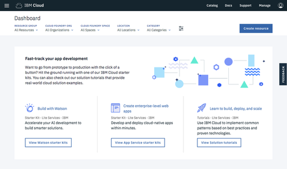
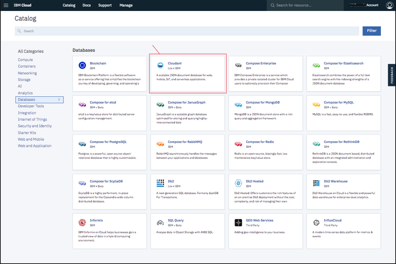
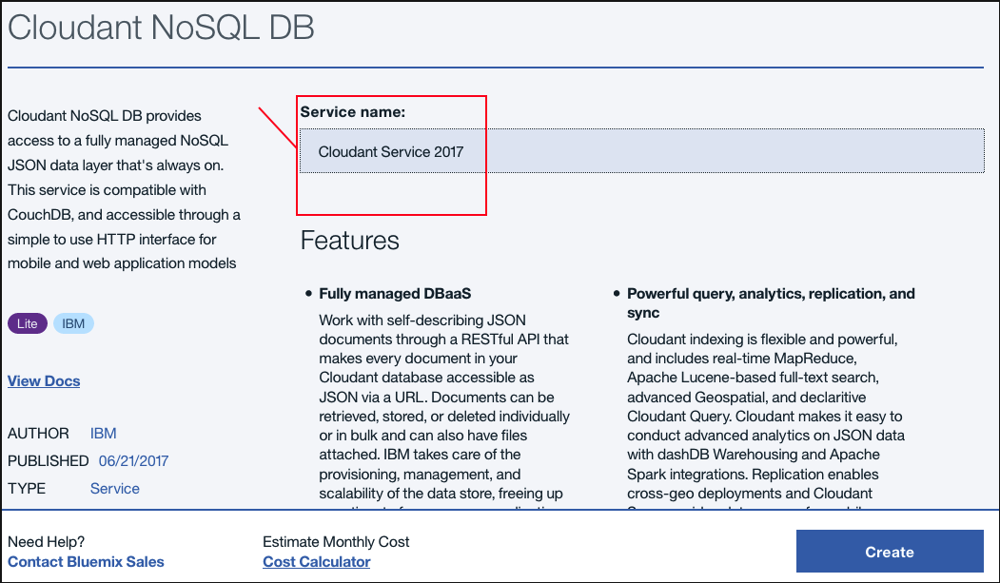
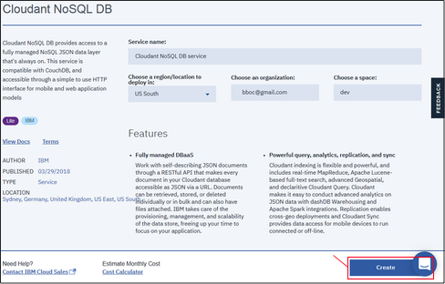
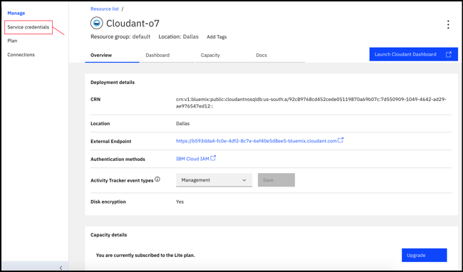
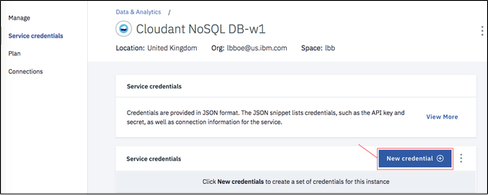
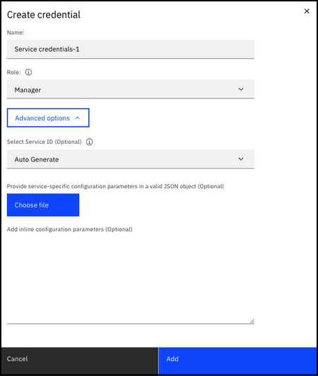
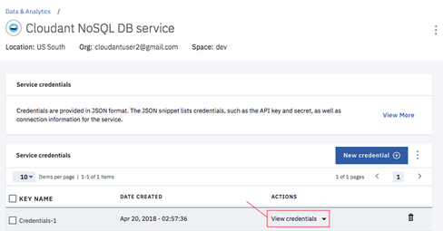
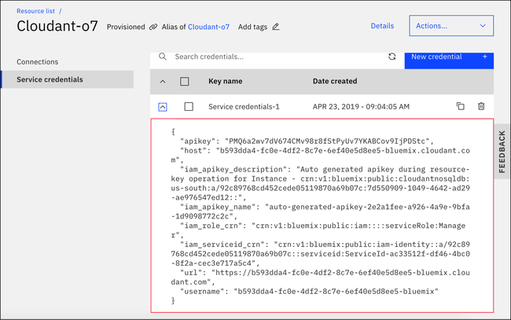
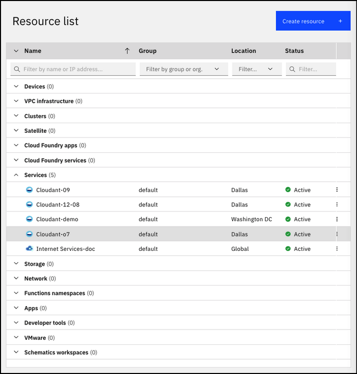

---

copyright:
  years: 2017, 2020
lastupdated: "2020-05-14"

keywords: create service instance, service credentials, locate service credentials

subcollection: Cloudant

---

{:new_window: target="_blank"}
{:shortdesc: .shortdesc}
{:screen: .screen}
{:codeblock: .codeblock}
{:pre: .pre}
{:tip: .tip}
{:note: .note}
{:important: .important}
{:deprecated: .deprecated}
{:external: target="_blank" .external}

<!-- Acrolinx: 2020-02-06 -->

# Creating an {{site.data.keyword.cloudant_short_notm}} instance on {{site.data.keyword.cloud_notm}}
{: #creating-an-ibm-cloudant-instance-on-ibm-cloud}

This tutorial shows you how to create an {{site.data.keyword.cloudantfull}}
service instance by using the {{site.data.keyword.cloud}} dashboard. You also see where to find the essential information to enable your applications
to work with the database.
{: shortdesc} 

## Creating a service instance
{: #creating-a-service-instance}

1.  Log in to your {{site.data.keyword.cloud_notm}} account.

    The {{site.data.keyword.cloud_notm}} dashboard can be found at:
    [https://cloud.ibm.com/](https://cloud.ibm.com/){: new_window}{: external}.
    After you authenticate with your user name and password,
    you're presented with the {{site.data.keyword.cloud_notm}} dashboard. Click the `Create resource` button.

    {: caption="Figure 1. {{site.data.keyword.cloud_notm}} dashboard" caption-side="bottom"}

2.  Type `Cloudant` in the Search bar and click to open it:

    {: caption="Figure 2. {{site.data.keyword.cloud_notm}} database services" caption-side="bottom"}

3.  In the service configuration window, select a region and pricing plan.

    {: caption="Figure 3. {{site.data.keyword.cloudant_short_notm}} region and pricing plan" caption-side="bottom"}

4.   Enter a service name. (In this example, the service name is `Cloudant-o7`.) Verify that the resource group and authentication methods are correct. Add a tag if you like. The authentication methods that are available include `Use only IAM` or `Use both legacy credentials and IAM`. For more information, see [authentication methods](/docs/Cloudant?topic=Cloudant-ibm-cloud-identity-and-access-management-iam-#ibm-cloud-identity-and-access-management-iam-){: new_window}. To create the service, click the `Create` button:

    {: caption="Figure 4. {{site.data.keyword.cloudant_short_notm}} service name and credentials" caption-side="bottom"}

    The {{site.data.keyword.cloudant_short_notm}} team recommends that you use IAM access controls over {{site.data.keyword.cloudant_short_notm}} legacy authentication whenever possible.
    {: important}

5.  A service page appears that confirms your new {{site.data.keyword.cloudant_short_notm}} service is available.
    To create the connection information that your application needs to connect to the service,
    click the `Service Credentials` tab:

    {: caption="Figure 5. Create {{site.data.keyword.cloudant_short_notm}} service credentials" caption-side="bottom"}

6.  Create an {{site.data.keyword.cloudant_short_notm}} service credential:

   a. Click the `New credential` button.

   {: caption="Figure 6. Create new service credentials" caption-side="bottom"}

   b. Enter a name for the new credential in the Add new credential window. See image.

   c. Accept the Manager role.

   d. (Optional) Create a service ID or have one automatically generated for you. 

   e. (Optional) Add inline configuration parameters. This parameter isn't used by {{site.data.keyword.cloudant_short_notm}} service credentials, so ignore it. 

   f. Click the `Add` button.

   {: caption="Figure 7. Add a service credential" caption-side="bottom"}
 
   Your new credential appears after the table.

   g. Click `View credentials` under Actions.

   {: caption="Figure 8. View all service credentials" caption-side="bottom"}

7.  The details for the service credentials appear:

    {: caption="Figure 9. The {{site.data.keyword.cloudant_short_notm}} service credentials" caption-side="bottom"}

The service credentials in these examples were defined when a demonstration {{site.data.keyword.cloudant_short_notm}} service was created on {{site.data.keyword.cloudant_short_notm}}. The credentials are reproduced here to show how they would appear in the dashboard. However, the demonstration {{site.data.keyword.cloudant_short_notm}} service was removed, so these credentials are no longer valid; you *must* supply and use your own service credentials.
{: note}

## The service credentials
{: #the-service-credentials}

Service credentials are valuable. If anyone or any application has access to the credentials, they can effectively do whatever they want with the service instance. For example, they might create spurious data, or delete valuable information. Protect these credentials carefully.
    
{{site.data.keyword.cloudant_short_notm}} has two authentication methods available at provisioning time, either `Use only IAM` or `Use both legacy credentials and IAM`. You can see the details about your legacy credentials only if the `Use both legacy credentials and IAM` authentication method is chosen. The credentials display on the Service credentials tab for your instance. For more information, see the [IAM guide](/docs/Cloudant?topic=Cloudant-ibm-cloud-identity-and-access-management-iam-#ibm-cloud-identity-and-access-management-iam-)
 and [legacy authentication](/docs/Cloudant?topic=Cloudant-authentication#authentication) document for details about using either style of authentication.

The service credentials include the following fields, as well as designating the fields that only display if you select the `Use both legacy credentials and IAM` option:

Field | Purpose | Legacy-auth enabled
------|---------|--------------------
`username` | The service name of the service instance user in the URL. This field also serves as the admin user name. | 
`password` | The legacy credentials password that is required for applications to access the service instance. | X
`host` | The host name that is used by applications to locate the service instance. | X
`port` | The HTTPS port number for accessing the service instance on the host. It's 443 as only HTTPS access is allowed by {{site.data.keyword.cloudant_short_notm}}. | X
`url`	| The HTTPS URL to access the {{site.data.keyword.cloudant_short_notm}} instance. | X (If the `Use both legacy credentials and IAM` option is chosen, it also includes the embedded legacy user name and password.) 
`apikey` | The IAM API key. | 
`iam_apikey_description` | Description of the IAM API key. | 
`iam_apikey_name` | ID of the IAM API key. | 
`iam_role_crn` | The IAM role that the IAM API key has. | 
`iam_serviceid_crn`	| The CRN of the service ID. | X
{: caption="Table 1. Service credential fields" caption-side="top"}

To create an application that can access your service instance, you need these credentials.

## Locating your service credentials
{: #locating-your-service-credentials}

At any time, you can find the credentials for a service that is associated with your account.

1.  Begin by logging in to {{site.data.keyword.cloud_notm}}.
    The {{site.data.keyword.cloud_notm}} dashboard can be found at:
    [https://cloud.ibm.com/](https://cloud.ibm.com/){: new_window}{: external}.
    After you authenticate with your user name and password,
    you're presented with the {{site.data.keyword.cloud_notm}} dashboard:

    {: caption="Figure 10. {{site.data.keyword.cloud_notm}} dashboard" caption-side="bottom"}

2.  In this example,
    we want to find the service credentials for the {{site.data.keyword.cloudant_short_notm}}
    service instance that was created earlier in this tutorial,
    called `Cloudant-o7`. Click the **Menu** icon > **Resource List**, and the corresponding row:

    {: caption="Figure 11. Selecting the {{site.data.keyword.cloudant_short_notm}} service" caption-side="bottom"}

3.  To see the credentials that are required to access the service,
    click `View Credentials`:

    {: caption="Figure 12. Viewing the {{site.data.keyword.cloudant_short_notm}} service credentials" caption-side="bottom"}

4.  The details for the service credentials appear:

    {: caption="Figure 13. The {{site.data.keyword.cloudant_short_notm}} service credentials" caption-side="bottom"}

The service credentials in these examples were defined when a demonstration {{site.data.keyword.cloudant_short_notm}} service was created on {{site.data.keyword.cloudant_short_notm}}. The credentials are reproduced here to show how they would appear in the dashboard. However, the demonstration {{site.data.keyword.cloudant_short_notm}} service was removed, so these credentials are no longer valid. You *must* supply and use your own service credentials.
{: note}

