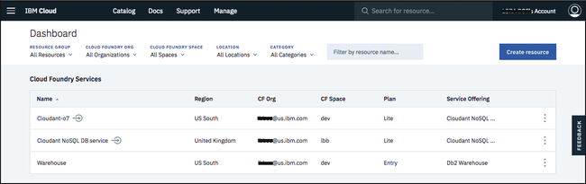

---

copyright:
  years: 2017, 2018
lastupdated: "2018-09-07"

---

{:new_window: target="_blank"}
{:shortdesc: .shortdesc}
{:screen: .screen}
{:codeblock: .codeblock}
{:pre: .pre}
{:tip: .tip}

<!-- Acrolinx: 2018-08-20 -->

# Creating an {{site.data.keyword.cloudant_short_notm}} instance on {{site.data.keyword.cloud_notm}}

This tutorial shows you how to create an {{site.data.keyword.cloudantfull}}
service instance using the {{site.data.keyword.cloud}} dashboard,
and shows you where to find the essential information to enable your applications
to work with the database.
{:shortdesc}

To access an {{site.data.keyword.cloudant_short_notm}} service instance,
you require a set of [Service Credentials](#the-service-credentials).
You create credentials when you create a service instance. You can create additional credentials at any time. 

You can find these credentials by accessing your {{site.data.keyword.cloudant_short_notm}} account.

## Creating a service instance

1.  Log in to your {{site.data.keyword.cloud_notm}} account. 
    The {{site.data.keyword.cloud_notm}} dashboard can be found at:
    [http://console.bluemix.net ](http://bluemix.net){:new_window}.
    After authenticating with your user name and password,
    you are presented with the {{site.data.keyword.cloud_notm}} dashboard without any service instances: 
    

2.  Click the `Create resource` button: 
     
    A list of the services available on {{site.data.keyword.cloud_notm}} appears.

3.  Click the `Databases` category and select the `Cloudant` service: 
     

4.  In the service configuration window,
    enter a service name. Verify that the service name, region/location, resource group, and authentication method are correct.
    In this example,
    the service name is `Cloudant-o7`: 
    

5.  By default,
    the service is created by using the 'Lite' pricing plan,
    which is free but offers limited capacity.
    Other [pricing plans](../offerings/bluemix.html),
    with greater capacity are available. 
    To create the service,
    click the `Create` button: 
    

6.  A service page appears,
    confirming that your new {{site.data.keyword.cloudant_short_notm}} service is available.
    To create the connection information that your application needs to connect to the service,
    click the `Service Credentials` tab: 
    

7.  Create a new {{site.data.keyword.cloudant_short_notm}} service credential:
   a. Click the `New credential` button.
   
   b. Enter a name for the new credential in the Add new credential window. See image.
   c. Accept the Manager role.
   d. Create a new service ID or have one automatically generated for you. 
   d. (Optional) Add inline configuration parameters.
   e. Click the `Add` button.  
   
   Your new credential appears after the table. 
   f. Click `View credentials` under Actions.
   

8.  The details for the service credentials appear: 
    

The service credentials in these examples were defined when a demonstration {{site.data.keyword.cloudant_short_notm}} service was created on {{site.data.keyword.cloudant_short_notm}}. The credentials are reproduced here to show how they would appear in the dashboard. However, the demonstration {{site.data.keyword.cloudant_short_notm}} service was removed, so these credentials are no longer valid; you _must_ supply and use your own service credentials.
{: tip}

## The service credentials

Service credentials are valuable. If anyone or any application has access to the credentials, they can effectively do whatever they want with the service instance, for example they might create spurious data,or delete valuable information. Protect these credentials carefully.
    
The service credentials consist of the following fields:

Field      | Purpose
-----------|--------
`username` | The user name that is required for applications to access the service instance.
`password` | The password that is required for applications to access the service instance.
`host`     | The host name that is used by applications to locate the service instance.
`port`     | The HTTP port number for accessing the service instance on the host. Normally 443 to force HTTPS access.
`url`      | A string aggregating the other credential information into a single URL, suitable for use by applications.

To create an application that can access your service instance,
you need these credentials.

## Locating your service credentials

At any time, you can find the credentials for a service that is associated with your account.

1.  Begin by logging in to {{site.data.keyword.cloud_notm}}.
    The {{site.data.keyword.cloud_notm}} dashboard can be found at:
    [http://bluemix.net ](http://bluemix.net){:new_window}.
    After authenticating with your user name and password,
    you are presented with the {{site.data.keyword.cloud_notm}} dashboard: 
    

2.  In this example,
    we want to find the service credentials for the {{site.data.keyword.cloudant_short_notm}}
    service instance that was created earlier in the tutorial,
    called `Cloudant-o7`.
    Click the corresponding row: 
    

3.  A service page appears,
    confirming that your new {{site.data.keyword.cloudant_short_notm}} service is available.
    To create the connection information that your application needs to connect to the service,
    click the `Service Credentials` tab: 
    

4.  To see the credentials that are required to access the service,
    click `View Credentials`: 
    

5.  The details for the service credentials appear: 
    

The service credentials in these examples were defined when a demonstration {{site.data.keyword.cloudant_short_notm}} service was created on {{site.data.keyword.cloudant_short_notm}}. The credentials are reproduced here to show how they would appear in the dashboard. However, the demonstration {{site.data.keyword.cloudant_short_notm}} service was removed, so these credentials are no longer valid; you _must_ supply and use your own service credentials.
{: tip}

