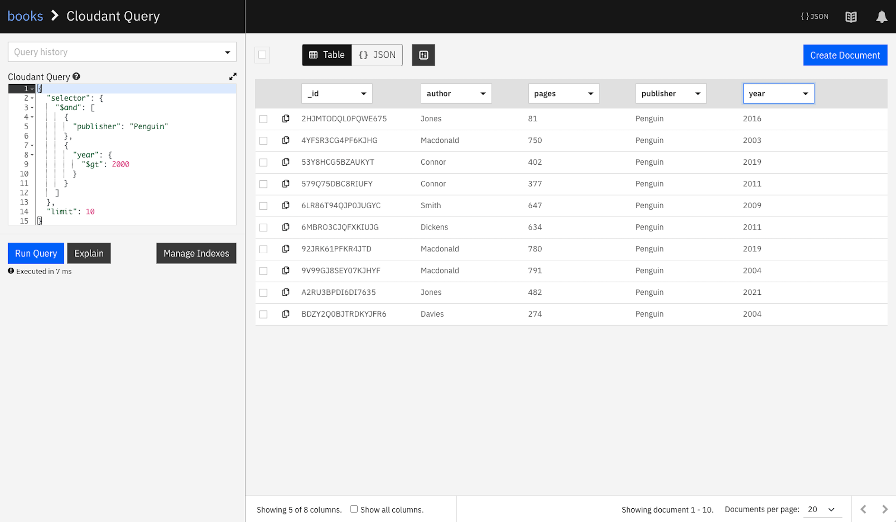
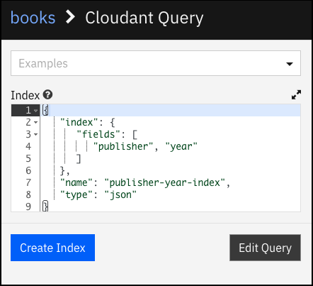
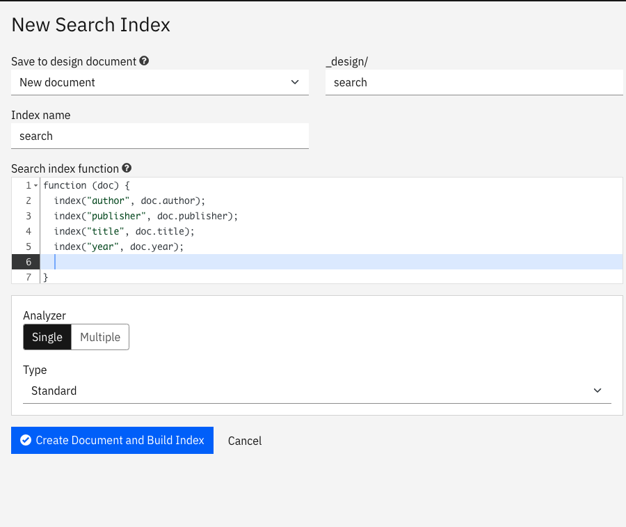
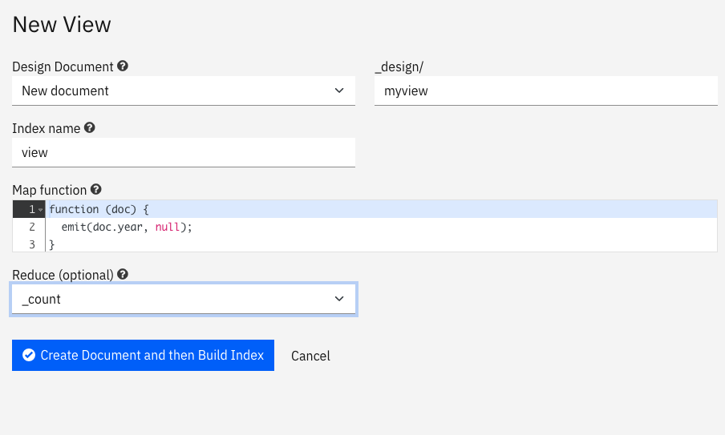
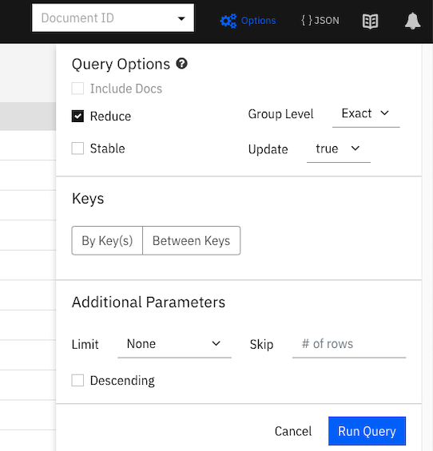
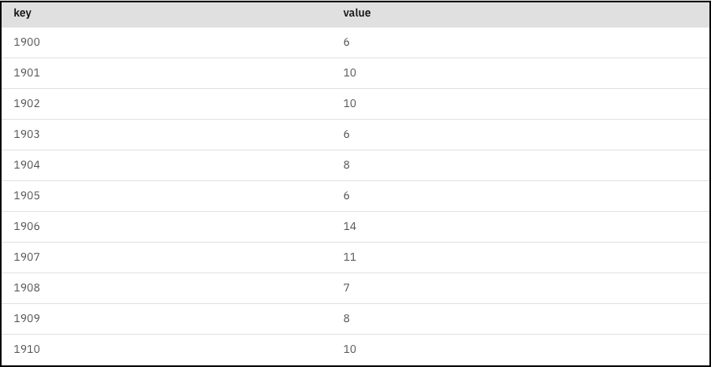

---

copyright:
  years: 2022, 2023
lastupdated: "2023-04-06"

keywords: cloudant dashboard, indexes, cloudant query, create, run, cloudant search

subcollection: Cloudant

---

{{site.data.keyword.attribute-definition-list}}

# Digging deeper into {{site.data.keyword.cloudant_short_notm}} Dashboard
{: #dig-deeper-dashboard}

The {{site.data.keyword.cloudantfull}} Dashboard gives new and experienced {{site.data.keyword.cloudant_short_notm}} users the opportunity to add, edit, and delete documents. The {{site.data.keyword.cloudant_short_notm}} users can refine the indexing and querying options that best suit their application's use-cases.

## Objectives
{: #objectives-use-dashboard}

Set up some basic indexes using the Dashboard to see how each of {{site.data.keyword.cloudant_short_notm}}'s querying mechanisms works.

## Before you begin
{: #prerequisites-use-dashboard}

You need to create a service instance in {{site.data.keyword.cloudant_short_notm}} before you start this tutorial. You can follow the instructions in the [Getting started](/docs/Cloudant?topic=Cloudant-getting-started-with-cloudant) tutorial to create one.

## Step 1. The data set
{: #the-data-set}

1. Create a database called `books`.

1. Create some sample data that represents a book in a library as shown in the following example:

    ```javascript
    {
      "_id": "BXP9G5ZQY9Q4EA13",
      "author": "Dickens",
      "title": "David Copperfield",
      "year": 1840,
      "pages": 723,
      "publisher": "Penguin",
      "url": "https://www.somurl.com/dc"
    }
    ```
    {: codeblock}

1. Continue to add some documents that match the pattern in the previous step by using the {{site.data.keyword.cloudant_short_notm}} Dashboard.

   The documents store simple `key/value` pairs that hold metadata about each book: its author and its publisher. In this example, we address the following three use-cases:

   1. A query facility that allows a user to find a book by a known publisher and year.
   2. A general-purpose search engine that allows a user to find books by a combination of one or more of the following descriptors: author, title, year, and publisher.
   3. A report that details the number of books that are published by year.

## Step 2. Querying books by publisher and year - {{site.data.keyword.cloudant_short_notm}} Query
{: #query-books-by-publisher-year}

{{site.data.keyword.cloudant_short_notm}} Query is a query language that allows small slices of a total database to be located. The following query finds 10 books that are published by `Penguin` in the year 2000:

```json
{
  "selector": {
    "$and": [
      { "publisher": "Penguin" },
      { "year": { "$gt": 2000 } }
    ]
  },
  "limit": 10
}
```
{: codeblock}

The query contains a `selector` object, which uses operators and text fields to define the slice of data you need:

- `$and` means *both* of the query clauses must be satisfied for a document to make it to the result set.
- `{ "publisher": "Penguin" }`- the publisher must be "Penguin".
- `{ "year": { "$gt": 2000 } }` - the year must be greater than 2000. `$gt` means "greater than".

We can try the query by choosing "Query" when you view our `books` database in the {{site.data.keyword.cloudant_short_notm}} Dashboard. You can paste in the query JSON and click **Run Query**.

### Running a query
{: #running-query-cq}

To try the query, do the following steps:

1. Go to {{site.data.keyword.cloudant_short_notm}} Dashboard.
2. Open the service instance that you created in the prerequisite section.
3. Open the database that you created.
4. Go to the Query tab.
5. Paste the query JSON from the previous section into the Cloudant Query window.
6. Click **Run Query**.
   See the results in the following screen capture:

   {: caption="Window for running queries" caption-side="bottom"}

{{site.data.keyword.cloudant_short_notm}} matches the documents that meet your criteria and it *seems* to do it quickly, but there's a catch. {{site.data.keyword.cloudant_short_notm}} isn't using an index to service this query, meaning that the database has to scan every document in the database to get your answer. This scan is fine for small data sets. But if you're running a production application where the data set is expanding all the time, you definitely *don't* want to rely on unindexed queries.
{: note}

### Creating an index
{: #creating-an-index-cq}

To create an index, we can tell {{site.data.keyword.cloudant_short_notm}} to create an index on the `publisher` and `year` fields that we are using in our query.

1. From the {{site.data.keyword.cloudant_short_notm}} Dashboard, select the `books` database.
2. Select the Design Documents tab.
3. Select New Indexes from the Design Documents menu.
4. Copy and paste the following index definition:

   ```javascript
   {
      "index": {
         "fields": [
            "publisher", "year"
         ]
      },
      "name": "publisher-year-index",indexingdashboard5
      "type": "json"
   }
   ```
   {: codeblock}

   See an example in the following screen capture:

   {: caption="Window for creating indexes" caption-side="bottom"}

The `fields` array contains a list of fields that we want {{site.data.keyword.cloudant_short_notm}} to index.

If we repeat our query, it is faster and remains quick even as the database size reaches millions of documents.

Indexing instructs {{site.data.keyword.cloudant_short_notm}} to create a secondary data structure that allows it to find the slice of data you need much faster than looking over every document in turn. {{site.data.keyword.cloudant_short_notm}} Query is best for fixed queries based on the same fields in the same order.
{: note}

For more information, see the following details in {{site.data.keyword.cloudant_short_notm}} documentation:

- [Optimizing {{site.data.keyword.cloudant_short_notm}} Queries](https://blog.cloudant.com/2020/04/24/Optimising-Cloudant-Queries.html)
- [{{site.data.keyword.cloudant_short_notm}} Query documentation](/docs/Cloudant?topic=Cloudant-query)

This index is useful for queries that involve both the `publisher` and the `year`, but if we introduce another field or make the query more complex (for example, by using the `$or` operator), then the index doesn't get used. We are back to a full database scan.

For a general-purpose search facility, we need {{site.data.keyword.cloudant_short_notm}} Search, which is described in the next section.

## Step 3. Creating a search engine - {{site.data.keyword.cloudant_short_notm}} Search
{: #create-search-engine}

{{site.data.keyword.cloudant_short_notm}} Search is based on Apache Lucene and has its own query language that allows rich queries to be constructed. See the following example of a search:

```sh
publisher:Penguin AND (year:1972 OR year:1973) AND title:Crash
```
{: codeblock}

Unlike {{site.data.keyword.cloudant_short_notm}} Query, you *must* specify the fields to index *before* you perform a query. {{site.data.keyword.cloudant_short_notm}} Search indexes are defined by supplying {{site.data.keyword.cloudant_short_notm}} with a JavaScript function that is called once for every document in the database - if the function calls `index` then data is added to the index.

1. From the {{site.data.keyword.cloudant_short_notm}} Dashboard, select the `books` database.
2. Select the Design Documents tab.
3. Select New Search Index from the menu.
4. Enter a design document name.
5. Enter an index name.
6. Paste the following code into the search index function:

   ```javascript
   function (doc) {
     index("author", doc.author);
     index("publisher", doc.publisher);
     index("title", doc.title);
     index("year", doc.year);
   }
   ```
   {: codeblock}

7. Choose the "Standard Analyzer".

   {: caption="New Search Index window" caption-side="bottom"}

You can then build complex queries that involve one, some, or all of the indexed fields combined with AND and OR operators.

{{site.data.keyword.cloudant_short_notm}} Search is best if you have many search use-cases involving different combinations of fields.
{: tip}

For more information, see the following resources:

- {{site.data.keyword.cloudant_short_notm}} Search uses "analyzers" to pre-process text before indexing. Learn about [Search Analyzers](/docs/Cloudant?topic=Cloudant-search-analyzers) to ensure you get the results that you expect.
- [{{site.data.keyword.cloudant_short_notm}} Search documentation](https://cloud.ibm.com/docs/Cloudant?topic=Cloudant-cloudant-search)

## Step 4. Aggregating data - MapReduce
{: #aggregate-data-mapreduce}

{{site.data.keyword.cloudant_short_notm}} Query and {{site.data.keyword.cloudant_short_notm}} Search cannot *aggregate* search results. In other words, you can't ask, *How many books were published in 1973?* {{site.data.keyword.cloudant_short_notm}}'s MapReduce feature allows secondary indexes to be created that can be used for selection or aggregation. MapReduce indexes are, like {{site.data.keyword.cloudant_short_notm}} Search, which is created by supplying a JavaScript function - any call to an `emit` function adds a row to the index.


1. From the {{site.data.keyword.cloudant_short_notm}} Dashboard, select the `books` database.
2. Select the Design Documents tab.
3. Select New View from the menu.
4. Keep New document in the drop-down field.
5. Enter a name in the Index name field.
   This name is the new view name.

6. Select `_count` from the Reduce (optional) drop-down menu.
   This way our results are *counted*.

7. Paste the following code into the Map function field:

   ```javascript
   function (doc) {
     emit(doc.year, null);
   }
   ```
   {: codeblock}

   See an example of the window in the following screen capture:

   {: caption="New View window" caption-side="bottom"}

   The subsequent MapReduce view allows documents to be found by year (as that is the key of the index). But if we select the checkbox for the Reduce function from the **Options** pull-down menu, the index aggregates the results, grouping by key (year):

   {: caption="Windows for running queries" caption-side="bottom"}

   See an example result from after the index aggregated the results.

   {: caption="Result set" caption-side="bottom"}

   MapReduce views are perfect for generating ordered views of your data, containing `key/value` pairs that you define. They can be used for selecting individual keys, range queries, or aggregation grouping by the key.

For more information, see the following resources from {{site.data.keyword.cloudant_short_notm}} documentation:

- [MapReduce blog](https://blog.cloudant.com/2011/01/13/mapreduce-from-the-basics-to-the-actually-useful.html)
- [MapReduce documentation](https://cloud.ibm.com/docs/Cloudant?topic=Cloudant-creating-views-mapreduce)
