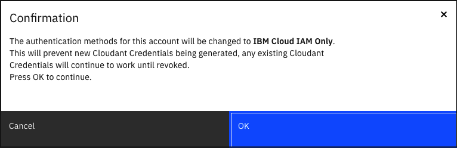
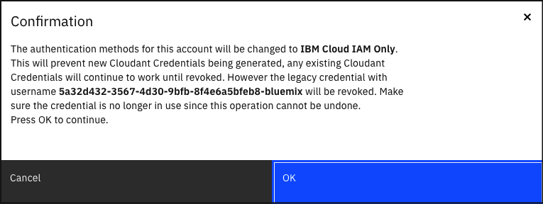

---

copyright:
  years: 2022
lastupdated: "2022-01-26"

keywords: legacy credentials, revoke credential, instance url style credential, authentication, security, credential rotation, IAM, migration

subcollection: Cloudant

content-type: tutorial
services: Cloudant
account-plan: lite
completion-time: 10m

---

{:new_window: target="_blank"}
{:shortdesc: .shortdesc}
{:codeblock: .codeblock}
{:pre: .pre}
{:screen: .screen}
{:tip: .tip}
{:note: .note}
{:important: .important}
{:deprecated: .deprecated}
{:external: target="_blank" .external}
{:step: data-tutorial-type='step'}

# Migrating an instance with legacy credentials and IAM Authentication to IAM Only Authentication
{: #migrating-to-iam-only}
{: toc-content-type="tutorial"}
{: toc-services="Cloudant"}
{: toc-completion-time="10m"}

When you create a new service credential by using the {{site.data.keyword.cloud_notm}} Dashboard or the
{{site.data.keyword.cloud_notm}} CLI, it always produces a new username and password combination for legacy credentials
as well as a new IAM API Key. This tutorial will guide you through
migrating your instance from generating new legacy credentials and IAM API Keys to generating new IAM API keys only.

This tutorial is only applicable to {{site.data.keyword.cloudant_short_notm}} instances within resource groups
that have legacy credentials enabled.
{: important}

Effects of this tutorial on existing legacy credentials:

- New format legacy credentials (usernames starting with `apikey-v2-`) will continue to function until the service credential is deleted.
- URL style legacy credentials if still active will be revoked. If you would like to revoke them separately follow the [Revoking credential tied to your instance URL](/docs/Cloudant?topic=Cloudant-revoke-instance-url-style-credential) before completing this tutorial.

## Objectives
{: #objectives}

- Update your applications to use IAM credentials instead of legacy credentials.
- Disable creation of new legacy credentials.

## Generating new {{site.data.keyword.cloudant_short_notm}} IAM Credentials
{: #generate-new-service-credentials}
{: step}

1. Use the {{site.data.keyword.cloud_notm}} Dashboard or the {{site.data.keyword.cloud_notm}} CLI to [generate new service credentials](/docs/Cloudant?topic=Cloudant-getting-started-with-cloudant#creating-service-credentials) for your {{site.data.keyword.cloudant_short_notm}} instance. For more information, see [Creating service credentials](#creating-service-credentials) for further instructions.

## Updating applications
{: #rotate-application-credentials}
{: step}

1. Update all applications to use IAM access tokens when authenticating with the {{site.data.keyword.cloudant_short_notm}} instance.

## Migrating to IAM only
{: #revoke-credentials}
{: step}

This operation cannot be undone. Make sure all applications that access the instance are using IAM to authenticate
before doing this step.
{: important}

1. Go to [{{site.data.keyword.cloud_notm}}](https://cloud.ibm.com/resources).

2. Find your {{site.data.keyword.cloudant_short_notm}} instance on the list of resources and open it.

   {: caption="Figure 1. Select your instance" caption-side="bottom"}

3. Click the *Migrate to IAM Only* button under the *Authententication methods* section. If you do not see the button, your instance is already IAM Only.

   {: caption="Figure 2. Migrate to IAM Only" caption-side="bottom"}

4. Confirm your action on the dialog window to proceed. If the instance URL-style credential is still enabled, the confirmation box will differ. See Figure 4 for an example.

   {: caption="Figure 3. Confirm operation to migrate to IAM only" caption-side="bottom"}

   {: caption="Figure 4. Confirm operation to migrate to IAM only and revoke URL-style credential" caption-side="bottom"}

5. When the operation completes successfully, the Authentication methods row will only show `IBM Cloud IAM`.

   {: caption="Figure 5. Migration completed" caption-side="bottom"}
   
