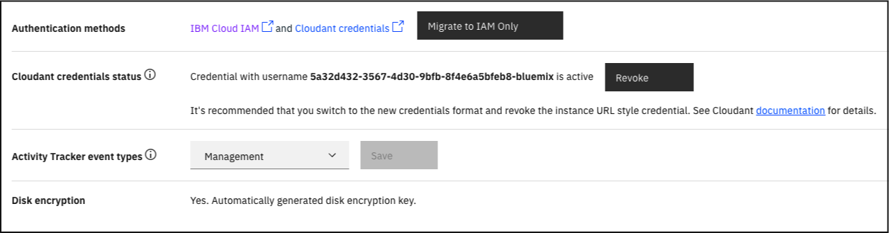
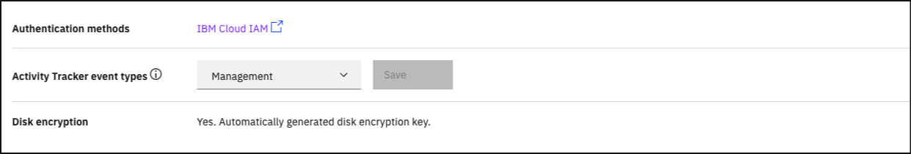

---

copyright:
  years: 2022, 2023
lastupdated: "2023-03-30"

keywords: legacy credentials, revoke credential, instance url style credential, authentication, security, credential rotation, IAM, migration

subcollection: Cloudant

content-type: tutorial
services: Cloudant
account-plan: lite
completion-time: 10m

---

{{site.data.keyword.attribute-definition-list}}

# Migrating an instance with legacy credentials and IAM Authentication to IAM Only Authentication
{: #migrating-to-iam-only}
{: toc-content-type="tutorial"}
{: toc-services="Cloudant"}
{: toc-completion-time="10m"}

When you create a new service credential by using the {{site.data.keyword.cloud_notm}} Dashboard or the
{{site.data.keyword.cloud_notm}} CLI, it always produces a new username and password combination. This method applies to legacy credentials as well as a new IAM API key. This tutorial guides you through
migrating your instance from generating new legacy credentials and IAM API keys to generating new IAM API keys only.

This tutorial is only applicable to {{site.data.keyword.cloudant_short_notm}} instances within resource groups
with legacy credentials that are enabled.
{: important}

See the effects of this tutorial on existing legacy credentials:

- New format legacy credentials (usernames that start with `apikey-v2-`) continue to function until the service credential is deleted.
- URL style legacy credentials if still active are revoked. If you would like to revoke them separately, follow the [Revoking credential that is tied to your instance URL](/docs/Cloudant?topic=Cloudant-revoke-instance-url-style-credential) steps before you complete this tutorial.

## Objectives
{: #objectives}

1. Update your applications to use IAM credentials instead of legacy credentials.
2. Disable creation of new legacy credentials.

## Generating new {{site.data.keyword.cloudant_short_notm}} IAM Credentials
{: #generate-new-service-credentials}
{: step}

1. Use the {{site.data.keyword.cloud_notm}} Dashboard or the {{site.data.keyword.cloud_notm}} CLI to [generate new service credentials](/docs/Cloudant?topic=Cloudant-getting-started-with-cloudant#creating-service-credentials) for your {{site.data.keyword.cloudant_short_notm}} instance. For more information, see [Creating service credentials](#creating-service-credentials) for further instructions.

## Updating applications
{: #rotate-application-credentials}
{: step}

1. Update all applications to use IAM access tokens when you authenticate with the {{site.data.keyword.cloudant_short_notm}} instance.

## Migrating to IAM only
{: #revoke-credentials}
{: step}

This operation cannot be undone. Make sure all applications that access the instance are using IAM to authenticate
before you start this step.
{: important}

1. Go to [{{site.data.keyword.cloud_notm}}](https://cloud.ibm.com/resources).

2. Find your {{site.data.keyword.cloudant_short_notm}} instance on the list of resources and open it.

   {: caption="Figure 1. Resource list" caption-side="bottom"}

3. Click the *Migrate to IAM Only* button under the *Authentication methods* section. If you do not see the button, your instance is already IAM Only.

   {: caption="Figure 2. Authentication methods" caption-side="bottom"}

4. Click OK to confirm your action on the dialog window to proceed. If the instance URL-style credential is still enabled, the confirmation box differs. You still click OK to confirm your action on the dialog window to proceed.

5. When the operation completes successfully, the Authentication methods row shows only `IBM Cloud IAM`.

   {: caption="Figure 3. Successful operation" caption-side="bottom"}
   
