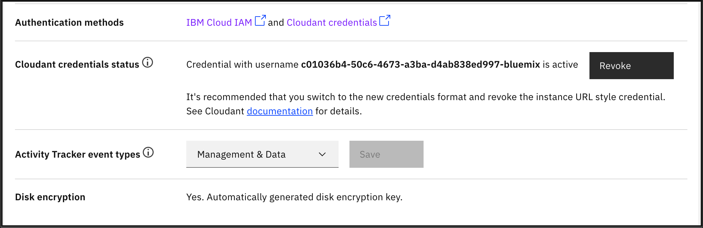
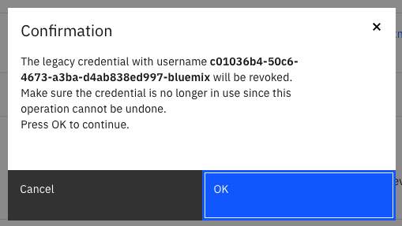
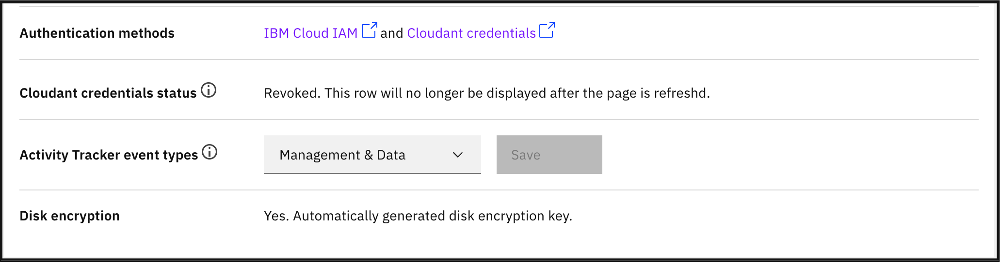

---

copyright:
  years: 2021
lastupdated: "2021-11-10"

keywords: legacy credentials, revoke credential, instance url style credential, authentication, security, credential rotation

subcollection: Cloudant

content-type: tutorial
services: Cloudant
account-plan: lite
completion-time: 10m

---

{:new_window: target="_blank"}
{:shortdesc: .shortdesc}
{:codeblock: .codeblock}
{:pre: .pre}
{:screen: .screen}
{:tip: .tip}
{:note: .note}
{:important: .important}
{:deprecated: .deprecated}
{:external: target="_blank" .external}
{:step: data-tutorial-type='step'}

# Revoking credential tied to your instance URL
{: #revoke-instance-url-style-credential}
{: toc-content-type="tutorial"}
{: toc-services="Cloudant"}
{: toc-completion-time="10m"}

When you create a new service credential by using the {{site.data.keyword.cloud_notm}} Dashboard or the
{{site.data.keyword.cloud_notm}} CLI, it always produces a new username and password combination as your
{{site.data.keyword.cloudantfull}} legacy credentials. As expected, deleting the service credential effectively revokes access for any
applications using those credentials.
{: shortdesc}

This has not always been the case though. Before 15 January 2021, creating a new service credential would always
produce the same {{site.data.keyword.cloudant_short_notm}} legacy credential username and password combination.
Consequently, deleting the service credential did not revoke its access either. This practice was required to 
prevent breaking legacy applications that expected this behavior.

This tutorial is only applicable to {{site.data.keyword.cloudant_short_notm}} instances provisioned prior to 15 January 2021 with
{{site.data.keyword.cloudant_short_notm}} legacy credentials enabled. Instances provisioned after this date already use
the new format of legacy credentials.
{: important}

You can inspect the username of your {{site.data.keyword.cloudant_short_notm}} legacy credentials to verify which
type you are currently using. The old style credential uses the format `<RANDOM_ID>-bluemix` for username, which matches your {{site.data.keyword.cloudant_short_notm}} instance URL. The new style credentials
use `apikey-v2-<RANDOM_ID>`.

## Objectives
{: #objectives}

- Update your applications to use the new style credentials in place of the instance URL style credentials.
- Revoke access to the old style {{site.data.keyword.cloudant_short_notm}} legacy credential. 

## Generating new {{site.data.keyword.cloudant_short_notm}} legacy credentials
{: #generate-new-service-credentials}
{: step}

1. Use the {{site.data.keyword.cloud_notm}} Dashboard or the {{site.data.keyword.cloud_notm}} CLI to [generate new service credentials](/docs/Cloudant?topic=Cloudant-getting-started-with-cloudant#creating-service-credentials) for your {{site.data.keyword.cloudant_short_notm}} instance. See [Creating service credentials](#creating-service-credentials) for further instructions.

## Updating applications
{: #rotate-application-credentials}
{: step}

1. Update all applications that have access to the {{site.data.keyword.cloudant_short_notm}} instance to use the new username and password combination.

## Revoking access to the instance URL style credential
{: #revoke-credentials}
{: step}

This operation cannot be undone. Make sure all your applications are no longer using the old style credential before starting this procedure.
{: important}

1. Go to [{{site.data.keyword.cloud_notm}}](https://cloud.ibm.com/resources).

2. Find your {{site.data.keyword.cloudant_short_notm}} instance on the list of resources and open it.

   {: caption="Figure 1. Select your instance" caption-side="bottom"}

3. Click the *Revoke* button under the *Cloudant credentials status* section. If you do not see this section, the credential has already been revoked or it never existed.

   {: caption="Figure 2. Revoke instance URL style credential" caption-side="bottom"}

4. Confirm your action on the dialog window to proceed.

   {: caption="Figure 3. Confirm operation to revoke the credential" caption-side="bottom"}

5. When the operation completes successfully, the status will change to `Revoked`.

   {: caption="Figure 4. Credential revoked" caption-side="bottom"}
    

After the credential has been revoked using this process, the 
*Cloudant credentials status* section no longer appears on the page.
{: note}
