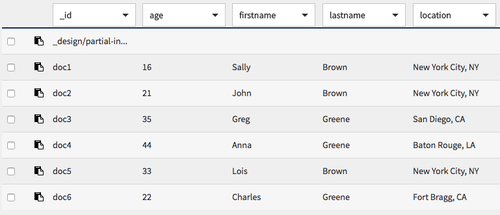
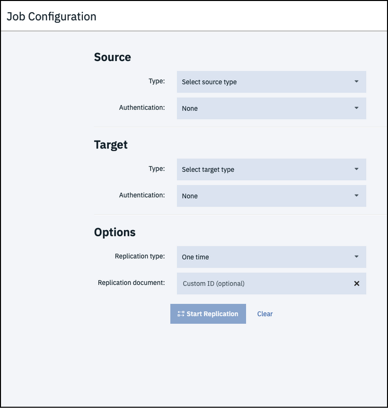
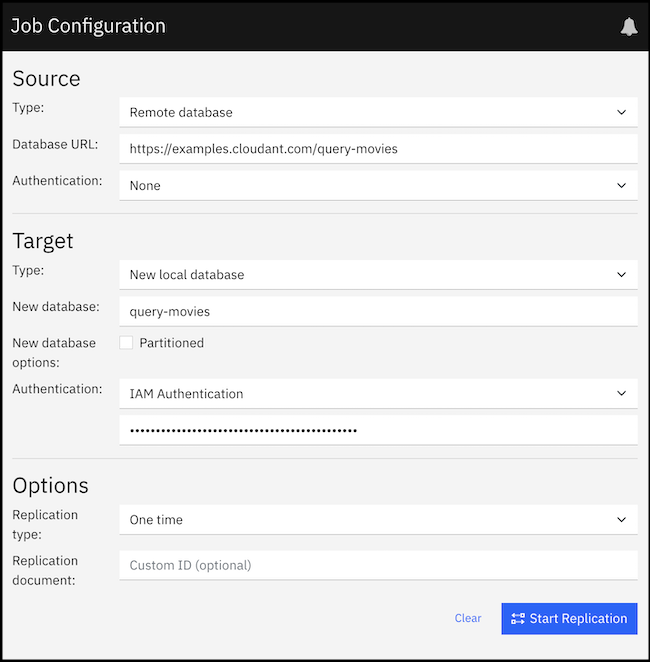
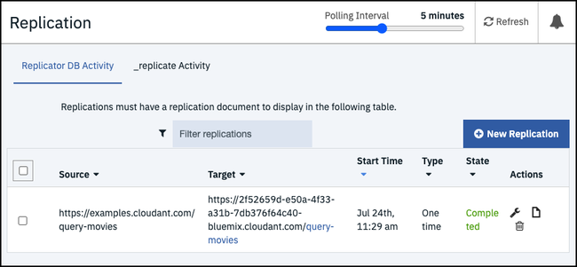
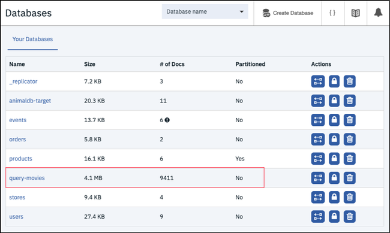
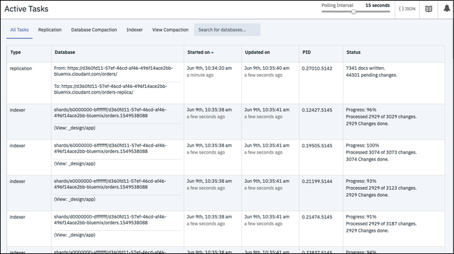
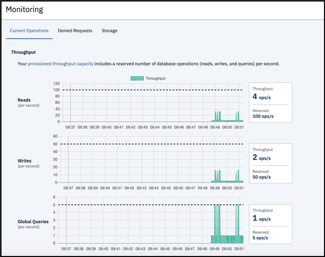
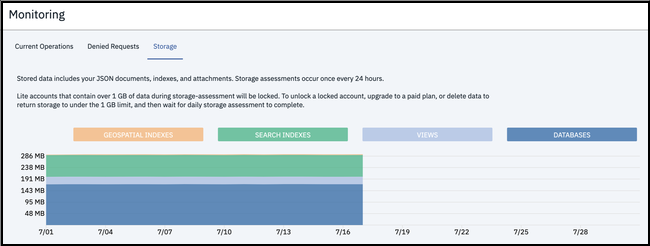

---

copyright:
  years: 2015, 2021
lastupdated: "2021-11-02"

keywords: dashboard, example, create a database, populate database, queries, retrieve data, api endpoint, close connection, create database, retrieve data, query data, create query, monitor active tasks, replicate database, add documents

subcollection: Cloudant

content-type: tutorial
services: Cloudant
account-plan: lite 
completion-time: 20m

---

{:new_window: target="_blank"}
{:shortdesc: .shortdesc}
{:codeblock: .codeblock}
{:pre: .pre}
{:screen: .screen}
{:tip: .tip}
{:note: .note}
{:important: .important}
{:deprecated: .deprecated}
{:external: target="_blank" .external}
{:step: data-tutorial-type='step'}

# Using the {{site.data.keyword.cloudant_short_notm}} dashboard
{: #navigate-the-dashboard}
{: toc-content-type="tutorial"}
{: toc-services="Cloudant"}
{: toc-completion-time="20m"}

By using the {{site.data.keyword.cloudantfull}} dashboard, you create an {{site.data.keyword.cloudant_short_notm}} database, populate the database with data, and retrieve data by using queries or API endpoints. For more information about API endpoints, see the [API and SDK reference](/apidocs/cloudant#introduction){: external}.
{: shortdesc}

## Objectives
{: #objectives-navigate}

- Open the {{site.data.keyword.cloudant_short_notm}} dashboard. 
- Create a database. 
- Add JSON documents to the database and run a query. 
- Replicate a database. 
- Monitor active tasks. 
- Monitor with {{site.data.keyword.cloudant_short_notm}}. 

## Prerequisites
{: #prerequisites-nav}

You need to create a service instance in {{site.data.keyword.cloud_notm}} before you start this tutorial. You can follow the instructions in the [Getting started](/docs/Cloudant?topic=Cloudant-getting-started-with-cloudant) tutorial to create one. 

## Opening your service instance on {{site.data.keyword.cloudant_short_notm}} dashboard
{: #using-the-ibm-cloudant-dashboard}
{: step}

Open your {{site.data.keyword.cloudant_short_notm}} service instance by following these steps.

1.  Go to the {{site.data.keyword.cloud_notm}} dashboard.
    
2.  Click **Services** in the Resource list.

3.  From the Services section, click the `Cloudant-o7` instance that you created in the *Getting started* tutorial, and click **Launch Dashboard**.
    The {{site.data.keyword.cloudant_short_notm}} dashboard opens.

Now, you can create a database, and run queries against it.  

## Creating a database
{: #creating-a-database-dt}
{: step}

In this exercise, you create the `dashboard-demo` [database](/apidocs/cloudant#putdatabase){: external}, which 
is the database that you use in this tutorial.

1.  From the {{site.data.keyword.cloudant_short_notm}} dashboard, click **Create database**.

    The Create database window opens. 

2.  Enter the database name `dashboard-demo`.

3.  Select **Non-partitioned**, and click **Create**.

    The `dashboard-demo` database opens automatically.

Now, you can create some documents. 

## Adding documents to the database
{: #creating-documents-in-the-database-dt}
{: step}

The [documents](/docs/Cloudant?topic=Cloudant-documents#documents)
that you create in this exercise include the data that you use to query the `dashboard-demo` database in later exercises.

1.  Click **Create document**. 

    The New Document window opens.

2.  Copy the following sample text and replace the existing text in the new document.    
    Use the following sample text for document 1:

    ```json
    {
      "firstname": "Sally",
      "lastname": "Brown",
      "age": 16,
      "location": "New York City, NY",
      "_id": "doc1"
    }
    ```
    {: codeblock}

3.  Repeat steps 1 and 2 to add the remaining four documents to the database.    
   Use the following sample text for document 2:

    ```json
    {
      "firstname": "John",
      "lastname": "Brown",
      "age": 21,
      "location": "New York City, NY",
      "_id": "doc2"
    }
    ```
    {: codeblock}

    Use the following sample text for document 3:

    ```json
    {
      "firstname": "Greg",
      "lastname": "Greene",
      "age": 35,
      "location": "San Diego, CA",
      "_id": "doc3"
    }
    ```
    {: codeblock}

    Use the following sample text for document 4:

    ```json
    {
      "firstname": "Anna",
      "lastname": "Greene",
      "age": 44,
      "location": "Baton Rouge, LA",
      "_id": "doc4"
    }
    ```
    {: codeblock}

    Use the following sample text for document 5:

    ```json
    {
      "firstname": "Lois",
      "lastname": "Brown",
      "age": 33,
      "location": "New York City, NY",
      "_id": "doc5"
    }
    ```
    {: codeblock}

    You populated the `dashboard-demo` with five documents. You can see the documents from the Table view in the following screen capture:

    {: caption="Figure 1. Sample documents" caption-side="bottom"} 

### Running a simple query
{: #running-a-simple-query-dt}
{: step}

This example demonstrates how {{site.data.keyword.cloudant_short_notm}} Query finds documents based on the `lastname` and the `firstname`.   

1.  Click **Query**.
2.  Copy the following sample JSON and replace the existing text in the new query window:
    ```json
     {
        "selector": {
              "lastname" : "Greene",
              "firstname" : "Anna"            
           }        
     }
    ```
    {: codeblock}

3.  Click **Run Query**.

    The query displays the results. You can see them from the Table view in the following screen capture:

    {: caption="Figure 2. Query results" caption-side="bottom"}

For more information, see the [{{site.data.keyword.cloudant_short_notm}} Query](/docs/Cloudant?topic=Cloudant-creating-an-ibm-cloudant-query) tutorial or the API reference on [{{site.data.keyword.cloudant_short_notm}} Query](/apidocs/cloudant#getindexesinformation){: external}.

## Replicating a database
{: #replicate-database-dt}
{: step}

When you replicate a database, it synchronizes the state of two databases: source and target. A replication copies all the changes that happened in the source database to the target database. When a document is deleted from the source database, the document is also deleted from the target database.

For more information, see [Replication](/docs/Cloudant?topic=Cloudant-replication-api#replication-operation).

1.  Click **Replication**.

2.  Click **New Replication**. 

    The Job configuration page opens. 

    {: caption="Figure 3. Job configuration page" caption-side="bottom"} 
   
    Additionally, you can create a replication from the databases page by clicking **Replicate** in the Actions column.
    {: note} 

3. Enter the following information for your replication job.     
    Use the following information in the Source section:
      - Type - Select **Remote database**.
      - Name - Enter the database URL: `http://examples.cloudant.com/query-movies`.
      - Authentication - Leave as `None`.

    Use the following information in the Target section:
      - Type - Select **New local database**.
      - New database - Enter the name for the new database, **`query-movies`**. 
      - New database options - Do not select the Partitioned option.
      - Authentication - Select **IAM Authentication**. 
      - IAM API Key - Enter the `apikey` from the Service credentials for your instance.

      For more information, see the section on [Locating your service credentials](/docs/Cloudant?topic=Cloudant-locating-your-service-credentials).

    Use the following information in the Options section:
      - Replication type - Leave as `One time`
      - Replication document - Leave as `Custom ID (optional` 

      {: caption="Figure 4. Replication configuration page" caption-side="bottom"}

4.  Click **Start Replication**. 

    The Replication page opens where you can see that your replication job is running. 

    {: caption="Figure 5. Status of your replication job" caption-side="bottom"} 

5.  See the status when your job finishes. 

    {: caption="Figure 6. Completed job status" caption-side="bottom"} 

6.  Check that the database was created on the databases page. 

    {: caption="Figure 7. Databases page" caption-side="bottom"} 

## Monitoring active tasks
{: #monitoring-active-tasks-dt}
{: step}

The Active tasks page displays a list of all running tasks. When you monitor your system's performance, this list can help you find potential issues. You can see a list of active tasks, which includes compaction, replication, and indexing. For more information, see the [Managing tasks](/docs/Cloudant?topic=Cloudant-managing-tasks) guide. 

If your instance does not have any active tasks, you can return to the previous step, delete the `query-movies` database, and then replicate it again. If you open the Active Tasks page immediately, you can see your replication. 
{: tip}

1. Click **Active Tasks**. 

    The Active Tasks page opens. 

    {: caption="Figure 8. Active tasks" caption-side="bottom"} 

2. Click the associated tab to see task-specific information. 

## Monitoring with {{site.data.keyword.cloudant_short_notm}}
{: #monitoring-with-cloudant-dt}
{: step}

Monitor your usage with a graph that shows your throughput by reads, writes, and global queries. You can see your current operations, denied requests, and storage usage. 

Your service instance contains no data because it is for demonstration purposes only. However, you can see what monitoring information is available to you by following these steps. 

1.  Click **Monitoring**. 

    The Monitoring page opens to the Current Operations tab. 
    Review recent consumption of provisioned throughput capacity by looking at requests broken down by reads, writes, and global queries. The dotted line is the peak capacity that is allowed for your instance. Peak capacity is based on what is set for your provisioned throughput capacity. 

    {: caption="Figure 9. Current Operations" caption-side="bottom"}

2.  Click **Denied Requests**. 

    Review the number of denied requests from a given second that are shown by the number of `429: too many requests.` responses. Requests are denied when they exceed the provisioned throughput capacity set for the instance. The graph shows the denied requests that are broken down by reads, writes, and global queries. 

    {: caption="Figure 10. Denied Requests" caption-side="bottom"}

3.  Click **Storage**.

    Periodically review your storage, so you are prepared if your plan's provisioning needs to be changed. 

    {: caption="Figure 11. Storage" caption-side="bottom"}

For more information, see [Plans and provisioning](/docs/Cloudant?topic=Cloudant-ibm-cloud-public).
